[English](README.md) · 한국어

<p align="center">
  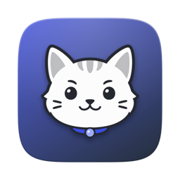
</p>

<h1 align="center">TokenCat</h1>

<p align="center">
  <b>코딩 에이전트가 지금 무엇을 하고 있는지,<br>메뉴 막대의 픽셀 고양이가 알려 줍니다.</b>
</p>

<p align="center">
  <a href="https://github.com/SeuPut0705/TokenCat/releases/latest"></a>
  
  
  
  <a href="LICENSE"></a>
</p>

<p align="center">
  <a href="https://github.com/SeuPut0705/TokenCat/releases/latest/download/TokenCat.zip"></a>
  &nbsp;
  <a href="https://github.com/SeuPut0705/TokenCat/releases/latest/download/TokenCat-Windows.zip"></a>
  <br>
  <sub>무료 오픈 소스 · <a href="#설치">macOS 설치 방법</a> · <a href="#windows">Windows 설치 방법</a></sub>
</p>

<p align="center">
  <picture>
    <source media="(prefers-color-scheme: dark)" srcset="docs/images/ko/hero-dark.png">
    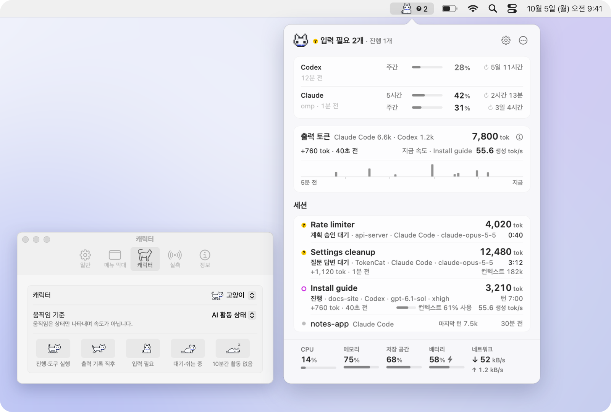
  </picture>
</p>

<p align="center">
  <a href="#주요-기능">주요 기능</a> ·
  <a href="#개인정보와-안전">개인정보</a> ·
  <a href="#설치">설치</a> ·
  <a href="#windows">Windows</a> ·
  <a href="#작동-방식">작동 방식</a> ·
  <a href="#자주-묻는-질문">자주 묻는 질문</a> ·
  <a href="docs/DETAILS.ko.md">자세한 동작</a>
</p>

---

터미널 여러 개에서 Codex·Claude Code나 다른 코딩 에이전트(OpenCode, Gemini CLI, Cursor, Grok, Kimi Code, omp 등)를 돌리다 보면 어느 세션이 일하고 있고 어느 세션이 내 답을 기다리는지 놓치기 쉽습니다. TokenCat은 그 상태를 메뉴 막대 한 칸에 모읍니다. 고양이가 걸으면 작업 중이고, 정면을 보고 앉아 있으면 입력이 필요하다는 뜻입니다. 항목을 누르면 세션별 상태, 최근 5분 출력 토큰, 지금 속도, Codex·Claude 사용 한도, Mac 시스템 지표를 한 화면에서 봅니다.

숫자는 있는 그대로 보여 줍니다. 토큰 수는 로컬 로그에 실제로 기록된 값이고, tok/s 속도는 실제 **실측**이 있을 때만 표시합니다. 클라이언트가 이 Mac의 수집기로 보낸 실측이거나, 클라이언트가 응답마다 직접 기록한 요청 시간(OpenCode·omp·Grok·Hermes·Goose·Kimi Code)입니다. 로그 시각의 차이로 속도를 추정하지 않고, 여러 세션의 속도를 합치지 않으며, 직접 켜는 **평균 속도** 항목에서만 세션별 실측을 평균하고, 모르는 값은 `—`로 둡니다.

- **입력 요청을 놓치지 않게**: 질문이나 계획 승인을 기다리는 세션은 노란 `?`와 정면을 보는 고양이로 알립니다. 원하면 알림도 보냅니다.
- **세션과 하위 에이전트를 한 목록에**: 진행 상태, 실행 중인 도구 종류, 이번 턴 출력, 컨텍스트를 세션마다 보여 주고 하위 에이전트는 부모 아래에 묶습니다.
- **데이터는 로컬에**: 대화 본문을 저장하지 않고, 실측 수집기는 `127.0.0.1`에서만 열며, 모델을 호출하거나 직접 계정에 로그인하지 않습니다. 인터넷에는 업데이트를 확인하고 내려받을 때 GitHub에, `실시간 한도 확인`이 켜져 있으면(기본) Codex·Claude Code(또는 omp·Pi)에 이미 저장된 로그인으로 사용 한도를 물을 때 OpenAI·Anthropic에 접속하며, 둘 다 끌 수 있습니다. 실측을 받기 위해 Codex·Claude Code 설정(설치돼 있으면 Gemini CLI·Qwen Code 설정도)에 이 Mac으로 보내는 전송 설정을 자동으로 추가하고 Claude Code 상태 표시줄 명령을 TokenCat 브리지로 감싸며, 원본은 먼저 백업합니다.
- **네이티브 앱**: Swift·AppKit·SwiftUI만 쓰고 외부 패키지가 없습니다. macOS 13 이상이 대상입니다.
- **Windows**: Windows 10·11(x64)용 알림 영역 버전을 같은 릴리스에 함께 올립니다. [Windows](#windows)를 보세요.

## 주요 기능

### 출력 흐름을 한눈에

<p align="center">
  <picture>
    <source media="(prefers-color-scheme: dark)" srcset="docs/images/ko/popover-flow-dark.png">
    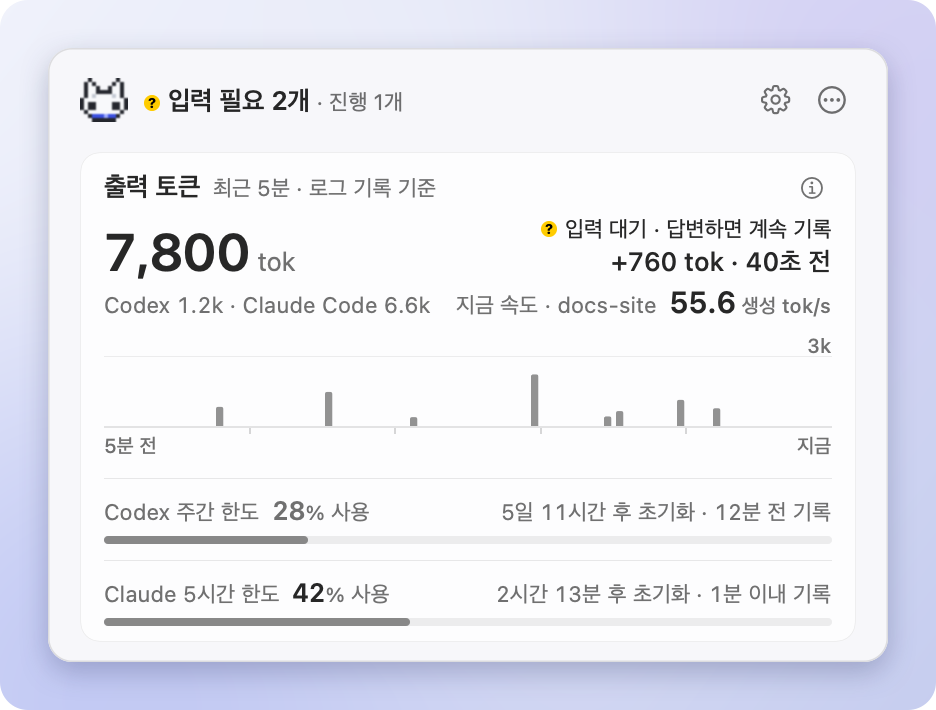
  </picture>
</p>

최근 5분 동안 로그에 기록된 출력 토큰을 5초 단위 막대로 보여 주고, 합계는 카드 제목 줄에 둡니다. 여러 클라이언트가 함께 기록하면 제목 옆에 `Claude Code 6.6k · Codex 1.2k`처럼 많은 순서로 나눠 보이고, 다 들어가지 않으면 작은 쪽부터 `외 N`으로 접습니다. 제목 아래 줄에는 마지막 기록이 나오고, 30초 동안 새 기록이 없으면 그 자리에서 지금 기다리는 이유(API 재시도, `명령 실행 중` 같은 도구 범주, 로그 대기)를 알려 줍니다. 입력을 기다리는 세션은 머리말과 그 행이 이미 말하므로 카드에서 되풀이하지 않습니다. 막대는 기록량이며 속도로 환산하지 않고, 막대 눈금은 그래프 도움말에 있습니다.

그 줄 끝의 **지금 속도**는 보이는 진행 세션 가운데 2분 안의 가장 최근 실측 한 건이며, 그 세션의 제목을 붙입니다(`지금 속도 · Install guide 55.6 생성 tok/s`). 수집기가 받은 실측이거나 OpenCode·omp·Grok·Hermes·Goose·Kimi Code가 응답마다 기록한 요청 시간입니다. 그 세션의 현재 모델로 잰 값만 쓰고, 재시작을 기다리는 클라이언트는 빼며, 세션끼리 합치거나 평균내지 않습니다. 진행·도구 실행·API 재시도 중인데 실측이 없으면 `속도 실측 없음`, 입력이나 로그만 기다리면 숨깁니다. 로그 시각으로 만든 속도는 쓰지 않습니다.

### 세션마다 지금 하는 일

<p align="center">
  <picture>
    <source media="(prefers-color-scheme: dark)" srcset="docs/images/ko/popover-sessions-dark.png">
    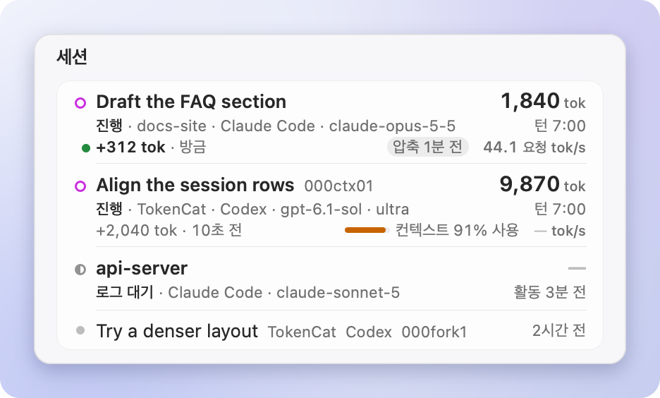
  </picture>
</p>

진행 중인 세션이 위로 올라옵니다. 행 제목(세션 제목, 없으면 프로젝트)은 색 있는 상태 표시 다음 같은 열에서 시작하고, 둘째 줄은 상태를 말로(`계획 승인 대기`, `명령 실행 중`, `진행` …) 시작한 뒤 클라이언트·모델·Codex effort를 보이고 턴 경과 시간(입력 대기면 기다린 시간)으로 끝납니다. 이번 턴 출력 누적과 컨텍스트 사용량도 보여 줍니다. 컨텍스트는 Codex의 경우 기록된 창 대비 비율(`컨텍스트 91% 사용`)로, Claude Code는 창 크기를 기록하지 않아 `컨텍스트 182k`처럼 절대값으로 표시하고, 압축했으면 `압축 1분 전`을 붙입니다. 실측이 있는 세션에는 `44.1 요청 tok/s`처럼 근거 단위와 함께 속도가 붙습니다. 실측이 없으면 생성 중일 수 있는 진행·도구 실행·API 재시도 행에만 `—`를 두고, 입력이나 로그를 기다리는 행에는 아무것도 붙이지 않습니다. 목록을 접어 두면 마지막 줄 하나가 나머지를 펼칩니다(`세션 12개 모두 보기 ⌄`, 펼치면 `접기 ⌃`).

`입력 필요`는 Claude Code의 질문(AskUserQuestion)·계획 승인(ExitPlanMode)과 Codex Plan 모드의 질문(`request_user_input`)을 로그에서 읽어 판단합니다. 권한 확인 요청은 로그에 남지 않아 표시하지 못합니다.

### 하위 에이전트는 부모 아래에

<p align="center">
  <picture>
    <source media="(prefers-color-scheme: dark)" srcset="docs/images/ko/popover-subagents-dark.png">
    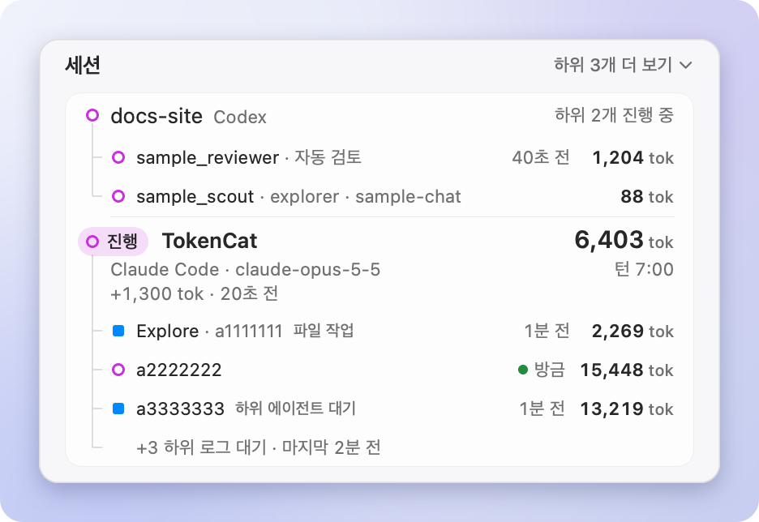
  </picture>
</p>

Codex와 Claude Code의 하위 에이전트를 정확한 부모 세션 식별자로 묶어 트리로 보여 줍니다. 제목은 역할이나 별명이고, 구별되는 역할이 없으면 `하위 에이전트 · a2222222`처럼 짧은 ID를 옆에 둡니다. 실행 중인 하위는 모두 보이며 로그를 기다리는 하위는 `+3 하위 로그 대기 ⌄`처럼 한 줄로 접고, 그 줄을 누르면 펼칩니다.

### 상세와 복사는 클릭 한 번으로

<p align="center">
  <picture>
    <source media="(prefers-color-scheme: dark)" srcset="docs/images/ko/popover-detail-dark.png">
    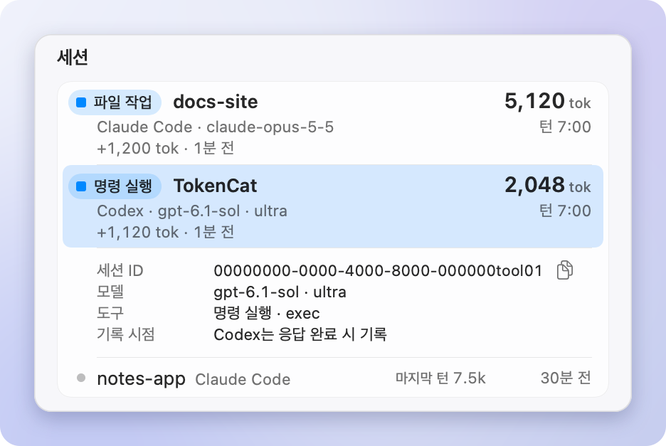
  </picture>
</p>

행을 클릭하거나 Return을 누르면 세션 ID, 모델, 실행 중인 도구, 기록 시점이 펼쳐지고, 재개 명령(`claude --resume …`, `codex resume …`)을 복사하는 버튼과 프로젝트 폴더를 Finder에서 보여 주는 버튼이 함께 나옵니다. 우클릭 메뉴에서는 세션·에이전트 ID도 복사하고 기록 파일도 Finder에서 보여 줍니다. 파일 내용은 열지 않습니다. ↑↓ · Return · ⌘C(ID 복사) · ⌘⇧C(재개 명령 복사)로 키보드만으로도 다룰 수 있습니다.

### Codex·Claude 사용 한도

<p align="center">
  <picture>
    <source media="(prefers-color-scheme: dark)" srcset="docs/images/ko/popover-limits-dark.png">
    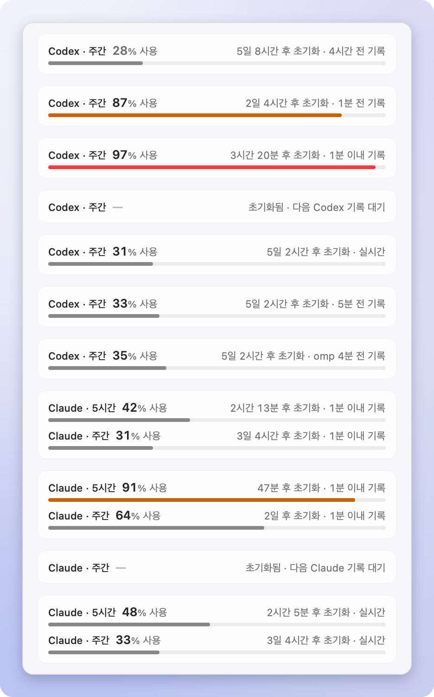
  </picture>
</p>

머리말 바로 아래 한도 카드에 한도 창마다 한 줄씩, 사용률과 초기화까지 남은 시간, 값이 얼마나 최근 것인지를 보여 줍니다(`Claude · 5시간 42% 사용`). 같은 계정의 다른 창도 아직 초기화되지 않았으면 그 아래 한 줄을 더 둡니다(`Claude · 주간 31% 사용`). 85% 이상은 주황, 95% 이상은 빨강이고 초기화 시각이 지나면 `—`로 바뀝니다. 소진 예측은 아닙니다.

**실시간 한도 확인**(기본 켜짐, 설정 › 실측)이 켜져 있으면 그 계정의 모델을 쓰는 세션이 실행 중이거나(자기 클라이언트든, Claude·GPT 모델을 쓰는 omp 같은 다른 클라이언트든) 상세 화면이 열려 있는 동안 1분마다, 그 밖에는 10분마다 계정 한도를 확인합니다. 2분 안에 확인한 값은 `… · 실시간`으로, 그보다 오래된 값은 몇 분 전 기록인지로 보이고, omp나 Pi가 기록한 값은 누가 기록했는지도 함께 보입니다(`… · omp 4분 전 기록`). 초기화 시각은 만들어 내지 않아, 받은 값에 없으면 표시하지 않습니다. 동작과 보내는 내용은 [자세한 동작 › 실시간 한도 확인](docs/DETAILS.ko.md#실시간-한도-확인)에 있습니다.

- **Codex**: 실시간 확인은 로컬 `codex app-server`(Codex CLI)를 잠깐 실행해, Codex CLI가 자기에게 저장된 로그인으로 OpenAI에 묻게 합니다. Codex 로그에 기록된 사용률도 함께 씁니다.
- **Claude**: 실시간 확인은 Claude Code에 저장된 로그인 토큰을 Anthropic에 보냅니다. 그 토큰이 없거나 만료됐으면 같은 계정으로 omp·Pi에 저장된 Claude 로그인을 대신 써서, omp·Pi로 작업하는 동안에도 한도가 실시간으로 유지됩니다. 쓸 수 있는 토큰이 없으면 기존 경로를 그대로 씁니다. Claude Code가 상태 표시줄 명령에만 넘기는 5시간·주간 한도를 TokenCat이 그 명령을 [브리지](docs/DETAILS.ko.md#claude-사용-한도와-상태-표시줄-브리지)로 감싸 받고(Claude.ai 구독 계정), Claude 데스크톱 앱이 약 15분마다 남기는 사용량 기록도 읽습니다(데스크톱 앱에서 쓴 Claude Code는 상태 표시줄을 실행하지 않습니다).
- **omp·Pi**: 자기 Claude·ChatGPT 로그인의 한도를 직접 확인해 `~/.omp/agent/agent.db`(`~/.pi/agent/agent.db`)에 남깁니다. TokenCat은 여기서 가장 최근 5시간·주간·Codex 창을 읽기만 하므로, Claude Code를 실행하지 않고 omp로 작업해도 한도 줄이 계속 갱신됩니다. 자세한 내용은 [자세한 동작 › omp·Pi 사용량 기록](docs/DETAILS.ko.md#omppi-사용량-기록)에 있습니다.

### 메뉴 막대는 원하는 만큼

<p align="center">
  <picture>
    <source media="(prefers-color-scheme: dark)" srcset="docs/images/ko/menubar-layouts-dark.png">
    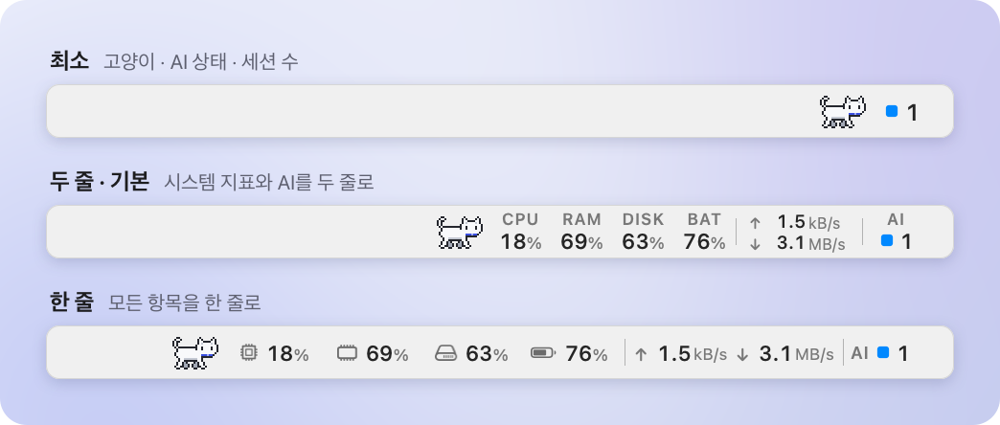
  </picture>
</p>

**최소**(약 72pt), **두 줄**(기본, 약 272pt), **한 줄**(약 410pt) 중에서 고르고, 항목을 켜고 끄거나 끌어서 순서를 바꿉니다. 캐릭터 체크 상자가 그 목록 맨 위에 있습니다. 항목마다 폭이 고정이라 값이 바뀌어도 옆 아이콘이 흔들리지 않고, 라벨은 막대의 밝은·어두운 모양을 따라 색이 비치는 막대에서도 잘 보입니다. 배터리가 없는 Mac에서는 배터리 항목을 숨깁니다.

기본으로 꺼져 있는 항목도 하나 있습니다. 설정 › 메뉴 막대에서 켜는 **평균 속도**(`AVG`)는 상세 화면의 **지금 속도** 규칙이 받아들이는 모든 클라이언트의 세션별 실측 속도를 평균합니다. 실측값만 평균하고 아무것도 추정하지 않으며, 설정의 항목 줄 도움말에도 그렇게 적혀 있습니다. 라벨 자리에는 지금 실측을 보태는 클라이언트의 아이콘을 빠른 순서로 보여 줍니다. 하나면 아이콘 하나, 여럿이면 최대 세 개를 1pt 간격으로 나란히, 잘리지 않게 그립니다. 최근 실측이 없으면 `AVG`와 `—`로 표시합니다.

<p align="center">
  <picture>
    <source media="(prefers-color-scheme: dark)" srcset="docs/images/ko/menubar-states-dark.png">
    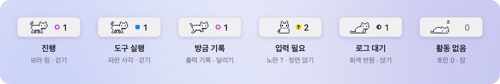
  </picture>
</p>

AI 숫자는 진행 중이거나 입력을 기다리는 최상위 세션 수입니다. 입력을 기다리는 세션이 있으면 내가 답할 그 세션 수만 보여 주고, 전체 내역은 도움말에 남깁니다. 마크는 상세 화면과 같은 글리프입니다. 출력 기록은 마크 대신 고양이가 잠깐 달리는 것으로 보여 줍니다. 항목을 우클릭하면(VoiceOver에서는 `빠른 메뉴` 동작) 급한 세션 세 개까지 바로 고를 수 있는 빠른 메뉴가 열리고, 더 있으면 `그 외 N개 세션…`으로 상세 화면을 엽니다.

### 상태를 보여 주는 고양이

<p align="center">
  <picture>
    <source media="(prefers-color-scheme: dark)" srcset="docs/images/ko/cat-dark.gif">
    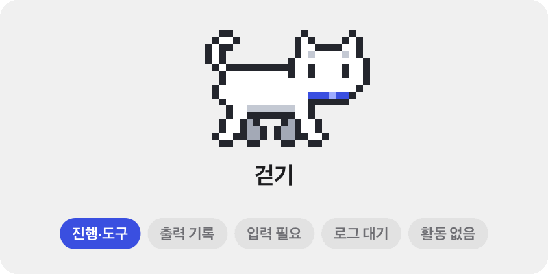
  </picture>
</p>

기본 움직임 기준인 **AI 활동 상태**에서는 진행·도구 실행 중에 걷고, 새 출력이 기록되면 1.2초 달리고, 입력이 필요하면 정면을 보고 앉습니다. 로그를 기다리는 동안 앉아서 깜빡이고, 10분간 활동이 없으면 잠듭니다. 박자는 상태별로 고정이라 속도를 뜻하지 않습니다. 설정에서 CPU 사용률, AI 실측 속도, 멈춤으로 바꿀 수 있고 '동작 줄이기'를 따릅니다.

<p align="center">
  <picture>
    <source media="(prefers-color-scheme: dark)" srcset="docs/images/ko/poses-dark.png">
    
  </picture>
</p>

고양이는 32 × 20pt 칸에 흐림 없이 1:1로 그리는 픽셀 아트입니다. 상세 화면 헤더와 16·32 px 앱 아이콘도 같은 픽셀 머리를 씁니다.

### 캐릭터와 프리셋

<p align="center">
  <picture>
    <source media="(prefers-color-scheme: dark)" srcset="docs/images/ko/characters-dark.png">
    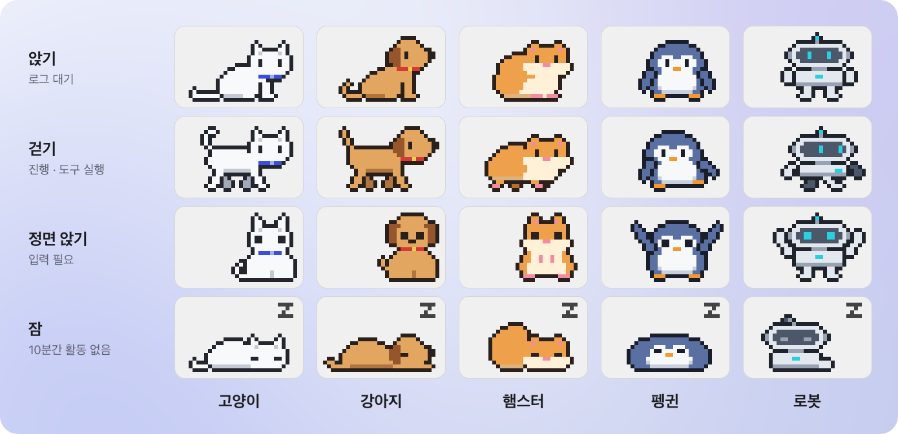
  </picture>
</p>

고양이 말고도 강아지·햄스터·펭귄·로봇을 설정 › 캐릭터나 빠른 메뉴 › 캐릭터에서 고를 수 있습니다. 다섯 캐릭터 모두 같은 자세와 박자를 써서 모습만 바뀌며, 상세 화면 헤더와 앱 아이콘은 고양이 그대로입니다.

프리셋은 메뉴 막대 구성을 한 번에 정합니다. **최소**, **AI 집중**(AI·CPU·메모리를 두 줄로), **시스템 모니터**(CPU·메모리·저장 공간·배터리·네트워크·AI를 두 줄로), **전체 한 줄**(같은 항목을 한 줄로) 중에서 설정 › 메뉴 막대 › 프리셋에서 고릅니다. 프리셋을 고르면 캐릭터도 다시 표시되고, 표시 방식이나 항목이 어느 프리셋과도 맞지 않으면 **사용자 지정**으로 표시됩니다.

### 설정과 알림

<p align="center">
  <picture>
    <source media="(prefers-color-scheme: dark)" srcset="docs/images/ko/settings-dark.png">
    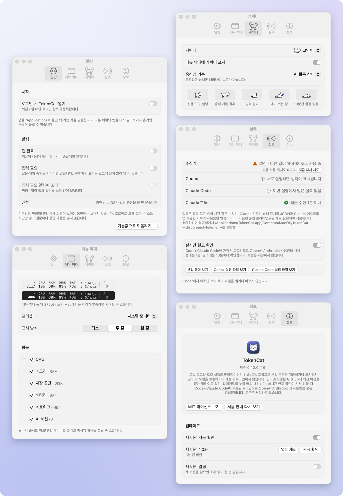
  </picture>
</p>

알림에는 프로젝트, 클라이언트·모델, 토큰 수, 소요 시간만 넣고 질문이나 응답 내용은 넣지 않습니다. 상세 화면이 보이는 동안에는 보내지 않습니다. 새 버전 알림은 버전마다 한 번, 소리 없이 보내며, 더 새 버전이 나오거나 업데이트하면 이전 알림을 지웁니다.

### 언어

화면·메뉴·알림·도움말·VoiceOver 안내와 명령줄 출력을 영어와 한국어로 제공합니다. macOS 언어 설정을 따라 선호 언어 가운데 한국어와 영어 중 먼저 나오는 쪽으로 표시하고, 둘 다 없으면 영어로 표시합니다. **시스템 설정 › 일반 › 언어 및 지역 › 응용 프로그램**에서 TokenCat만 따로 고를 수 있으며, 바꾼 언어는 TokenCat을 다시 열면 적용됩니다.

## 개인정보와 안전

<p align="center">
  <picture>
    <source media="(prefers-color-scheme: dark)" srcset="docs/images/ko/popover-onboarding-dark.png">
    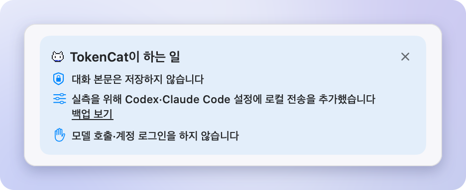
  </picture>
</p>

처음 실행하면 TokenCat이 실제로 한 일과 하지 않는 일을 위 카드가 항목마다 한 줄로 알려 주고, 줄에 포인터를 올리면 자세한 설명이 나옵니다. 실측 연결이 되지 않았으면 그 이유와 `설정 열기`가 카드에 남습니다.

- **본문은 저장하지 않습니다.** 로컬 로그에서 모델·토큰 수·도구 종류·프로젝트 폴더 같은 메타데이터만 씁니다. 도구 입력은 읽지 않고, API 재시도 기록의 오류 메시지도 저장하지 않습니다. 보여 주는 글은 클라이언트가 직접 만든 세션 제목이나 사용자가 바꾼 세션 이름뿐이며(Claude Code·Codex·OpenCode·Kilo Code·MiMo Code·omp·Pi·Gemini CLI·Qwen Code·Copilot CLI·Amp·Droid·Cursor·Grok·Hermes·OpenClaw·Goose·Kimi Code), 한 줄 80자로 자릅니다. 메모리에만 두고 파일·로그로 남기거나 보내지 않으며, 첫 프롬프트를 그대로 옮긴 제목은 쓰지 않습니다.
- **수집기는 이 Mac 안에만 엽니다.** `127.0.0.1:16493`에서만 받고, 웹페이지 Origin이 붙었거나 Host가 `127.0.0.1`·`localhost`가 아닌 요청은 거부합니다. 받은 실측은 정해진 개수만 메모리에 두고 파일로 남기지 않습니다. 수집기로 받은 것 가운데 디스크에 남는 것은 Claude 한도의 사용률·초기화 시각·받은 시각뿐이며, 다음 실행에도 보이도록 TokenCat 설정 값(UserDefaults)에 둡니다. Claude 데스크톱 앱의 사용량 기록 파일은 읽기만 하고 마지막 기록의 사용률과 시각만 같은 곳에 둡니다.
- **본문 전송은 끈 채로 연결합니다.** Codex·Claude Code·Gemini CLI·Qwen Code 설정에 실측 전송을 추가할 때 프롬프트·응답 본문 로깅은 끕니다(기본으로 프롬프트를 기록하는 Gemini CLI·Qwen Code에는 `logPrompts: false`).
- **Claude Code 상태 표시줄은 감싸기만 합니다.** Claude Code는 사용 한도를 상태 표시줄 명령에만 넘겨 주므로, `~/.claude/settings.json`의 `statusLine` 명령을 TokenCat 브리지(`~/Library/Application Support/TokenCat/claude-statusline.sh`)로 바꿉니다. 브리지는 Claude Code가 넘긴 상태 JSON(작업 폴더, 세션, 모델, 비용, 사용 한도 등)을 `127.0.0.1`로만 보내고, 같은 입력으로 원래 명령을 실행해 출력과 종료 코드를 그대로 돌려줍니다. TokenCat은 받은 JSON에서 5시간·주간 한도 숫자만 남기고 나머지는 버립니다. 상태 표시줄이 없었다면 아무것도 출력하지 않는 브리지만 추가합니다.
- **모델 호출이 없고 직접 로그인하지 않습니다.** TokenCat은 어떤 모델도 호출하지 않고 스스로 계정에 로그인하지 않습니다. 실시간 한도 확인은 Codex·Claude Code(또는 omp·Pi)에 이미 저장된 로그인을 씁니다.
- **인터넷 접속은 업데이트와 사용 한도 확인뿐입니다.** 업데이트는 GitHub에 최신 릴리스의 버전 번호만 묻습니다. 설정 › 정보의 `새 버전 자동 확인`을 끄면 `지금 확인`을 누를 때만 묻습니다. 새 버전 파일은 `업데이트`를 누를 때만 내려받습니다.
- **실시간 한도 확인은 토큰을 저장하지 않습니다.** Codex는 로컬 `codex app-server`를 잠깐 실행해, Codex CLI가 자기 로그인으로 OpenAI에 묻게 하며 TokenCat은 Codex 토큰을 읽지 않습니다. Claude는 Claude Code가 저장한 토큰(macOS 키체인 또는 `~/.claude/.credentials.json`)을, 그 토큰이 없거나 만료됐으면 같은 계정으로 omp·Pi가 `agent.db`에 저장한 Claude 토큰을 읽어 `api.anthropic.com`에만 보냅니다. 토큰은 메모리에만 두고 파일·로그에 남기거나 갱신하지 않으며, 만료된 토큰은 보내지 않습니다. 설정 › 실측의 `실시간 한도 확인`으로 끕니다.
- **그 밖에는 이 Mac 밖으로 나가지 않습니다.** 두 요청 모두 사용 기록·기기 정보·식별자를 보내지 않으며, 나머지 통신은 모두 이 Mac 안(`127.0.0.1`)에서만 일어납니다.
- **원본 설정을 먼저 백업합니다.** 바꾸기 전에 원본을 접근 제한된 폴더에 보관하고, 기존 외부 실측 목적지와 충돌하면 덮어쓰지 않습니다. 연결 뒤 설정 파일이 바뀌었다면 연결 해제(설정 › 실측의 `연결 해제…`나 `--disconnect-telemetry`)는 그 파일을 통째로 덮어쓰지 않고, 지금 파일을 백업한 뒤 TokenCat이 넣은 항목만 되돌립니다.
- **로그인 항목과 알림은 직접 켤 때만.** 둘 다 기본으로 꺼져 있습니다. 업데이트 설치도 직접 누를 때만 합니다.

## 설치

macOS 13 이상에서 실행되며, 한 앱으로 Apple silicon과 Intel Mac을 모두 지원합니다(universal).

1. [**TokenCat.zip 내려받기**](https://github.com/SeuPut0705/TokenCat/releases/latest/download/TokenCat.zip) ([최신 릴리스](https://github.com/SeuPut0705/TokenCat/releases/latest)의 첨부 파일)
2. 압축을 풀고 `TokenCat.app`을 **응용 프로그램** 폴더로 옮깁니다. 다운로드 폴더 등 다른 곳에서 열면 macOS가 임시 위치에서 실행해 스스로 업데이트할 수 없습니다.
3. 처음 한 번은 아래 [처음 열 때](#처음-열-때) 순서로 엽니다.

> [!IMPORTANT]
> 처음 실행하면 실측을 받기 위해 Codex `~/.codex/config.toml`과 Claude Code `~/.claude/settings.json`에 이 Mac(`127.0.0.1:16493`)으로 보내는 설정을 **자동으로** 추가하고(파일이 없으면 새로 만듭니다), Claude Code의 상태 표시줄(`statusLine`) 명령을 TokenCat 브리지로 감쌉니다(원래 상태 표시줄 출력은 그대로). `~/.gemini`나 `~/.qwen`이 있으면 Gemini CLI `~/.gemini/settings.json`, Qwen Code `~/.qwen/settings.json`의 `telemetry` 항목도 설정하며, 이미 다른 곳으로 실측을 보내거나 순수 JSON이 아닌 파일은 건너뛰고 그대로 둡니다. 원본은 먼저 백업하고 프롬프트·응답 본문 로깅은 끕니다. 실행할 때마다 연결을 다시 확인하며, 연결을 해제하면(설정 › 실측의 `연결 해제…` 또는 `--disconnect-telemetry`) `다시 연결`을 누르거나 `--connect-telemetry`를 실행할 때까지 다시 연결하지 않습니다. 되돌리는 방법은 [연결 해제와 제거](#연결-해제와-제거)에 있습니다.

### 처음 열 때

TokenCat은 Apple Developer ID 서명과 공증을 받지 않고 ad-hoc 서명만 한 앱입니다. 그래서 브라우저로 내려받은 앱을 처음 열면 macOS(Gatekeeper)가 확인되지 않은 앱으로 보고 막습니다. 설치한 앱마다 한 번만 허용하면 됩니다.

**macOS 15 이상**

1. `TokenCat.app`을 엽니다. 열 수 없다는 창이 나오면 **완료**를 누릅니다. **휴지통으로 이동**은 누르지 마세요.
2. **시스템 설정 › 개인정보 보호 및 보안**을 열고 아래쪽 **보안** 항목까지 내립니다.
3. 'Mac을 보호하기 위해 ‘TokenCat’을(를) 차단했습니다.' 옆의 **그래도 열기**를 누릅니다. 이 버튼은 열기를 시도한 뒤 약 1시간 동안만 보입니다.
4. 다시 나오는 창에서 **그래도 열기**를 누르고 Mac 암호나 Touch ID로 확인합니다.

**macOS 13–14**

1. Finder에서 `TokenCat.app`을 Control-클릭(또는 우클릭)하고 **열기**를 고릅니다.
2. 확인 창에서 **열기**를 누릅니다. 창에 열기 버튼이 없으면 macOS 15와 같이 **시스템 설정 › 개인정보 보호 및 보안**에서 **그래도 열기**를 누릅니다.

### 터미널로 설치

먼저 내려받아 SHA-256을 [최신 릴리스](https://github.com/SeuPut0705/TokenCat/releases/latest) 노트의 값과 비교합니다.

```sh
curl -fL https://github.com/SeuPut0705/TokenCat/releases/latest/download/TokenCat.zip -o /tmp/TokenCat.zip \
  && shasum -a 256 /tmp/TokenCat.zip
```

값이 같으면 새 앱을 먼저 풀어 둔 뒤, 실행 중인 TokenCat을 종료하고 기존 앱과 바꿔 엽니다. 압축 풀기에 실패하면 기존 앱은 지우지 않습니다. 설정 값과 백업은 앱 밖에 있어 그대로 남습니다.

```sh
rm -rf /tmp/TokenCat-new && ditto -x -k /tmp/TokenCat.zip /tmp/TokenCat-new \
  && { pkill -x TokenCat; rm -rf /Applications/TokenCat.app; } \
  && mv /tmp/TokenCat-new/TokenCat.app /Applications/ \
  && open /Applications/TokenCat.app
```

브라우저와 달리 `curl`은 내려받은 파일에 격리 속성(`com.apple.quarantine`)을 붙이지 않아 위 확인 창 없이 열립니다. 그래서 주소가 이 저장소인지와 SHA-256을 먼저 확인하는 것이 중요합니다.

### 소스에서 빌드

Xcode가 필요합니다. `Package.swift`는 Swift 5.9 이상을 요구하며, macOS 27.0.1 · Xcode 27.0 · Swift 6.4에서 빌드를 확인했습니다. 같은 환경에서 Command Line Tools만으로는 SwiftUI 매크로 플러그인이 없어 빌드에 실패합니다. `xcode-select -p`가 `/Library/Developer/CommandLineTools`를 출력하면 `DEVELOPER_DIR=/Applications/Xcode.app/Contents/Developer ./build.sh`로 빌드하거나, `sudo xcode-select -s /Applications/Xcode.app`으로 한 번 바꿉니다.

```sh
git clone https://github.com/SeuPut0705/TokenCat.git
cd TokenCat
./build.sh
open dist/TokenCat.app
```

`build.sh`는 Apple silicon·Intel용 universal 릴리스 빌드로 `dist/TokenCat.app`을 만들고 ad-hoc 서명합니다. Developer ID 서명, 공증, App Store 배포는 없습니다. 로그인할 때 자동으로 열려면 앱을 `/Applications`로 옮긴 뒤 설정 › 일반에서 켜세요. 다른 위치의 앱을 다시 빌드하거나 옮기면 등록이 풀릴 수 있습니다.

### 처음 실행하면

1. 메뉴 막대에 고양이가 나타납니다. 고양이를 클릭하면 TokenCat이 바꾼 내용을 볼 수 있습니다. Dock 아이콘은 없으며, 실행 중에 앱을 다시 열면 설정 창이 열립니다. 메뉴 막대가 꽉 차 노치 뒤에 고양이가 숨으면 앱을 다시 열고 설정 › 메뉴 막대 › 프리셋에서 최소를 고릅니다.
2. 로컬 수집기가 준비되면 [설치](#설치)의 안내대로 설정을 바꿉니다. 수집기가 준비되지 않으면 아무것도 바꾸지 않습니다.
3. 연결한 클라이언트(Codex·Claude Code, 설치돼 있으면 Gemini CLI·Qwen Code)는 **다음에 새로 실행할 때부터** 실측을, Claude Code는 사용 한도도 보냅니다. 진행 중인 작업은 재시작하지 않습니다. 세션 상태와 토큰 수는 로그에서 읽고(지원하는 클라이언트는 폴더가 생기는 대로 읽음) 실시간 한도는 직접 확인하므로 바로 보입니다.

<p align="center">
  <picture>
    <source media="(prefers-color-scheme: dark)" srcset="docs/images/ko/popover-empty-dark.png">
    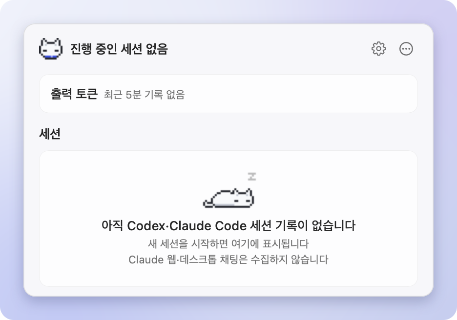
  </picture>
</p>

아직 기록이 없으면 고양이가 잠든 화면이 보입니다. 지원하는 클라이언트에서 새 세션을 시작하면 바로 나타납니다. 어느 클라이언트의 기록 폴더도 없으면 지원하는 클라이언트를 한 줄로 보여 주고, 그 줄에 포인터를 올리면 TokenCat이 찾는 폴더가 나옵니다.

### 업데이트

TokenCat은 GitHub의 최신 릴리스를 스스로 확인하고, 설치는 사용자가 누를 때만 합니다.

- **확인**: 설정 › 정보 › 업데이트의 `새 버전 자동 확인`(기본 켜짐)이 켜져 있으면 실행 직후, 이후 15분마다, Mac이 잠자기에서 깬 뒤, 마지막 확인이 5분 넘게 지난 상태에서 상세 화면을 열 때 확인합니다. 끄면 `지금 확인`을 누를 때만 확인합니다.
- **알림**: 새 버전이 있으면 상세 화면 아래쪽에 `새 버전 1.0.0`과 `업데이트` 버튼이 한 줄로 조용히 나타나고, 우클릭 빠른 메뉴에 `업데이트 1.0.0 설치…`가 생깁니다. 줄의 닫기 버튼은 그 버전 알림만 숨깁니다. 시스템 알림도 받으려면 `새 버전 알림`을 켜세요(기본 꺼짐).
- **설치**: `업데이트`를 누르면 `TokenCat.zip`을 내려받고(`업데이트 내려받는 중 45%`), GitHub가 기록한 SHA-256과 맞는지 확인한 뒤 앱을 바꾸고(`설치 중…`) 다시 실행합니다. 다시 열리면 `1.0.0으로 업데이트했습니다`를 한 번 보여 줍니다. 실패하면 `업데이트 실패`와 릴리스 페이지 열기가 나오고, 다시 해서 나아질 수 있는 실패에는 `다시 시도`도 나옵니다. 설치 중에 종료하면 설치 단계를 마친 뒤 종료합니다.

설정 값과 실측 백업은 앱 밖에 있어 업데이트 뒤에도 그대로입니다. 직접 받으려면 [설치](#설치)를 다시 하거나 [터미널로 설치](#터미널로-설치)의 명령을 실행합니다. 직접 받거나 옮긴 앱은 실행 중인 TokenCat을 먼저 종료한 뒤 여세요. 실행 중이면 새로 연 앱은 기존 앱의 패널만 열고 끝납니다.

### 연결 해제와 제거

TokenCat은 실행될 때마다 실측 연결을 확인하고 필요하면 다시 추가합니다. 연결을 해제하면(설정 › 실측의 `연결 해제…`나 아래 3단계의 `--disconnect-telemetry`, 복구를 거절한 경우 포함) 그 뒤로는 자동으로 연결하지 않고, 같은 줄의 `다시 연결`이나 `--connect-telemetry`로 다시 연결합니다.

1. 로그인 시 열기를 켰다면 설정 › 일반에서 끕니다.
2. 설정 › 실측에서 `연결 해제…`를 누른 뒤(건너뛰고 3단계를 써도 됩니다) 메뉴 막대 항목을 우클릭해 TokenCat을 종료합니다.
3. 설정에서 해제하지 않았다면 터미널에서 클라이언트 설정을 복구합니다. 앱이 다른 곳에 있다면(소스에서 빌드했다면 `dist/TokenCat.app`) 그 위치의 `TokenCat.app` 안 실행 파일을 씁니다.

   ```sh
   /Applications/TokenCat.app/Contents/MacOS/TokenCat --disconnect-telemetry
   ```

   연결한 뒤 바뀌지 않은 설정 파일은 원본 바이트로 되돌립니다. 그사이 수정된 파일은 TokenCat이 넣은 항목만 되돌리고, 지금 파일은 `~/Library/Application Support/TokenCat/telemetry-backups/`에 남깁니다. 명령은 한 일과 백업을 보고 직접 정리할 파일을 알려 주며, 복구는 클라이언트를 다음에 실행할 때부터 적용됩니다. `~/.claude/settings.json`의 `statusLine.command`가 아직 `claude-statusline.sh`를 가리키면 `~/Library/Application Support/TokenCat/claude-statusline-command`에 적힌 명령으로 바꿉니다(이 파일이 없으면 `statusLine`을 지웁니다). 정확한 규칙은 [자세한 동작 › 토큰 지표](docs/DETAILS.ko.md#토큰-지표)에 있습니다.
4. 앱을 지웁니다. 복구를 마쳤다면 `~/Library/Application Support/TokenCat/`(백업·브리지)과 설정 값(`defaults delete dev.seuput.TokenCat`, Claude 한도 기록 포함)도 지울 수 있습니다. `~/.claude/settings.json`이 아직 `claude-statusline.sh`를 가리키면 이 폴더를 지우지 마세요. 원래 명령이 함께 사라지고 Claude Code 상태 표시줄이 실행에 실패합니다.

## Windows

<p align="center">
  <picture>
    <source media="(prefers-color-scheme: dark)" srcset="docs/images/ko/windows-flyout-dark.png">
    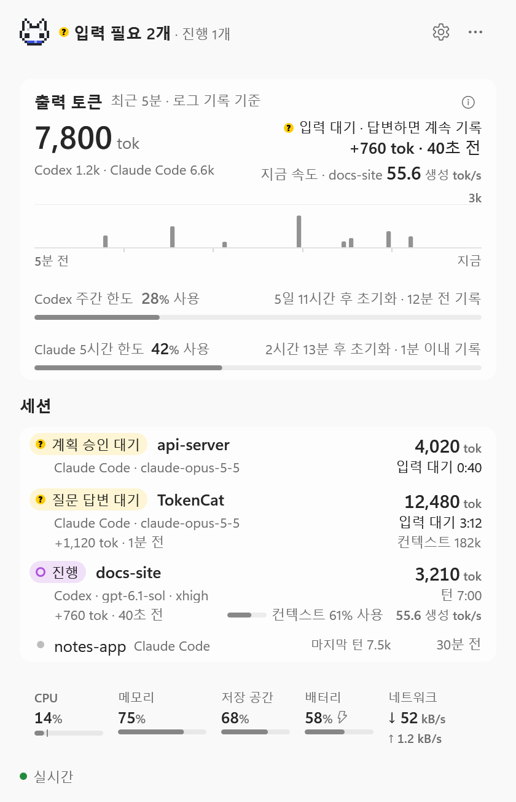
  </picture>
</p>

0.11.0부터 TokenCat은 Windows 알림 영역에서도 실행됩니다. Mac 앱의 규칙을 같은 검사와 함께 옮겼으며, 문제가 있으면 [이슈](https://github.com/SeuPut0705/TokenCat/issues)로 알려 주세요(`--diagnose` 출력은 프로젝트 경로가 들어 있으니 첨부하지 마세요). 만든 방식은 [자세한 동작 › Windows](docs/DETAILS.ko.md#windows)에 있습니다.

Windows 10·11(x64)에서 실행됩니다. 설치 프로그램은 없습니다.

1. [**TokenCat-Windows.zip 내려받기**](https://github.com/SeuPut0705/TokenCat/releases/latest/download/TokenCat-Windows.zip) (Mac 앱과 같은 [최신 릴리스](https://github.com/SeuPut0705/TokenCat/releases/latest)의 첨부 파일). `TokenCat.exe` 하나와 `LICENSE`가 들어 있습니다. 압축을 풀기 전에 zip 파일 **속성**에서 **차단 해제**를 체크하면 3단계의 SmartScreen 창이 나오지 않습니다.
2. zip 전체(`TokenCat.exe`와 `LICENSE`)를 `%LOCALAPPDATA%\Programs\TokenCat`(권장)에 풀고 그곳에서 `TokenCat.exe`를 실행합니다. PowerShell에서 `Expand-Archive "$HOME\Downloads\TokenCat-Windows.zip" "$env:LOCALAPPDATA\Programs\TokenCat"`를 실행하면 폴더도 만듭니다. 압축 파일 안이나 임시 폴더에서 실행하면 스스로 업데이트하거나 로그인 시 열 수 없습니다.
3. 코드 서명을 하지 않은 exe라 Microsoft Defender SmartScreen이 **Windows의 PC 보호** 창을 띄울 수 있습니다. **추가 정보**를 누른 뒤 **실행**을 누릅니다(영어 Windows에서는 **More info** → **Run anyway**). Windows 버전에 따라 문구가 다를 수 있으니 PC에 보이는 대로 따르세요. Windows 11에서 **스마트 앱 컨트롤**이 켜져 있으면 서명하지 않은 앱을 하나만 허용할 방법이 없어, 이를 꺼야 실행됩니다.
4. 처음에는 고양이가 숨겨진 아이콘(**^**) 안에 있을 수 있습니다. 계속 보이게 하려면 **^**에서 작업 표시줄로 끌어 놓거나, **설정 › 개인 설정 › 작업 표시줄 › 기타 시스템 트레이 아이콘**에서 켭니다.

> [!IMPORTANT]
> 처음 실행하면 Codex `%USERPROFILE%\.codex\config.toml`과 Claude Code `%USERPROFILE%\.claude\settings.json`에 이 PC(`127.0.0.1:16493`)로 보내는 실측 설정을 **자동으로** 추가하고(파일이 없으면 새로 만듭니다), 폴더가 있으면 Gemini CLI `%USERPROFILE%\.gemini\settings.json`, Qwen Code `%USERPROFILE%\.qwen\settings.json`의 `telemetry` 항목도 설정합니다(이미 다른 곳으로 실측을 보내거나 순수 JSON이 아니면 건너뜁니다). 원본은 먼저 `%LOCALAPPDATA%\TokenCat\telemetry-backups`에 백업하고 프롬프트·응답 본문 로깅은 끕니다. Claude Code에 `statusLine`이 없으면 TokenCat 브리지(`%LOCALAPPDATA%\TokenCat\claude-statusline.ps1`, PowerShell로 실행)를 추가합니다. 브리지는 상태 JSON을 `127.0.0.1`로만 보내고 아무것도 출력하지 않으며, 이미 있는 `statusLine`은 건드리지 않습니다. 실행할 때마다 연결을 다시 확인하며, `--disconnect-telemetry`로 해제하면 `--connect-telemetry`를 실행할 때까지 다시 연결하지 않습니다.

**macOS와 다른 점**

- **화면 위젯**: 작업 표시줄에는 글자를 넣을 수 없어 메뉴 막대 항목을 화면 위에 띄웁니다. 캐릭터와 AI 상태·세션 수(최소)나 메뉴 막대의 두 줄·한 줄 배치를 보여 줍니다. 끌어서 아무 곳에나 옮기면(가장자리에 붙음) 모니터 구성마다 위치를 기억하고, 포커스를 가져가지 않으며, 전체 화면 앱이 앞에 있는 동안에는 숨습니다. 클릭하면 상세 화면이, 우클릭하면 빠른 메뉴가 열립니다. 숨기려면 우클릭 › **위젯 숨기기**를 누르거나 설정 › 위젯에서 `화면에 위젯 표시`를 끕니다.
- **설정 › 위젯**은 Mac의 메뉴 막대 탭과 같습니다. 프리셋, 표시 방식, 보여 줄 항목과 순서를 고르며, 순서는 행을 끌거나 Alt+↑·↓, 행 우클릭으로 바꿉니다. 기본으로 꺼져 있는 평균 속도 항목도 여기서 켭니다. 목록 맨 위의 `캐릭터` 체크 상자로 위젯의 캐릭터 표시를 정합니다(알림 영역 아이콘에는 항상 보입니다). 위젯 크기(100–300 %)도 여기서 정하고, 우클릭 › **위젯 크기**나 위젯 위에서 Ctrl+마우스 휠로도 바꿀 수 있습니다. 크기를 바꾸면 가까운 화면 가장자리를 기준으로 커지거나 작아집니다.
- **알림 영역 아이콘**: 캐릭터와 상태를 보여 줍니다. 모서리의 노란 점은 입력 필요, 주황 점은 API 재시도입니다. 마우스를 올리면 짧은 요약이, 클릭하면 모든 숫자가 있는 상세 화면이, 우클릭하면 빠른 메뉴가 열립니다.
- **크기는 디스플레이 배율을 따릅니다**: 100–175 %에서는 작업 중에 까딱이는 고양이 머리이고, 200 % 이상에서는 고른 캐릭터의 전신입니다.
- **WSL은 추적하지 않습니다**: Windows에서 직접 실행한 클라이언트만 수집합니다(`%USERPROFILE%\.codex\sessions`, `%USERPROFILE%\.claude\projects`처럼 `%USERPROFILE%` 아래 폴더).
- **Claude 한도**: 이미 있는 Claude Code `statusLine`은 감싸지 않으므로, 이때 Claude 한도는 실시간 확인(Claude Code 토큰을 `%USERPROFILE%\.claude\.credentials.json`에서 읽음) 말고는 Claude 데스크톱 앱을 쓰는 경우 그 사용량 기록과 omp·Pi의 사용량 기록(`%USERPROFILE%\.omp\agent\agent.db`, `%USERPROFILE%\.pi\agent\agent.db`)에서만 읽습니다.
- **언어**: Windows 표시 언어를 따릅니다(한국어면 한국어, 그 밖에는 영어).

**업데이트**는 Mac과 같습니다. GitHub를 확인하고(설정 › 정보 › `새 버전 자동 확인`), `새 버전`과 `업데이트` 버튼을 보여 주며, `TokenCat-Windows.zip`을 내려받아 SHA-256을 확인한 뒤 `TokenCat.exe`를 바꾸고 다시 실행합니다. 압축 파일 안, 임시 폴더, 쓰기 권한이 없는 폴더(Program Files 등)에서는 TokenCat을 종료하고 `TokenCat.exe`를 직접 바꿉니다.

**연결 해제와 제거**

1. `로그인 시 TokenCat 열기`를 켰다면 설정 › 일반에서 끕니다. 시작 프로그램 항목이 지워집니다.
2. 설정 › 실측에서 `연결 해제…`를 누른 뒤(대신 3단계를 써도 됩니다) 알림 영역 아이콘을 우클릭해 **TokenCat 종료**를 고릅니다.
3. 설정에서 해제하지 않았다면 PowerShell에서 클라이언트 설정을 복구합니다(압축을 푼 폴더를 쓰고, `| Out-Host`는 출력을 기다리게 합니다). 규칙은 Mac과 같고, `statusLine`은 아직 TokenCat 브리지 그대로일 때만 지웁니다.

   ```powershell
   & "$env:LOCALAPPDATA\Programs\TokenCat\TokenCat.exe" --disconnect-telemetry | Out-Host
   ```

4. `%LOCALAPPDATA%\Programs\TokenCat`을 지웁니다. 복구를 마쳤다면 `%LOCALAPPDATA%\TokenCat`(설정 값, Claude 한도 기록, 백업, 브리지)도 지울 수 있지만, `%USERPROFILE%\.claude\settings.json`이 아직 `claude-statusline.ps1`을 가리키면 지우지 마세요.

## 작동 방식

<picture>
  <source media="(prefers-color-scheme: dark)" srcset="docs/images/ko/architecture-dark.png">
  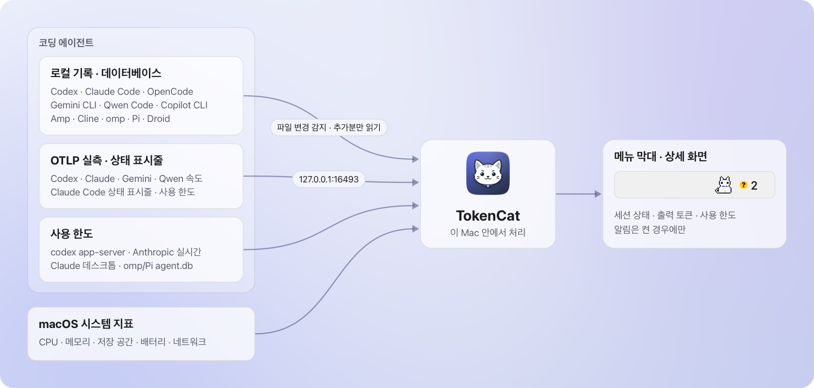
</picture>

- **로그**에서 세션, 모델, 출력 토큰, 진행 상태를 읽습니다. 로그가 기록한 시점에만 반영하므로 Claude Code처럼 메시지가 끝날 때 기록하는 클라이언트는 메시지 완료 후 숫자가 오릅니다. 진행 표시는 마지막 기록 뒤 허용 시간(모델 응답 대기 10분, Claude Code 도구 15분, Codex 도구 120초) 안에서만 유지하고, 지나면 `로그 대기`로 바꿉니다. OS 프로세스가 살아 있는지를 뜻하지는 않습니다.
- **Gemini CLI·Qwen Code** 대화 로그(`~/.gemini/tmp`, `~/.qwen/projects`)도 폴더가 있으면 하위 에이전트까지 같은 방식으로 읽습니다. 로그에는 생성 시간이 없어, 속도는 TokenCat이 Codex·Claude Code처럼 연결하는 각 클라이언트의 자체 실측에서 옵니다. 메인 대화의 응답마다 출력 토큰을 요청 시간으로 나눈 값(**요청 tok/s**)입니다.
- **OpenCode** 세션은 폴더가 있으면 데이터베이스(`~/.local/share/opencode/opencode.db`, 또는 `$XDG_DATA_HOME`·`OPENCODE_DB`)를 읽기 전용으로 열어 읽습니다. 기존 형식과 OpenCode 2의 `session_message` 형식을 모두 읽고, 두 곳에 다 있는 세션은 한쪽만 읽어 두 번 세지 않습니다. **Kilo Code**(`~/.local/share/kilo/kilo.db`)와 **MiMo Code**(`~/.local/share/mimocode/mimocode.db`)도 같은 저장 방식이라 함께 읽고 각자의 이름으로 보입니다. OpenCode는 응답마다 시작 시각과 마지막 토큰이 생성된 시각을 기록하므로, 수집기 없이도 그 기록으로 잰 **요청 tok/s**가 붙습니다.
- **Copilot CLI·Amp·Factory Droid** 로그(`~/.copilot/session-state`, `~/.local/share/amp/threads`, `~/.factory/sessions` 또는 `$FACTORY_HOME_OVERRIDE/.factory/sessions`)도 폴더가 있으면 같은 방식으로 읽습니다. Copilot CLI는 권한 확인도 기록하므로 `입력 필요`로 보이고, Droid는 세션 출력 합계만 기록하므로 합계가 늘어난 만큼 출력으로 보입니다. 셋 다 생성 시간을 기록하지 않아 속도는 붙지 않습니다.
- **Cline·Roo Code·Kilo Code·Zoo Code·IBM Bob** 작업(모든 VS Code 계열 에디터의 `globalStorage/<확장>/tasks`)과 Cline 공용 저장소(`~/.cline/data/tasks`, **Cline CLI** 세션은 `~/.cline/data/sessions`; `CLINE_DIR`·`CLINE_DATA_DIR`·`CLINE_SESSION_DATA_DIR`)도 폴더가 있으면 읽습니다. 질문이나 승인 요청은 `입력 필요`로 보입니다. 생성 시간을 기록하지 않아 속도는 붙지 않습니다.
- **omp·Pi** 세션 로그(`~/.omp/agent/sessions`와 그 이름 붙은 프로필, `~/.pi/agent/sessions`, 그리고 `PI_CODING_AGENT_DIR`·`PI_CONFIG_DIR`·`$XDG_DATA_HOME/omp`·Pi의 `PI_CODING_AGENT_SESSION_DIR`)도 폴더가 있으면 하위 에이전트까지 같은 방식으로 읽습니다. omp는 요청마다 걸린 시간을 기록하므로, 수집기 없이도 그 기록으로 잰 **요청 tok/s**가 붙습니다.
- **Cursor** 에이전트 세션은 IDE와 `cursor-agent` CLI 모두(`~/.cursor/projects`, `CURSOR_CONFIG_DIR`) Cursor의 대화 기록과 자체 데이터베이스에서 상태·모델·제목·컨텍스트·프로젝트를 읽습니다. Cursor는 토큰 수를 디스크에 남기지 않으므로 출력 토큰과 속도는 표시하지 않습니다.
- **Grok**(xAI의 Grok Build CLI, `~/.grok/sessions` 또는 `$GROK_HOME`)은 모델 호출마다 걸린 시간을 기록하는 Grok의 `logs/unified.jsonl`에서 호출별 출력 토큰과 잰 **요청 tok/s**를 읽습니다.
- **Hermes**(Nous Research의 Hermes Agent)는 `~/.hermes/state.db`(또는 `$HERMES_HOME`)와 프로필마다의 `state.db`를 읽기 전용으로 엽니다. 출력은 Hermes 세션 합계가 늘어난 만큼이고, 컨텍스트와 **요청 tok/s**는 `logs/agent.log`의 `API call` 줄에서 오므로 그 로그에 세션의 최근 호출이 남아 있을 때만 보입니다.
- **OpenClaw**(예전 Clawdbot·Moltbot 설치 포함, `~/.openclaw/agents` 또는 `$OPENCLAW_STATE_DIR`)는 에이전트마다의 SQLite 저장소와 예전 JSONL 파일을 읽습니다. 최근 버전은 큰 항목을 TokenCat이 풀 수 없는 형식으로 압축하므로, 턴의 출력이 실행이 끝난 뒤 OpenClaw 자체 합계로만 보일 수 있습니다. 요청 시간을 기록하지 않아 속도는 붙지 않습니다.
- **Goose**(`~/.local/share/goose/sessions/sessions.db` 또는 `$GOOSE_PATH_ROOT`)는 읽기 전용으로 열어, 사용량 원장에서 모델 호출마다의 출력 토큰을 읽고 Goose가 호출 시간을 기록했으면 **요청 tok/s**를 붙입니다. 다른 에이전트의 CLI나 ACP 서버를 돌리는 세션(claude-code, codex, gemini-cli, cursor-agent, `*-acp`)은 그 에이전트의 로그를 이미 세므로 토큰과 속도를 보고하지 않습니다.
- **Kimi Code**(`~/.kimi-code/sessions` 또는 `$KIMI_CODE_HOME`), Kimi 데스크톱 앱 안의 같은 런타임(**Kimi Work**로 표시), 보관된 kimi-cli(`~/.kimi/sessions`, **Kimi CLI**로 표시)를 하위 에이전트까지 읽습니다. Kimi Code는 단계마다 첫 토큰 대기와 스트리밍 시간을 기록하므로 Kimi Code·Kimi Work 세션에는 잰 **요청 tok/s**가 붙고, Kimi CLI 세션에는 속도도 제목도 없습니다. Kimi Code가 kimi-cli에서 옮겨 온 세션은 한 번만 보입니다.
- **그 밖의 데이터 폴더**도 클라이언트가 쓰는 대로 따라갑니다: `CODEX_HOME`, `CLAUDE_CONFIG_DIR`(쉼표로 여럿 지정 가능)와 `~/.config/claude`, Gemini CLI의 macOS 샌드박스 폴더 `~/.cache/.gemini`. 다른 클라이언트의 형식으로 기록하는 제품은 자기 이름으로 보입니다: **TRAE CLI**(Codex 형식, `~/.trae/cli/sessions`), **OpenClaude**(`~/.openclaude`)와 **Qoder**(`~/.qoder`, Claude Code 형식). 이 행에는 Codex·Claude 계정 한도와 재개 명령이 없습니다.
- **실측**은 제공사·세션·에이전트 식별자가 정확히 일치할 때만 세션 행에 붙입니다. 모델 이름이나 시간이 가깝다는 이유로 연결하지 않습니다. 속도는 근거에 따라 단위를 나눠 표시합니다.
- **사용 한도**는 `실시간 한도 확인`이 켜져 있으면 실시간 확인(Codex는 로컬 `codex app-server`, Claude는 Claude Code에 저장된 토큰, 그 토큰이 없거나 만료됐으면 같은 계정의 omp·Pi 토큰으로 `api.anthropic.com`)에서, 그리고 Codex 로그, Claude Code가 상태 표시줄을 그릴 때 브리지가 같은 수집기(`/v1/claude/status`)로 보낸 상태 JSON(5시간·주간 한도만), Claude 데스크톱 앱의 사용량 기록 파일(마지막 사용률과 기록 시각만), omp·Pi의 사용량 기록(`agent.db`, 읽기 전용으로 열어 최근 사용률·초기화 시각·기록 시각만)에서 읽습니다.
- **업데이트**와 **실시간 한도 확인**만 이 Mac 밖으로 나갑니다. 업데이트는 GitHub API에 최신 릴리스를 물어 버전 번호를 비교하고, `업데이트`를 누를 때만 파일을 내려받습니다. 둘 다 위 그림의 수집 경로와는 따로 돕니다.

| 단위 | 근거 |
|---|---|
| 생성 tok/s | Codex 서버가 보낸 실제 토큰 간 시간(TBT)의 역수 |
| 모델 tok/s | 여러 관측을 묶어 보낸 서버 지표의 평균 토큰 간 시간. 개별 세션 속도로 귀속하지 않음 |
| 요청 tok/s | 출력 토큰 ÷ 요청 시간. Claude Code `api_request`의 성공 요청 시간이거나 OpenCode·omp·Grok·Hermes·Goose·Kimi Code가 로그에 기록한 응답 시간. 첫 응답 대기·추론을 포함하므로 순수 생성 속도가 아님 |

더 자세한 규칙은 [자세한 동작](docs/DETAILS.ko.md)의 [토큰 지표](docs/DETAILS.ko.md#토큰-지표), [세션과 상태](docs/DETAILS.ko.md#세션과-상태), [수집 범위와 갱신](docs/DETAILS.ko.md#수집-범위와-갱신)에 있습니다.

## 자주 묻는 질문

<details>
<summary><b>처음 열 때 Apple이 악성 코드가 없음을 확인할 수 없다고 나와요.</b></summary>

<br>

TokenCat이 Apple 공증을 받지 않은 앱이라 나오는 안내입니다. [처음 열 때](#처음-열-때)의 순서대로 한 번 허용하면 그다음부터는 바로 열립니다. 소스 코드를 직접 확인하고 [소스에서 빌드](#소스에서-빌드)해도 됩니다.

</details>

<details>
<summary><b>인터넷으로 무엇을 보내나요?</b></summary>

<br>

두 가지 요청뿐이며, 어느 쪽도 사용 기록·기기 정보·식별자를 보내지 않습니다. 로그·실측·대화 내용은 이 Mac 밖으로 나가지 않습니다.

- **업데이트 확인**: `api.github.com`에 이 저장소의 최신 릴리스를 묻는 GET 요청이며, HTTP 요청에 기본으로 따르는 정보(IP 주소, `TokenCat/0.9.0` 같은 User-Agent, `en`으로 고정한 언어 헤더)만 실립니다. 바뀌지 않은 응답은 다시 받지 않도록 캐시 확인 헤더를 쓰고, GitHub가 요청 한도를 알리면 그 시각까지 쉽니다. 설정 › 정보에서 `새 버전 자동 확인`을 끄면 직접 누를 때만 확인합니다. `업데이트`를 누르면 그때 GitHub에서 `TokenCat.zip`을 내려받습니다.
- **실시간 한도 확인**(기본 켜짐): Codex는 로컬 `codex app-server`를 잠깐 실행해, Codex CLI가 자기 로그인으로 OpenAI에 한도를 묻게 합니다. Claude는 Claude Code에 저장된 로그인 토큰(그 토큰이 없거나 만료됐으면 같은 계정으로 omp·Pi에 저장된 토큰)으로 `https://api.anthropic.com/api/oauth/usage`에 GET 요청을 한 번 보내며, 토큰은 메모리에만 두고 저장·기록·갱신하지 않습니다. 설정 › 실측의 `실시간 한도 확인`으로 끕니다.

</details>

<details>
<summary><b>업데이트는 어떻게 하나요?</b></summary>

<br>

새 버전이 나오면 상세 화면 아래쪽에 `새 버전` 줄이 나타납니다. `업데이트`를 누르면 내려받기, SHA-256 확인, 교체, 다시 실행까지 한 번에 합니다. 자동으로 설치하지는 않습니다. 자세한 내용은 [업데이트](#업데이트)에 있습니다. 소스에서 빌드했다면 `git pull` 뒤 `./build.sh`를 다시 실행해도 됩니다.

</details>

<details>
<summary><b>속도가 <code>—</code>로 보여요.</b></summary>

<br>

실측이 아직 없다는 뜻입니다. TokenCat은 로그 시각으로 속도를 만들지 않습니다. 실측을 받으려면 TokenCat이 실행 중이어야 하고, 연결 뒤 Codex·Claude Code·Gemini CLI·Qwen Code를 새로 실행해야 합니다(OpenCode·omp·Grok·Hermes·Goose·Kimi Code는 요청 시간을 스스로 기록하므로 따로 할 일이 없습니다). 설정 › 실측 탭에서 클라이언트별 수신 여부를 확인할 수 있습니다. 클라이언트 버전이나 서버 응답에 따라 지표가 오지 않을 수도 있습니다. 출력 카드의 `지금 속도`는 2분 안에 받은 실측만 쓰므로, 그보다 오래됐거나 세션이 지금과 다른 모델로 잰 값이면 행에 속도가 있어도 `속도 실측 없음`으로 둡니다. 이유는 그 문구나 행의 `—`에 포인터를 올리면 보입니다.

</details>

<details>
<summary><b>출력 막대나 고양이 걸음이 빠르면 토큰도 빨리 나오는 건가요?</b></summary>

<br>

아닙니다. 막대는 5초마다 기록된 양이고, 기본 움직임 기준에서 고양이 박자는 상태별로 고정입니다. 실측 속도에 따라 움직이게 하려면 설정 › 캐릭터에서 'AI 실측 속도'를 고르세요. 최근 5초 안의 실측에만 반응합니다.

</details>

<details>
<summary><b>Claude 웹이나 데스크톱 채팅도 보이나요?</b></summary>

<br>

아니요. 터미널이나 데스크톱 앱에서 실행한 Claude Code 세션만 수집합니다. Claude 웹과 일반 데스크톱 채팅은 Claude Code와 다른 경로라 대상이 아닙니다.

</details>

<details>
<summary><b>Codex 데스크톱 앱의 속도는요?</b></summary>

<br>

Codex 데스크톱(codex-app-server)은 로그와 trace를 보내지만 요청별 생성 시간 형식을 확인하지 못해 속도를 `—`로 표시합니다.

</details>

<details>
<summary><b>Claude 사용 한도가 보이지 않아요.</b></summary>

<br>

`실시간 한도 확인`(설정 › 실측)이 켜져 있으면 Claude Code에 저장된 로그인으로 Anthropic에 묻고, 상세 화면을 열면 바로 확인합니다. macOS에서는 처음 확인할 때 `Claude Code-credentials` 키체인 항목 접근을 물을 수 있고, 거부하면 그 실행 동안은 `~/.claude/.credentials.json`만 읽습니다. TokenCat은 토큰을 갱신하지 않습니다. Claude Code 토큰이 없거나 만료됐으면 같은 계정으로 omp·Pi에 저장된 Claude 로그인을 쓰며, omp·Pi는 쓰는 동안 이 토큰을 갱신합니다. 그 밖에는 만료된 토큰을 Claude Code를 다시 실행해 갱신될 때까지 보내지 않습니다.

쓸 수 있는 토큰이 없으면 Claude 한도는 Claude Code가 상태 표시줄 명령에 넘기는 `rate_limits`(5시간·주간)에서 옵니다. 이 값은 Claude.ai 구독 계정에서만, 그것도 첫 응답을 받은 뒤에야 들어 있습니다. 그래서 TokenCat이 실행 중이고, 연결 뒤 새로 실행한 Claude Code가 응답을 한 번 받아 상태 표시줄을 다시 그려야 행이 나타납니다. Claude 데스크톱 앱에서 쓴다면 데스크톱 앱이 약 15분마다 남기는 사용량 기록에서도 읽으므로, 그 앱을 한 번 쓴 뒤 기록이 생기면 나타납니다. 한 번 받은 값은 다음 실행에도 남고, 초기화 시각이 지나면 `—`와 `초기화됨`을 하루 동안 보인 뒤 숨깁니다. `statusLine`이 명령 형식이 아니면 연결을 건너뛰고, 브리지를 직접 지웠다면 다시 넣지 않습니다.

</details>

<details>
<summary><b>Claude Code 상태 표시줄 설정이 바뀌었어요.</b></summary>

<br>

사용 한도를 받으려고 TokenCat이 `statusLine` 명령을 `/bin/sh "$HOME/Library/Application Support/TokenCat/claude-statusline.sh"`로 감싼 것입니다. 브리지는 원래 명령(`claude-statusline-command` 파일)을 같은 입력으로 실행하므로 상태 표시줄 출력은 그대로이고, `padding` 같은 다른 필드도 유지합니다. 되돌리는 방법은 [연결 해제와 제거](#연결-해제와-제거)에 있습니다.

</details>

<details>
<summary><b>Claude Code 컨텍스트는 왜 비율이 아닌가요?</b></summary>

<br>

Claude Code가 컨텍스트 창 크기를 로그에 남기지 않기 때문입니다. 그래서 창 대비 비율 대신 `컨텍스트 182k`처럼 절대값으로 보여 주며, 창 크기를 모델 이름으로 추정하지 않습니다.

</details>

<details>
<summary><b>권한 확인을 기다리는 세션이 <code>입력 필요</code>로 바뀌지 않아요.</b></summary>

<br>

권한 확인 요청은 로그에 남지 않아 알 수 없습니다. `입력 필요`는 질문과 계획 승인처럼 로그에 기록되는 대기만 표시합니다.

</details>

<details>
<summary><b>이미 다른 OpenTelemetry 목적지를 쓰고 있어요.</b></summary>

<br>

기존 외부 실측 목적지와 충돌하면 덮어쓰지 않습니다. 이때는 상세 화면 아래쪽에 `실측 꺼짐 · 설정 충돌`이 표시되고, 누르면 설정의 실측 탭이 열립니다. 세션 상태와 토큰 수는 로그에서 읽으므로 계속 보입니다. Gemini CLI·Qwen Code는 그 클라이언트만 건너뜁니다. 설정 › 실측의 해당 줄에 `연결 안 함 · 기존 실측 설정 유지`와 이유가 보이고, 다른 클라이언트는 그대로 연결합니다.

</details>

<details>
<summary><b>자원은 얼마나 쓰나요?</b></summary>

<br>

CPU·메모리 측정값은 아직 이 문서에 정리하지 않았습니다. 대신 이렇게 부담을 줄입니다.

- 로그 파일은 이후 추가된 부분만 읽습니다. 파일 변경 이벤트(FSEvents)로 깨어나되 다시 읽기는 초당 최대 4회이고, 1초 주기 확인과 60초 주기 새 파일 확인이 함께 돕니다(아직 추적하지 않던 로그에 기록이 생기면 바로 엽니다).
- 시스템·로그 수집과 로컬 실측은 각각 독립된 백그라운드 큐에서 처리합니다.
- 실측은 정해진 개수만 메모리에 두고, 수집기는 본문 크기·동시 연결·요청 시간을 제한합니다.
- 고양이를 숨겼거나 화면이 잠들었거나 메뉴 막대가 가려지면 애니메이션 타이머를 멈추고, 잠든 뒤 20분이 지나도 멈춥니다.

</details>

## 개발

```sh
./build.sh
dist/TokenCat.app/Contents/MacOS/TokenCat --self-test                    # 로그 파싱·상태·실측·설정 백업·상태 표시줄 브리지·업데이트 단계 검사
dist/TokenCat.app/Contents/MacOS/TokenCat --telemetry-lifecycle-checks   # 테스트용 루프백 포트로 수집기 수명 검사
dist/TokenCat.app/Contents/MacOS/TokenCat --live-check                   # 실제 시스템·로그로 약 6초간 갱신 확인
dist/TokenCat.app/Contents/MacOS/TokenCat --update-check                 # 최신 릴리스와 비교만(설치하지 않음)
```

화면은 로컬 로그와 수집기 대신 합성 데이터로도 렌더할 수 있습니다.

```sh
dist/TokenCat.app/Contents/MacOS/TokenCat --snapshot-fixtures work/fixtures
dist/TokenCat.app/Contents/MacOS/TokenCat --snapshot-menubar work/menubar-states.png --fixtures
dist/TokenCat.app/Contents/MacOS/TokenCat --snapshot-settings work/settings.png --pane all --fixtures
```

스냅숏과 명령줄 출력의 언어는 `--language ko|en`으로 고를 수 있습니다. README의 이미지는 위 합성 스냅숏과 `Assets/`만으로 다시 만들며, 글자가 들어간 이미지는 `docs/images/ko/`와 `docs/images/en/`에 언어별로 만듭니다. 방법은 [`docs/Generator`](docs/Generator/README.md)에 있습니다.

```sh
mkdir -p work && swiftc -O docs/Generator/*.swift -o work/docs-generator && work/docs-generator
```

> [!WARNING]
> 픽스처 없는 `--snapshot`과 `--diagnose`는 이 Mac의 실제 프로젝트 이름·경로와 세션 제목을 담습니다. 이슈나 문서에 붙이지 마세요.

전체 명령과 검사 범위는 [자세한 동작 › 검증 명령](docs/DETAILS.ko.md#검증-명령)에 있습니다.

### 프로젝트 구조

| 경로 (`Sources/TokenCat/` 기준) | 내용 |
|---|---|
| `Entry.swift` | 진입점과 명령줄 옵션(검사·스냅숏·진단·실측 연결·업데이트 확인·실시간 한도) |
| `App.swift` | 앱 수명, 메뉴 막대 항목, 팝오버·패널, 설정 값 |
| `Models.swift` | 시스템·토큰·세션 상태 데이터 모델 |
| `StatusBarView.swift` | 메뉴 막대 렌더링 |
| `DashboardView.swift`, `SessionPresentation.swift`, `TokenFlow.swift` | 상세 화면, 세션 묶음과 상태, 출력 막대 |
| `SettingsView.swift` | 설정 창 |
| `TokenTracker.swift`, `LogWatcher.swift` | 로컬 JSONL 파싱과 파일 변경 감지 |
| `TokenProviders.swift`, `Providers/` | 클라이언트 목록과 그 밖의 클라이언트별 기록 읽기(OpenCode/Kilo Code/MiMo Code, Gemini CLI·Qwen Code, Copilot CLI, Amp, Cline/Roo/Kilo/Zoo/IBM Bob, omp/Pi, Droid, Cursor, Grok, Hermes, OpenClaw, Goose, Kimi) |
| `SessionTitle.swift` | 클라이언트가 만들었거나 사용자가 바꾼 세션 제목 |
| `LiveLimits.swift`, `AgentUsageHistory.swift` | 실시간 한도 확인(`codex app-server`, Anthropic)과 omp·Pi 사용량 기록 |
| `Telemetry.swift`, `TelemetrySetup.swift`, `TokenSpeed.swift` | 로컬 OTLP·상태 표시줄 수집기, 클라이언트 설정 연결·복구와 Claude Code 상태 표시줄 브리지, 실측 속도 |
| `Updater.swift` | GitHub 최신 릴리스 확인, 내려받기·SHA-256 검증·앱 교체·다시 실행 |
| `SystemSampler.swift` | CPU·메모리·저장 공간·배터리·네트워크 |
| `Runner.swift`, `RunnerAnimator.swift` | 고양이 스프라이트와 움직임 |
| `Notifier.swift`, `LoginItem.swift` | 알림, 로그인 항목 |
| `DesignTokens.swift` | 서체·색·상태 글리프 |
| `Localization.swift` | 표시 언어 결정과 영어·한국어 문구(`loc`)·시간 형식 |
| `*Checks.swift`, `SnapshotFixtures.swift` | `--self-test` 검사와 합성 스냅숏 |

저장소 루트의 [`Assets/`](Assets)에는 스프라이트·아이콘과 이를 만드는 Swift 코드(`Assets/Generator/`)가, [`docs/Generator/`](docs/Generator/README.md)에는 README 미리보기 이미지 생성기가 있습니다.

## 라이선스

소스와 저장소에 포함된 TokenCat 생성 자산은 [MIT License](LICENSE)로 공개합니다. MIT 라이선스: 저작권 고지(출처)만 남기면 상업적 이용을 포함해 자유롭게 사용·수정·배포할 수 있습니다. RunCat의 이미지나 코드는 사용하지 않습니다. TokenCat은 Codex나 Claude Code의 공식 도구가 아닙니다.
