<p align="center">
  
</p>

<h1 align="center">TokenCat</h1>

<p align="center">
  <b>Codex와 Claude Code가 지금 무엇을 하고 있는지,<br>메뉴 막대의 픽셀 고양이가 알려 줍니다.</b>
</p>

<p align="center">
  
  
  
  <a href="LICENSE"></a>
</p>

<p align="center">
  <picture>
    <source media="(prefers-color-scheme: dark)" srcset="docs/images/hero-dark.png">
    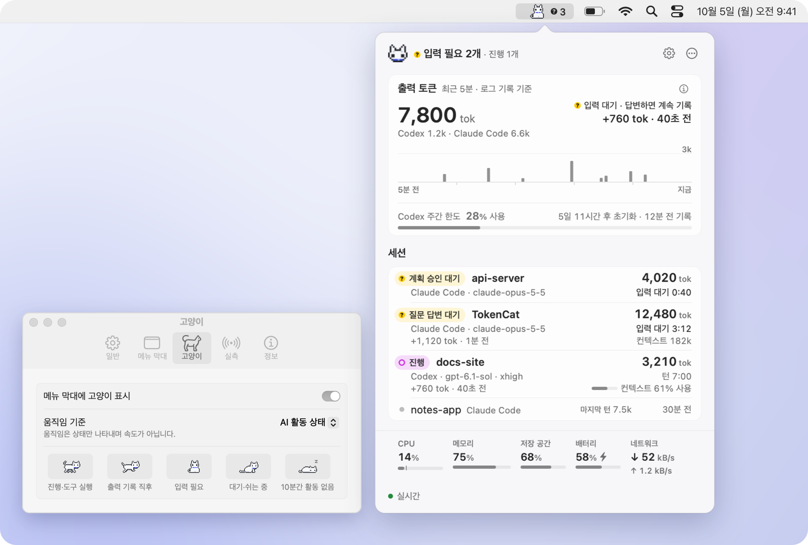
  </picture>
</p>

<p align="center">
  <a href="#주요-기능">주요 기능</a> ·
  <a href="#개인정보와-안전">개인정보</a> ·
  <a href="#설치">설치</a> ·
  <a href="#작동-방식">작동 방식</a> ·
  <a href="#자주-묻는-질문">자주 묻는 질문</a> ·
  <a href="docs/DETAILS.md">자세한 동작</a>
</p>

---

터미널 여러 개에서 Codex와 Claude Code를 돌리다 보면 어느 세션이 일하고 있고 어느 세션이 내 답을 기다리는지 놓치기 쉽습니다. TokenCat은 그 상태를 메뉴 막대 한 칸에 모읍니다. 고양이가 걸으면 작업 중이고, 정면을 보고 앉아 있으면 입력이 필요하다는 뜻입니다. 항목을 누르면 세션별 상태, 최근 5분 출력 토큰, Codex 사용 한도, Mac 시스템 지표를 한 화면에서 봅니다.

숫자는 있는 그대로 보여 줍니다. 토큰 수는 로컬 로그에 실제로 기록된 값이고, tok/s 속도는 클라이언트가 이 Mac의 수집기로 보낸 **실측**이 있을 때만 표시합니다. 로그 시각의 차이로 속도를 추정하지 않으며, 모르는 값은 `—`로 둡니다.

- **입력 요청을 놓치지 않게**: 질문이나 계획 승인을 기다리는 세션은 노란 `?`와 정면을 보는 고양이로 알립니다. 원하면 알림도 보냅니다.
- **세션과 하위 에이전트를 한 목록에**: 진행 상태, 실행 중인 도구 종류, 이번 턴 출력, 컨텍스트를 세션마다 보여 주고 하위 에이전트는 부모 아래에 묶습니다.
- **로컬 전용**: 대화 본문을 저장하지 않고, 실측 수집기는 `127.0.0.1`에서만 열며, 모델 호출이나 계정 로그인을 하지 않습니다. 실측을 받기 위해 Codex·Claude Code 설정에 이 Mac으로 보내는 전송 설정을 자동으로 추가하며, 원본은 먼저 백업합니다.
- **네이티브 앱**: Swift·AppKit·SwiftUI만 쓰고 외부 패키지가 없습니다. macOS 13 이상이 대상입니다.

## 주요 기능

### 출력 흐름을 한눈에

<p align="center">
  <picture>
    <source media="(prefers-color-scheme: dark)" srcset="docs/images/popover-flow-dark.png">
    
  </picture>
</p>

최근 5분 동안 로그에 기록된 출력 토큰을 5초 단위 막대로 보여 줍니다. 두 클라이언트가 함께 기록하면 `Codex 1.2k · Claude Code 6.6k`처럼 나눠 보입니다. 오른쪽에는 마지막 기록이 나오고, 30초 동안 새 기록이 없으면 그 자리에서 지금 기다리는 이유(입력 대기, 계획 승인 대기, API 재시도, `명령 실행 중` 같은 도구 범주)를 알려 줍니다. 막대는 기록량이며 속도로 환산하지 않습니다.

### 세션마다 지금 하는 일

<p align="center">
  <picture>
    <source media="(prefers-color-scheme: dark)" srcset="docs/images/popover-sessions-dark.png">
    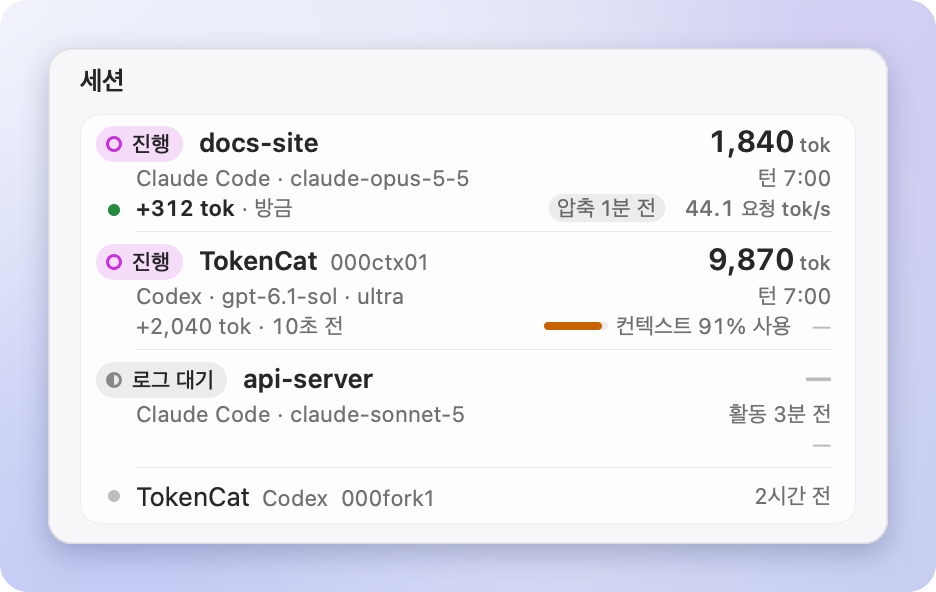
  </picture>
</p>

진행 중인 세션이 위로 올라옵니다. 행마다 상태 칩, 이번 턴 출력 누적, 클라이언트·모델·Codex effort, 턴 경과 시간, 컨텍스트 사용량을 보여 줍니다. 컨텍스트는 Codex의 경우 기록된 창 대비 비율(`컨텍스트 91% 사용`)로, Claude Code는 창 크기를 기록하지 않아 `컨텍스트 182k`처럼 절대값으로 표시하고, 압축했으면 `압축 1분 전`을 붙입니다. 실측이 있는 세션에는 `44.1 요청 tok/s`처럼 근거 단위와 함께 속도가 붙고, 없으면 `—`로 둡니다.

`입력 필요`는 Claude Code의 질문(AskUserQuestion)·계획 승인(ExitPlanMode)과 Codex Plan 모드의 질문(`request_user_input`)을 로그에서 읽어 판단합니다. 권한 확인 요청은 로그에 남지 않아 표시하지 못합니다.

### 하위 에이전트는 부모 아래에

<p align="center">
  <picture>
    <source media="(prefers-color-scheme: dark)" srcset="docs/images/popover-subagents-dark.png">
    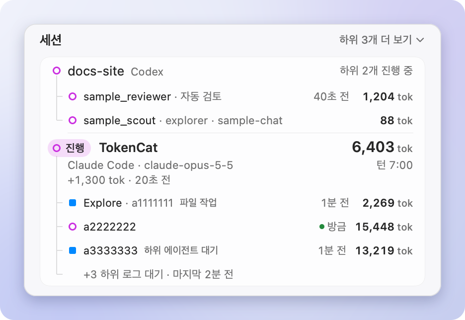
  </picture>
</p>

Codex와 Claude Code의 하위 에이전트를 정확한 부모 세션 식별자로 묶어 트리로 보여 줍니다. 제목은 역할이나 별명(공통 역할이면 짧은 ID)이고, 실행 중인 하위는 모두 보이며 로그를 기다리는 하위는 `+3 하위 로그 대기`처럼 한 줄로 접습니다.

### 상세와 복사는 클릭 한 번으로

<p align="center">
  <picture>
    <source media="(prefers-color-scheme: dark)" srcset="docs/images/popover-detail-dark.png">
    
  </picture>
</p>

행을 클릭하거나 Return을 누르면 세션 ID, 모델, 실행 중인 도구, 기록 시점이 펼쳐집니다. 우클릭 메뉴에서는 세션·에이전트 ID와 재개 명령(`claude --resume …`, `codex resume …`)을 복사하고, 기록 파일이나 프로젝트 폴더를 Finder에서 보여 줍니다. 파일 내용은 열지 않습니다. ↑↓ · Return · ⌘C로 키보드만으로도 다룰 수 있습니다.

### Codex 사용 한도

<p align="center">
  <picture>
    <source media="(prefers-color-scheme: dark)" srcset="docs/images/popover-limits-dark.png">
    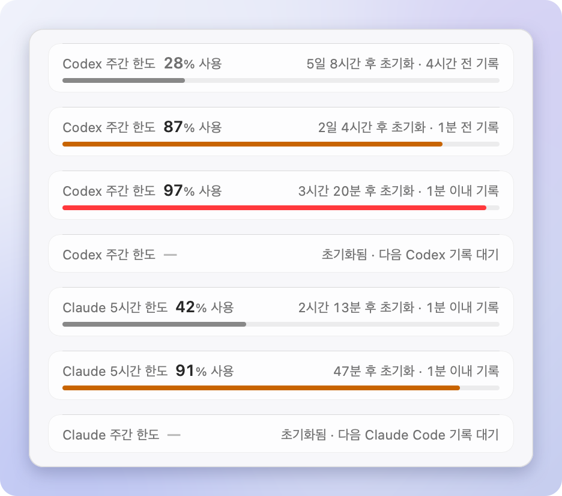
  </picture>
</p>

Codex 로그에 마지막으로 기록된 사용률, 초기화까지 남은 시간, 기록된 지 얼마나 됐는지를 출력 카드 맨 아래에 보여 줍니다. 85% 이상은 주황, 95% 이상은 빨강이고 초기화 시각이 지나면 `—`로 바뀝니다. 실시간 잔여량이나 소진 예측은 아닙니다. Claude Code는 한도를 로그에 남기지 않아 표시하지 않습니다.

### 메뉴 막대는 원하는 만큼

<p align="center">
  <picture>
    <source media="(prefers-color-scheme: dark)" srcset="docs/images/menubar-layouts-dark.png">
    
  </picture>
</p>

**최소**(약 72pt), **두 줄**(기본, 약 272pt), **한 줄**(약 410pt) 중에서 고르고, 항목을 켜고 끄거나 끌어서 순서를 바꿉니다. 항목마다 폭이 고정이라 값이 바뀌어도 옆 아이콘이 흔들리지 않습니다. 배터리가 없는 Mac에서는 배터리 항목을 숨깁니다.

<p align="center">
  <picture>
    <source media="(prefers-color-scheme: dark)" srcset="docs/images/menubar-states-dark.png">
    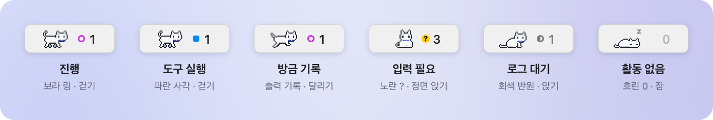
  </picture>
</p>

AI 숫자는 진행 중이거나 입력을 기다리는 최상위 세션 수이고, 마크는 상세 화면과 같은 글리프입니다. 출력 기록은 마크 대신 고양이가 잠깐 달리는 것으로 보여 줍니다. 항목을 우클릭하면 급한 세션 세 개까지 바로 고를 수 있는 빠른 메뉴가 열립니다.

### 상태를 보여 주는 고양이

<p align="center">
  <picture>
    <source media="(prefers-color-scheme: dark)" srcset="docs/images/cat-dark.gif">
    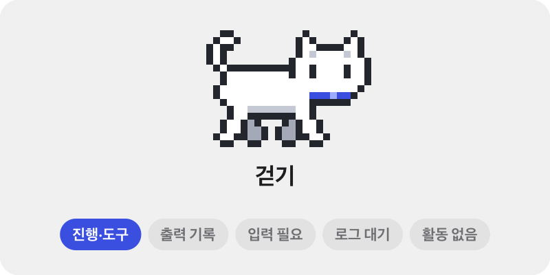
  </picture>
</p>

기본 움직임 기준인 **AI 활동 상태**에서는 진행·도구 실행 중에 걷고, 새 출력이 기록되면 1.2초 달리고, 입력이 필요하면 정면을 보고 앉습니다. 로그를 기다리는 동안 앉아서 깜빡이고, 10분간 활동이 없으면 잠듭니다. 박자는 상태별로 고정이라 속도를 뜻하지 않습니다. 설정에서 CPU 사용률, AI 실측 속도, 멈춤으로 바꿀 수 있고 '동작 줄이기'를 따릅니다.

<p align="center">
  <picture>
    <source media="(prefers-color-scheme: dark)" srcset="docs/images/poses-dark.png">
    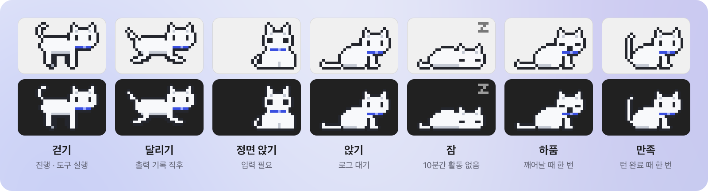
  </picture>
</p>

고양이는 32 × 20pt 칸에 흐림 없이 1:1로 그리는 픽셀 아트입니다. 상세 화면 헤더와 16·32 px 앱 아이콘도 같은 픽셀 머리를 씁니다.

### 설정과 알림

<p align="center">
  <picture>
    <source media="(prefers-color-scheme: dark)" srcset="docs/images/settings-dark.png">
    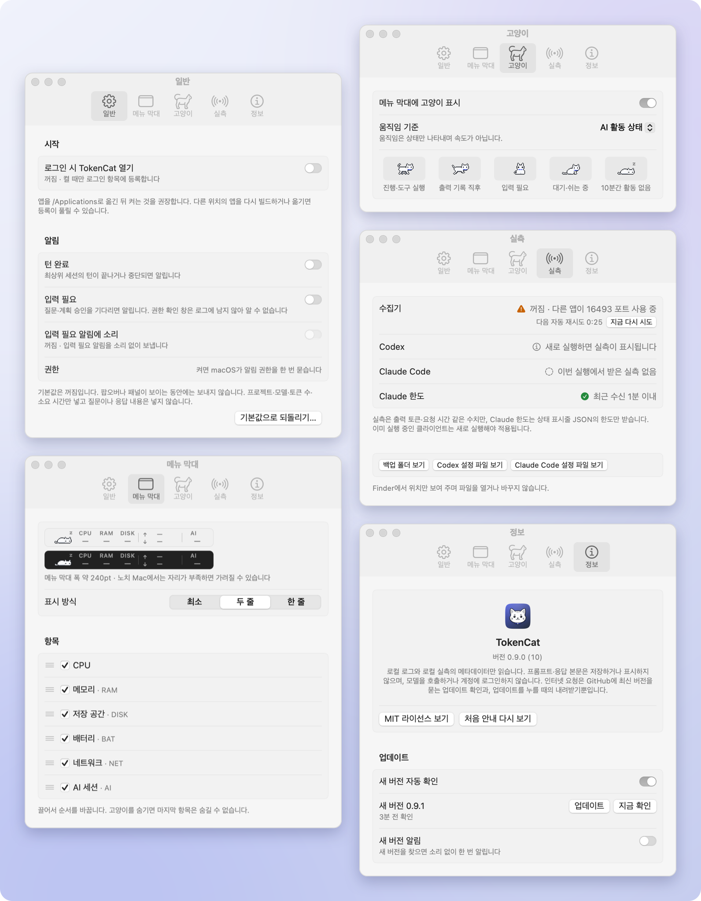
  </picture>
</p>

- **일반**: 로그인 시 열기와 알림(턴 완료, 입력 필요, 입력 필요 알림 소리). 모두 기본으로 꺼져 있고, 켤 때만 로그인 항목에 등록하거나 알림 권한을 묻습니다.
- **메뉴 막대**: 라이트·다크 1:1 미리보기, 표시 방식, 항목 표시·순서.
- **고양이**: 표시 여부, 움직임 기준, 상태별 자세 범례.
- **실측**: 수집기 상태, 클라이언트별 수신 여부, 백업 폴더 바로 보기.
- **정보**: 버전, 개인정보 문구, MIT 라이선스.

알림에는 프로젝트, 클라이언트·모델, 토큰 수, 소요 시간만 넣고 질문이나 응답 내용은 넣지 않습니다. 상세 화면이 보이는 동안에는 보내지 않습니다.

## 개인정보와 안전

<p align="center">
  <picture>
    <source media="(prefers-color-scheme: dark)" srcset="docs/images/popover-onboarding-dark.png">
    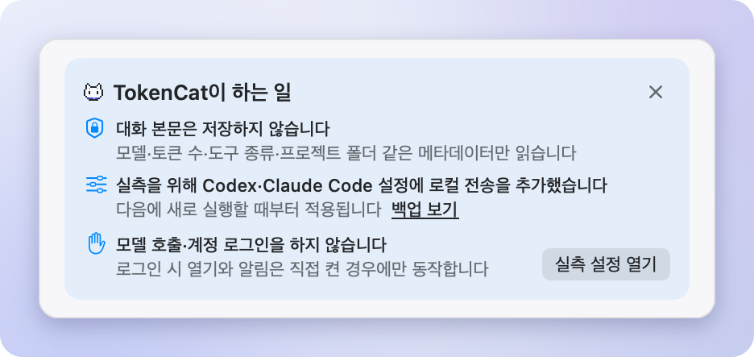
  </picture>
</p>

처음 실행하면 TokenCat이 실제로 한 일과 하지 않는 일을 위 카드로 알려 줍니다.

- **본문은 저장하지 않습니다.** 로컬 로그에서 모델·토큰 수·도구 종류·프로젝트 폴더 같은 메타데이터만 씁니다. 도구 입력은 읽지 않고, API 재시도 기록의 오류 메시지도 저장하지 않습니다.
- **수집기는 이 Mac 안에만 엽니다.** `127.0.0.1:16493`에서만 받고, 웹페이지 Origin이 붙은 요청은 거부합니다. 받은 실측은 정해진 개수만 메모리에 두고 파일로 남기지 않습니다.
- **본문 전송은 끈 채로 연결합니다.** Codex·Claude Code 설정에 실측 전송을 추가할 때 프롬프트·응답 본문 로깅은 끕니다.
- **모델 호출·계정 로그인이 없습니다.** TokenCat은 어떤 모델도 호출하지 않고 어떤 계정에도 로그인하지 않습니다.
- **원본 설정을 먼저 백업합니다.** 바꾸기 전에 원본을 접근 제한된 폴더에 보관하고, 기존 외부 실측 목적지와 충돌하면 덮어쓰지 않습니다. 연결 뒤 설정 파일을 직접 고쳤다면 연결 해제 명령(`--disconnect-telemetry`)도 그 파일을 덮어쓰지 않습니다.
- **로그인 항목과 알림은 직접 켤 때만.** 둘 다 기본으로 꺼져 있습니다.

## 설치

현재는 소스에서 빌드합니다. macOS 13 이상과 Swift 툴체인(Xcode 또는 Command Line Tools)이 필요합니다. `Package.swift`는 Swift 5.9 이상을 요구하며, macOS 27.0.1 · Swift 6.4에서 빌드를 확인했습니다.

> [!IMPORTANT]
> 처음 실행하면 실측을 받기 위해 Codex `~/.codex/config.toml`과 Claude Code `~/.claude/settings.json`에 이 Mac(`127.0.0.1:16493`)으로 보내는 설정을 **자동으로** 추가합니다. 원본은 먼저 백업하고 프롬프트·응답 본문 로깅은 끕니다. 실행할 때마다 연결을 다시 확인하며, 이를 끄는 설정은 아직 없습니다. 되돌리는 방법은 [연결 해제와 제거](#연결-해제와-제거)에 있습니다.

```sh
git clone https://github.com/SeuPut0705/TokenCat.git
cd TokenCat
./build.sh
open dist/TokenCat.app
```

`build.sh`는 릴리스 빌드로 `dist/TokenCat.app`을 만들고 이 Mac에서 실행하도록 ad-hoc 서명합니다. Developer ID 서명, 공증, 자동 업데이트, App Store 배포는 없습니다. 로그인할 때 자동으로 열려면 앱을 `/Applications`로 옮긴 뒤 설정 › 일반에서 켜세요. 다른 위치의 앱을 다시 빌드하거나 옮기면 등록이 풀릴 수 있습니다.

### 처음 실행하면

1. 메뉴 막대에 고양이가 나타납니다. Dock 아이콘은 없으며, 실행 중에 앱을 다시 열면 설정 창이 열립니다.
2. 로컬 수집기가 준비되면 Codex `~/.codex/config.toml`과 Claude Code `~/.claude/settings.json`에 로컬 실측 전송 설정을 **자동으로** 추가합니다. 원본은 `~/Library/Application Support/TokenCat/telemetry-backups/`에 먼저 백업하며, 인증·모델·훅 같은 기존 설정과 파일 권한은 그대로 둡니다. 수집기가 준비되지 않으면 설정을 바꾸지 않습니다.
3. 두 클라이언트는 **다음에 새로 실행할 때부터** 실측을 보냅니다. 진행 중인 작업은 재시작하지 않습니다. 세션 상태와 토큰 수는 로그에서 읽으므로 바로 보입니다.

<p align="center">
  <picture>
    <source media="(prefers-color-scheme: dark)" srcset="docs/images/popover-empty-dark.png">
    
  </picture>
</p>

아직 기록이 없으면 고양이가 잠든 화면이 보입니다. Codex나 Claude Code에서 새 세션을 시작하면 바로 나타납니다.

### 연결 해제와 제거

TokenCat은 실행될 때마다 실측 연결을 확인하고 필요하면 다시 추가합니다. 자동 연결을 끄는 설정은 아직 없으므로, 되돌리려면 TokenCat을 먼저 종료하세요.

1. 로그인 시 열기를 켰다면 설정 › 일반에서 끕니다.
2. 메뉴 막대 항목을 우클릭해 TokenCat을 종료합니다.
3. 클라이언트 설정을 복구합니다. 앱을 옮겼다면 그 위치의 `TokenCat.app` 안 실행 파일을 씁니다.

   ```sh
   dist/TokenCat.app/Contents/MacOS/TokenCat --disconnect-telemetry
   ```

   연결한 뒤 설정 파일이 바뀌지 않았으면 원본 바이트로 되돌립니다. 그사이 직접 수정했다면 사용자 변경을 지키기 위해 되돌리지 않으므로, 백업 폴더의 원본을 보고 직접 정리합니다. 복구는 클라이언트를 다음에 실행할 때부터 적용됩니다.
4. 앱을 지웁니다. 복구를 마쳤다면 `~/Library/Application Support/TokenCat/`(백업)과 설정 값(`defaults delete dev.seuput.TokenCat`)도 지울 수 있습니다.

## 작동 방식

<picture>
  <source media="(prefers-color-scheme: dark)" srcset="docs/images/architecture-dark.png">
  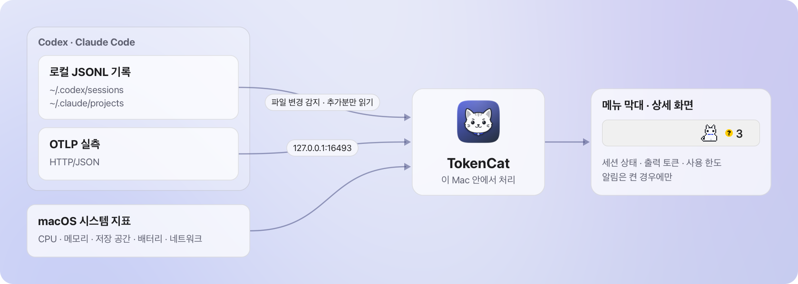
</picture>

- **로그**에서 세션, 모델, 출력 토큰, 진행 상태를 읽습니다. 로그가 기록한 시점에만 반영하므로 Claude Code처럼 메시지가 끝날 때 기록하는 클라이언트는 메시지 완료 후 숫자가 오릅니다. 진행 표시는 마지막 기록 뒤 허용 시간(모델 응답 대기 10분, Claude Code 도구 15분, Codex 도구 120초) 안에서만 유지하고, 지나면 `로그 대기`로 바꿉니다. OS 프로세스가 살아 있는지를 뜻하지는 않습니다.
- **실측**은 제공사·세션·에이전트 식별자가 정확히 일치할 때만 세션 행에 붙입니다. 모델 이름이나 시간이 가깝다는 이유로 연결하지 않습니다. 속도는 근거에 따라 단위를 나눠 표시합니다.

| 단위 | 근거 |
|---|---|
| 생성 tok/s | Codex 서버가 보낸 실제 토큰 간 시간(TBT)의 역수 |
| 모델 tok/s | 여러 관측을 묶어 보낸 서버 지표의 평균 토큰 간 시간. 개별 세션 속도로 귀속하지 않음 |
| 요청 tok/s | Claude Code `api_request`의 출력 토큰 ÷ 성공 요청 시간. 첫 응답 대기·추론을 포함하므로 순수 생성 속도가 아님 |

더 자세한 규칙은 [자세한 동작](docs/DETAILS.md)의 [토큰 지표](docs/DETAILS.md#토큰-지표), [세션과 상태](docs/DETAILS.md#세션과-상태), [수집 범위와 갱신](docs/DETAILS.md#수집-범위와-갱신)에 있습니다.

## 자주 묻는 질문

<details>
<summary><b>속도가 <code>—</code>로 보여요.</b></summary>

<br>

실측이 아직 없다는 뜻입니다. TokenCat은 로그 시각으로 속도를 만들지 않습니다. 실측을 받으려면 TokenCat이 실행 중이어야 하고, 연결 뒤 Codex나 Claude Code를 새로 실행해야 합니다. 설정 › 실측 탭에서 클라이언트별 수신 여부를 확인할 수 있습니다. 클라이언트 버전이나 서버 응답에 따라 지표가 오지 않을 수도 있습니다.

</details>

<details>
<summary><b>출력 막대나 고양이 걸음이 빠르면 토큰도 빨리 나오는 건가요?</b></summary>

<br>

아닙니다. 막대는 5초마다 기록된 양이고, 기본 움직임 기준에서 고양이 박자는 상태별로 고정입니다. 실측 속도에 따라 움직이게 하려면 설정 › 고양이에서 'AI 실측 속도'를 고르세요. 최근 5초 안의 실측에만 반응합니다.

</details>

<details>
<summary><b>Claude 웹이나 데스크톱 채팅도 보이나요?</b></summary>

<br>

아니요. 터미널이나 데스크톱 앱에서 실행한 Claude Code 세션만 수집합니다. Claude 웹과 일반 데스크톱 채팅은 Claude Code와 다른 경로라 대상이 아닙니다.

</details>

<details>
<summary><b>Codex 데스크톱 앱의 속도는요?</b></summary>

<br>

Codex 데스크톱(codex-app-server)은 로그와 trace를 보내지만 요청별 생성 시간 형식을 확인하지 못해 속도를 `—`로 표시합니다.

</details>

<details>
<summary><b>Claude Code 사용 한도는 왜 없나요?</b></summary>

<br>

Claude Code가 한도를 로그에 남기지 않기 때문입니다. 같은 이유로 컨텍스트도 창 대비 비율 대신 절대값으로 보여 주며, 창 크기를 모델 이름으로 추정하지 않습니다.

</details>

<details>
<summary><b>권한 확인을 기다리는 세션이 <code>입력 필요</code>로 바뀌지 않아요.</b></summary>

<br>

권한 확인 요청은 로그에 남지 않아 알 수 없습니다. `입력 필요`는 질문과 계획 승인처럼 로그에 기록되는 대기만 표시합니다.

</details>

<details>
<summary><b>이미 다른 OpenTelemetry 목적지를 쓰고 있어요.</b></summary>

<br>

기존 외부 실측 목적지와 충돌하면 덮어쓰지 않습니다. 이때는 상세 화면 아래쪽에 `실측 꺼짐 · 설정 충돌`이 표시되고, 누르면 설정의 실측 탭이 열립니다. 세션 상태와 토큰 수는 로그에서 읽으므로 계속 보입니다.

</details>

<details>
<summary><b>자원은 얼마나 쓰나요?</b></summary>

<br>

CPU·메모리 측정값은 아직 이 문서에 정리하지 않았습니다. 대신 이렇게 부담을 줄입니다.

- 로그 파일은 이후 추가된 부분만 읽습니다. 파일 변경 이벤트(FSEvents)로 깨어나되 다시 읽기는 초당 최대 4회이고, 1초 주기 확인과 5초 주기 새 파일 확인이 함께 돕니다.
- 시스템·로그 수집과 로컬 실측은 각각 독립된 백그라운드 큐에서 처리합니다.
- 실측은 정해진 개수만 메모리에 두고, 수집기는 본문 크기·동시 연결·요청 시간을 제한합니다.
- 고양이를 숨겼거나 화면이 잠들었거나 메뉴 막대가 가려지면 애니메이션 타이머를 멈추고, 잠든 뒤 20분이 지나도 멈춥니다.

</details>

## 개발

```sh
./build.sh
dist/TokenCat.app/Contents/MacOS/TokenCat --self-test                    # 로그 파싱·상태·실측·설정 백업 검사
dist/TokenCat.app/Contents/MacOS/TokenCat --telemetry-lifecycle-checks   # 테스트용 루프백 포트로 수집기 수명 검사
dist/TokenCat.app/Contents/MacOS/TokenCat --live-check                   # 실제 시스템·로그로 약 6초간 갱신 확인
```

화면은 로컬 로그와 수집기 대신 합성 데이터로도 렌더할 수 있습니다.

```sh
dist/TokenCat.app/Contents/MacOS/TokenCat --snapshot-fixtures work/fixtures
dist/TokenCat.app/Contents/MacOS/TokenCat --snapshot-menubar work/menubar-states.png --fixtures
dist/TokenCat.app/Contents/MacOS/TokenCat --snapshot-settings work/settings.png --pane all --fixtures
```

README의 이미지는 위 합성 스냅숏과 `Assets/`만으로 다시 만듭니다. 방법은 [`docs/Generator`](docs/Generator/README.md)에 있습니다.

```sh
mkdir -p work && swiftc -O docs/Generator/*.swift -o work/docs-generator && work/docs-generator
```

> [!WARNING]
> 픽스처 없는 `--snapshot`과 `--diagnose`는 이 Mac의 실제 프로젝트 이름과 경로를 담습니다. 이슈나 문서에 붙이지 마세요.

전체 명령과 검사 범위는 [자세한 동작 › 검증 명령](docs/DETAILS.md#검증-명령)에 있습니다.

### 프로젝트 구조

| 경로 (`Sources/TokenCat/` 기준) | 내용 |
|---|---|
| `Entry.swift` | 진입점과 명령줄 옵션(검사·스냅숏·진단·실측 연결) |
| `App.swift` | 앱 수명, 메뉴 막대 항목, 팝오버·패널, 설정 값 |
| `Models.swift` | 시스템·토큰·세션 상태 데이터 모델 |
| `StatusBarView.swift` | 메뉴 막대 렌더링 |
| `DashboardView.swift`, `SessionPresentation.swift`, `TokenFlow.swift` | 상세 화면, 세션 묶음과 상태, 출력 막대 |
| `SettingsView.swift` | 설정 창 |
| `TokenTracker.swift`, `LogWatcher.swift` | 로컬 JSONL 파싱과 파일 변경 감지 |
| `Telemetry.swift`, `TelemetrySetup.swift`, `TokenSpeed.swift` | 로컬 OTLP 수집기, 클라이언트 설정 연결·복구, 실측 속도 |
| `SystemSampler.swift` | CPU·메모리·저장 공간·배터리·네트워크 |
| `Runner.swift`, `RunnerAnimator.swift` | 고양이 스프라이트와 움직임 |
| `Notifier.swift`, `LoginItem.swift` | 알림, 로그인 항목 |
| `DesignTokens.swift` | 서체·색·상태 글리프 |
| `*Checks.swift`, `SnapshotFixtures.swift` | `--self-test` 검사와 합성 스냅숏 |

저장소 루트의 [`Assets/`](Assets)에는 스프라이트·아이콘과 이를 만드는 Swift 코드(`Assets/Generator/`)가, [`docs/Generator/`](docs/Generator/README.md)에는 README 미리보기 이미지 생성기가 있습니다.

### 자산

<p align="center">
  <picture>
    <source media="(prefers-color-scheme: dark)" srcset="docs/images/app-icon-dark.png">
    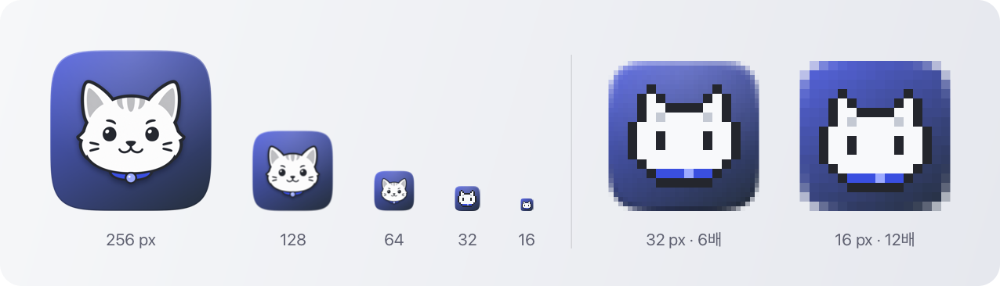
  </picture>
</p>

앱 아이콘과 메뉴 막대 고양이는 [`Assets/Generator`](Assets/Generator)의 Swift 코드로 결정적으로 생성하며, 팔레트는 한 곳에서 정합니다. 생성 명령과 측정값은 [`Assets/runner-v2.md`](Assets/runner-v2.md), [`Assets/app-icon-v2.md`](Assets/app-icon-v2.md)에 있습니다.

## 라이선스

소스와 저장소에 포함된 TokenCat 생성 자산은 [MIT License](LICENSE)로 공개합니다. RunCat의 이미지나 코드는 사용하지 않습니다. TokenCat은 Codex나 Claude Code의 공식 도구가 아닙니다.
