English · [한국어](README.ko.md)

<p align="center">
  
</p>

<h1 align="center">TokenCat</h1>

<p align="center">
  <b>A pixel cat in your menu bar that tells you<br>what your coding agents are doing right now.</b>
</p>

<p align="center">
  <a href="https://github.com/SeuPut0705/TokenCat/releases/latest"></a>
  
  
  
  <a href="LICENSE"></a>
</p>

<p align="center">
  <a href="https://github.com/SeuPut0705/TokenCat/releases/latest/download/TokenCat.zip"></a>
  &nbsp;
  <a href="https://github.com/SeuPut0705/TokenCat/releases/latest/download/TokenCat-Windows.zip"></a>
  <br>
  <sub>Free and open source · <a href="#install">Mac install steps</a> · <a href="#windows-preview">Windows install steps</a></sub>
</p>

<p align="center">
  <picture>
    <source media="(prefers-color-scheme: dark)" srcset="docs/images/en/hero-dark.png">
    
  </picture>
</p>

<p align="center">
  <a href="#features">Features</a> ·
  <a href="#privacy-and-safety">Privacy</a> ·
  <a href="#install">Install</a> ·
  <a href="#windows-preview">Windows</a> ·
  <a href="#how-it-works">How it works</a> ·
  <a href="#faq">FAQ</a> ·
  <a href="docs/DETAILS.md">Details</a>
</p>

---

Run Codex, Claude Code or other coding agents (OpenCode, Gemini CLI, Cursor, Grok, Kimi Code, omp and more) in a few terminals and it's easy to lose track of which session is working and which one is waiting for you. TokenCat gathers that state into a single menu bar item. A walking cat means work is in progress; a cat sitting and facing you means a session needs input. Click the item to see each session's state, output tokens from the last 5 minutes, the current speed, Codex and Claude usage limits, and your Mac's system metrics on one screen.

The numbers are shown as they are. Token counts are the values actually recorded in local logs, and a tok/s speed appears only from a real **measurement**: one a client sent to the collector on this Mac, or the request times a client records for each of its replies (OpenCode, omp, Grok, Hermes, Goose and Kimi Code). TokenCat never estimates speed from gaps between log timestamps, never sums speeds across sessions, averages them only in the opt-in **Average speed** item, and leaves unknown values as `—`.

- **Never miss an input request**: a session waiting for an answer or a plan approval shows a yellow `?` and a cat facing you. Notifications are available if you want them.
- **Sessions and subagents in one list**: each session shows its progress, the kind of tool running, output this turn and context, and subagents are grouped under their parent.
- **Your data stays local**: no conversation text is stored, the measurement collector listens only on `127.0.0.1`, and TokenCat never calls a model or signs in on its own. It goes online only to check for and download updates from GitHub and, with `Live usage limits` on (the default), to ask OpenAI and Anthropic for your usage limits with the sign-in Codex and Claude Code (or omp and Pi) already saved; both can be turned off. To receive measurements, it automatically adds settings to Codex and Claude Code (and to Gemini CLI and Qwen Code when they're installed) that send telemetry to this Mac, and wraps the Claude Code status line command with a TokenCat bridge, backing up the originals first.
- **Native app**: Swift, AppKit and SwiftUI only, with no third-party packages. Targets macOS 13 and later.
- **Windows preview**: a notification-area version for Windows 10 and 11 (x64) ships on the same release. See [Windows (preview)](#windows-preview).

## Features

### The output flow at a glance

<p align="center">
  <picture>
    <source media="(prefers-color-scheme: dark)" srcset="docs/images/en/popover-flow-dark.png">
    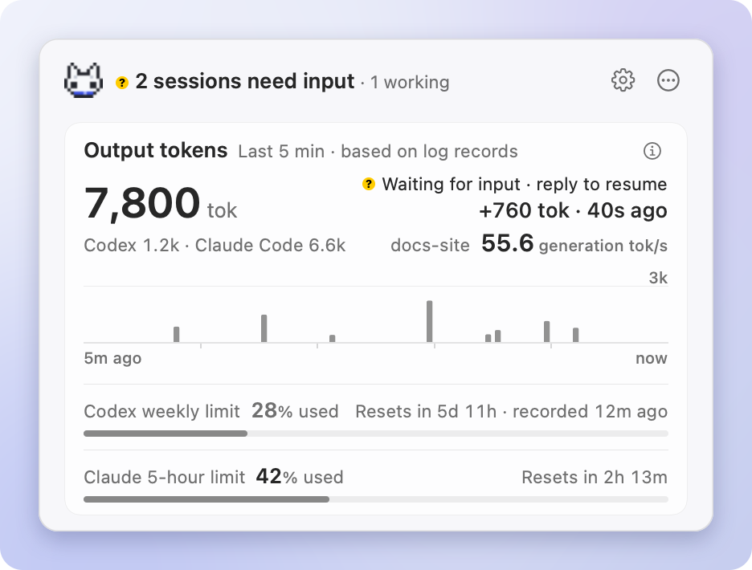
  </picture>
</p>

Output tokens recorded in the logs over the last 5 minutes are shown as 5-second bars, with the total on the card's title line. When more than one client records, the total is split beside the title, largest first, as in `Claude Code 6.6k · Codex 1.2k`; when they don't all fit, the smallest fold into `+N more`. The line under the title shows the last record; after 30 seconds without a new one, it tells you what is being waited on instead (an API retry, a tool category such as `Running command`, or a log). A session waiting for your input says so in the header and on its row, so the card doesn't repeat it. The bars are amounts recorded and are never converted into a speed; their scale is in the chart's help.

**Speed now**, at the end of that line, is the single most recent measurement from the visible working sessions within the last 2 minutes, named by its session's title (`Speed now · Install guide 55.6 generation tok/s`): telemetry received by the collector, or the request times OpenCode, omp, Grok, Hermes, Goose and Kimi Code record for each reply. Only a value measured with that session's current model counts, clients waiting for a restart are left out, and sessions are never summed or averaged. If sessions are working, running a tool or retrying the API with no measurement, it says `No measured speed`; if they are only waiting for input or logs, it's hidden. Speeds derived from log timestamps are never used.

### What each session is doing

<p align="center">
  <picture>
    <source media="(prefers-color-scheme: dark)" srcset="docs/images/en/popover-sessions-dark.png">
    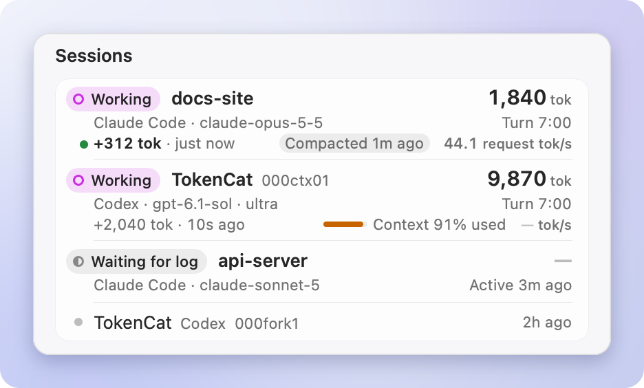
  </picture>
</p>

Working sessions move to the top. Every row's title (the session's title, else its project) starts on the same column after a colored state glyph; the second line opens with the state in words (`Waiting for plan approval`, `Running command`, `Working`, …), then the client, model and Codex effort, and ends with the turn's elapsed time (for a session waiting for input, how long it has waited). The row also shows the output so far this turn and context usage. For Codex, context is a share of the recorded window (`Context 91% used`); Claude Code doesn't record its window size, so it's shown as an absolute value such as `Context 182k`, followed by `Compacted 1m ago` after a compaction. A session with a measurement shows its speed with the unit that names its basis, such as `44.1 request tok/s`. Without a measurement, only rows that may be generating (working, running a tool or retrying the API) show `—`, and rows waiting for input or logs show nothing. When the list is collapsed, its last row is the one control that shows the rest (`Show all 12 sessions ⌄`, or `Show less ⌃` when open).

`Input needed` comes from the logs: Claude Code's questions (AskUserQuestion) and plan approvals (ExitPlanMode), and questions in Codex Plan mode (`request_user_input`). Permission prompts aren't logged, so they can't be shown.

### Subagents under their parent

<p align="center">
  <picture>
    <source media="(prefers-color-scheme: dark)" srcset="docs/images/en/popover-subagents-dark.png">
    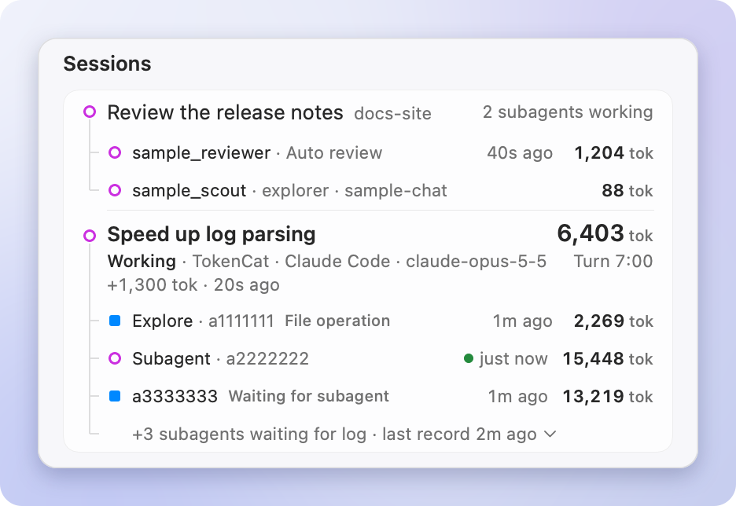
  </picture>
</p>

Codex and Claude Code subagents are grouped under their parent by its exact session identifier and shown as a tree. Each is titled by its role or nickname; one without a distinguishing role reads `Subagent · a2222222`, its short ID beside it. Every running subagent is shown, and those waiting for logs collapse into one line, such as `+3 subagents waiting for log ⌄`, which opens them.

### Details and copying in one click

<p align="center">
  <picture>
    <source media="(prefers-color-scheme: dark)" srcset="docs/images/en/popover-detail-dark.png">
    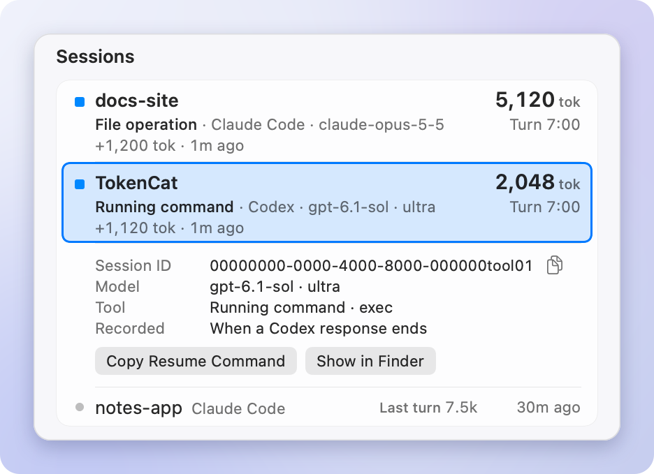
  </picture>
</p>

Click a row or press Return to expand its session ID, model, running tool and record times, with buttons to copy the resume command (`claude --resume …`, `codex resume …`) and show the project folder in Finder. The right-click menu also copies the session or agent ID and shows the log file in Finder. File contents are never opened. ↑↓ · Return · ⌘C (copy the ID) · ⌘⇧C (copy the resume command) let you do all of this from the keyboard.

### Codex and Claude usage limits

<p align="center">
  <picture>
    <source media="(prefers-color-scheme: dark)" srcset="docs/images/en/popover-limits-dark.png">
    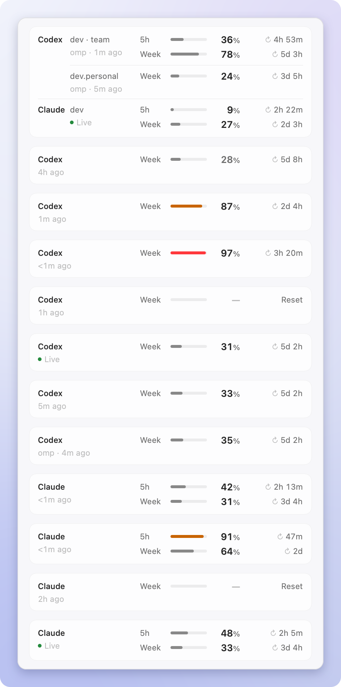
  </picture>
</p>

Right under the header, in their own card, one line per limit window shows the usage percentage, the time until it resets, and how fresh the value is (`Claude · 5-hour 42% used`); when the account's other window is live too, it gets its own line under it (`Claude · weekly 31% used`). 85% or more is orange, 95% or more is red, and once the reset time passes it changes to `—`. It isn't a forecast of when you'll run out.

With **Live usage limits** on (the default, in Settings › Telemetry), TokenCat checks each account's limits every minute while a session on that account's models is running (in its own client or another one, such as omp running a Claude or GPT model) or the dashboard is open, and every 10 minutes otherwise. A value checked within the last 2 minutes reads `… · live`; older values say how long ago they were recorded, and by whom when omp or Pi recorded them (`… · omp recorded 4m ago`). Reset times are never made up: when none is given, none is shown. How it works and what is sent is in [Details › Live usage limits](docs/DETAILS.md#live-usage-limits).

- **Codex**: the live check briefly runs the local `codex app-server` (the Codex CLI), which asks OpenAI with its own saved sign-in. The usage percentage recorded in the Codex logs is used too.
- **Claude**: the live check sends Claude Code's saved sign-in token to Anthropic. If that token is missing or expired, it uses omp's or Pi's saved Claude sign-in for the same account instead, so the limits stay live while you work through omp or Pi. Without a usable token, the existing sources still apply: the 5-hour and weekly limits that Claude Code passes only to its status line command, which TokenCat wraps with a [bridge](docs/DETAILS.md#claude-usage-limits-and-the-status-line-bridge) (Claude.ai subscription accounts), and the usage history the Claude desktop app writes about every 15 minutes (Claude Code in the desktop app doesn't run the status line).
- **omp and Pi**: they check their own Claude and ChatGPT sign-ins' limits and keep the results in `~/.omp/agent/agent.db` (`~/.pi/agent/agent.db`); TokenCat reads the newest 5-hour, weekly and Codex windows from there, read-only, so the rows keep updating while you work through omp even when Claude Code isn't running. Details are in [Details › omp and Pi usage history](docs/DETAILS.md#omp-and-pi-usage-history).

### As much menu bar as you want

<p align="center">
  <picture>
    <source media="(prefers-color-scheme: dark)" srcset="docs/images/en/menubar-layouts-dark.png">
    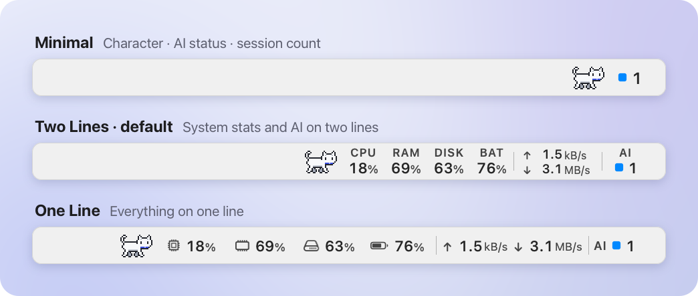
  </picture>
</p>

Choose **Minimal** (about 72 pt), **Two Lines** (the default, about 272 pt) or **One Line** (about 410 pt), then turn items on or off and drag them to reorder; the character's own checkbox heads that list. Each item has a fixed width, so the icons next to it don't shift when values change, and labels follow the bar's light or dark appearance so they stay readable on tinted bars. On a Mac without a battery, the battery item is hidden.

One more item is off by default: **Average speed** (`AVG`), turned on in Settings › Menu Bar, is an explicit opt-in mean of the per-session measured rates of every client that the dashboard's **Speed now** rule accepts; it averages only measured rates and estimates nothing, and its Settings row's tooltip says so. In place of its label it shows the icons of the clients contributing a rate right now, fastest first: one icon for one client, or up to three side by side, each whole and 1 pt apart. Without a fresh measurement it shows `AVG` and `—`.

<p align="center">
  <picture>
    <source media="(prefers-color-scheme: dark)" srcset="docs/images/en/menubar-states-dark.png">
    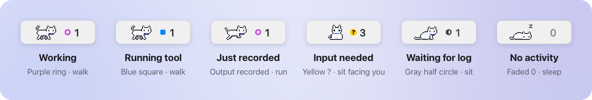
  </picture>
</p>

The AI number is the count of top-level sessions that are working or waiting for input; while any session waits for you, it counts only those, the number you act on (the tooltip keeps the full breakdown). The mark uses the same glyphs as the dashboard. Recorded output shows as a short run by the cat instead of a mark. Right-click the item (or use its `Quick menu` action in VoiceOver) for a quick menu that jumps straight to up to three urgent sessions, with `N more sessions…` opening the dashboard when more are live.

### A cat that shows the state

<p align="center">
  <picture>
    <source media="(prefers-color-scheme: dark)" srcset="docs/images/en/cat-dark.gif">
    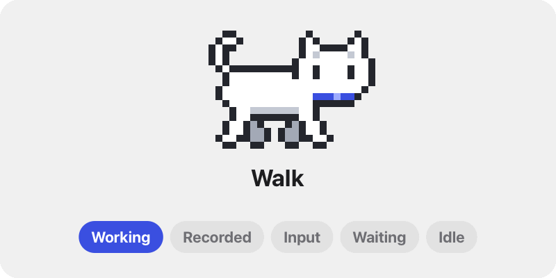
  </picture>
</p>

With the default motion source, **AI Activity**, the cat walks while sessions are working or running tools, runs for 1.2 seconds when new output is recorded, and sits facing you when input is needed. It sits and blinks while waiting for logs, and falls asleep after 10 minutes without activity. The pace is fixed for each state and doesn't indicate speed. In Settings you can switch to CPU Usage, Measured AI Speed or Still, and the cat respects Reduce Motion.

<p align="center">
  <picture>
    <source media="(prefers-color-scheme: dark)" srcset="docs/images/en/poses-dark.png">
    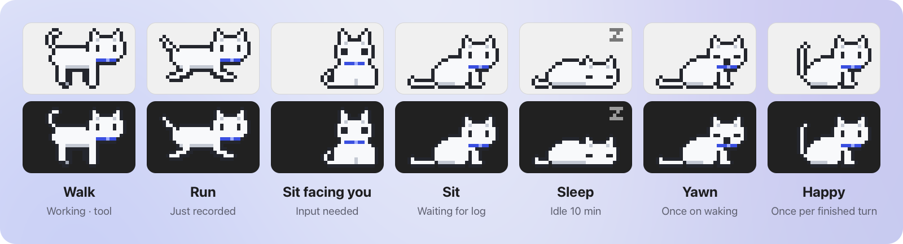
  </picture>
</p>

The cat is pixel art drawn 1:1, without blur, in a 32 × 20 pt cell. The dashboard header and the 16 and 32 px app icons use the same pixel head.

### Characters & presets

<p align="center">
  <picture>
    <source media="(prefers-color-scheme: dark)" srcset="docs/images/en/characters-dark.png">
    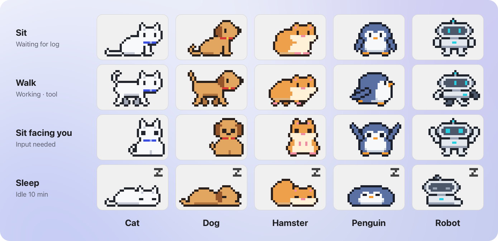
  </picture>
</p>

Besides the cat, you can pick a dog, hamster, penguin or robot in Settings › Character or in the quick menu's Character submenu. All five share the same poses and pace, so only the look changes; the dashboard header and the app icon keep the cat.

Presets set up the menu bar in one step: **Minimal**, **AI Focus** (AI, CPU and memory on two lines), **System Monitor** (CPU, memory, storage, battery, network and AI on two lines) or **All on One Line** (the same items on one line). Choose one in Settings › Menu Bar › Preset. Picking a preset also shows the character again, and when the layout or items no longer match any preset, the picker shows **Custom**.

### Settings and notifications

<p align="center">
  <picture>
    <source media="(prefers-color-scheme: dark)" srcset="docs/images/en/settings-dark.png">
    
  </picture>
</p>

Notifications include only the project, client and model, token count and duration, never the question or response text. They aren't sent while the dashboard is visible. A new-version notification is sent once per version, without sound, and the previous one is removed when a newer version appears or you update.

### Language

Screens, menus, notifications, help, VoiceOver labels and command-line output are in English and Korean. TokenCat follows your macOS language settings, using whichever of Korean and English comes first in your preferred languages, and English if neither is listed. To pick a language for TokenCat alone, use **System Settings › General › Language & Region › Applications**; the change applies the next time you open TokenCat.

## Privacy and safety

<p align="center">
  <picture>
    <source media="(prefers-color-scheme: dark)" srcset="docs/images/en/popover-onboarding-dark.png">
    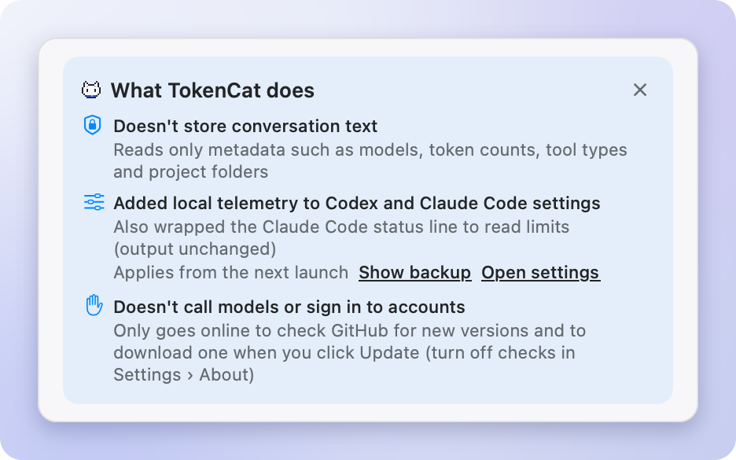
  </picture>
</p>

On first launch, the card above tells you, one line per point, what TokenCat actually did and what it doesn't do; hover a line for the details. When connecting telemetry didn't go through, the reason and `Open settings` stay on the card.

- **No conversation text is stored.** Only metadata from local logs is used, such as models, token counts, tool types and project folders. Tool inputs aren't read, and error messages in API retry records aren't stored either. The one piece of text shown is a session's title when the client itself generated it or you renamed the session (Claude Code, Codex, OpenCode, Kilo Code, MiMo Code, omp, Pi, Gemini CLI, Qwen Code, Copilot CLI, Amp, Droid, Cursor, Grok, Hermes, OpenClaw, Goose, Kimi Code), cut to one line of 80 characters; it's kept in memory only, never written, logged or sent, and a client's copy of your first prompt is never used as a title.
- **The collector stays inside this Mac.** It accepts requests only on `127.0.0.1:16493` and rejects any request that carries a web page Origin or a Host other than `127.0.0.1` or `localhost`. Received measurements are kept in memory up to a fixed count and never written to files. The only things from the collector that reach disk are the Claude limits' usage percentage, reset time and time received, stored in TokenCat's settings (UserDefaults) so they still show on the next launch. The Claude desktop app's usage history file is only read, and just the last record's percentages and time are stored in the same place.
- **Connected with text logging off.** When TokenCat adds telemetry to the Codex, Claude Code, Gemini CLI and Qwen Code settings, prompt and response text logging is turned off (`logPrompts: false` for Gemini CLI and Qwen Code, which log prompts by default).
- **The Claude Code status line is only wrapped.** Claude Code passes usage limits only to its status line command, so TokenCat replaces the `statusLine` command in `~/.claude/settings.json` with the TokenCat bridge (`~/Library/Application Support/TokenCat/claude-statusline.sh`). The bridge sends the status JSON that Claude Code passes it (working folder, session, model, cost, usage limits and so on) only to `127.0.0.1`, then runs the original command with the same input and returns its output and exit code unchanged. TokenCat keeps only the 5-hour and weekly limit numbers from that JSON and discards the rest. If there was no status line, it adds a bridge that prints nothing.
- **No model calls, no sign-ins of its own.** TokenCat never calls any model and never signs in to an account itself; the live usage check uses the sign-in Codex and Claude Code (or omp and Pi) already saved.
- **Internet access is for updates and usage limits only.** For updates, TokenCat asks GitHub only for the latest release's version number. If you turn off `Check for updates automatically` in Settings › About, it asks only when you click `Check Now`. The new version is downloaded only when you click `Update`.
- **Live usage limits never store the token.** For Codex, TokenCat briefly runs the local `codex app-server`, which asks OpenAI with its own sign-in; TokenCat never reads Codex's tokens. For Claude, it reads the token Claude Code saved (the macOS Keychain or `~/.claude/.credentials.json`), or, when that one is missing or expired, the Claude token omp or Pi saved in their `agent.db` for the same account, and sends it only to `api.anthropic.com`. The token is kept in memory only and never written, logged or refreshed, and an expired one isn't sent. Turn it off with `Live usage limits` in Settings › Telemetry.
- **Nothing else leaves this Mac.** Neither request carries usage history, device information or identifiers, and all other communication stays inside this Mac (`127.0.0.1`).
- **Original settings are backed up first.** Before changing anything, TokenCat keeps the originals in a folder with restricted access, and it never overwrites an existing external telemetry destination that would conflict. If a config file changed after connecting, disconnecting (`Disconnect…` in Settings › Telemetry, or `--disconnect-telemetry`) doesn't overwrite the whole file; it backs up the current file and reverts only the entries TokenCat added.
- **Login item and notifications only when you turn them on.** Both are off by default. Updates are installed only when you click, too.

## Install

TokenCat runs on macOS 13 and later, and one universal app supports both Apple silicon and Intel Macs.

1. [**Download TokenCat.zip**](https://github.com/SeuPut0705/TokenCat/releases/latest/download/TokenCat.zip) (attached to the [latest release](https://github.com/SeuPut0705/TokenCat/releases/latest))
2. Unzip it and move `TokenCat.app` to the **Applications** folder. Opened from Downloads or elsewhere, macOS runs it from a temporary location where it can't update itself.
3. The first time, open it following [Opening it the first time](#opening-it-the-first-time) below.

> [!IMPORTANT]
> On first launch, to receive measurements, TokenCat **automatically** adds settings to Codex `~/.codex/config.toml` and Claude Code `~/.claude/settings.json` (creating them if they don't exist yet) that send telemetry to this Mac (`127.0.0.1:16493`), and wraps Claude Code's status line (`statusLine`) command with the TokenCat bridge (the original status line output stays the same). If `~/.gemini` or `~/.qwen` exists, it also sets the `telemetry` section of Gemini CLI `~/.gemini/settings.json` or Qwen Code `~/.qwen/settings.json`; one that already sends telemetry elsewhere or isn't plain JSON is skipped and left as it is. It backs up the originals first and turns off prompt and response text logging. It checks the connection on every launch; after you disconnect (`Disconnect…` in Settings › Telemetry or `--disconnect-telemetry`), it won't reconnect until you click `Reconnect` or run `--connect-telemetry`. How to undo it is in [Disconnect and uninstall](#disconnect-and-uninstall).

### Opening it the first time

TokenCat has only an ad-hoc signature, without an Apple Developer ID signature or notarization. So the first time you open an app downloaded with a browser, macOS (Gatekeeper) treats it as an unverified app and blocks it. You only need to allow each installed app once.

**macOS 15 and later**

1. Open `TokenCat.app`. When a window says it can't be opened, click **Done**. Don't click **Move to Trash**.
2. Open **System Settings › Privacy & Security** and scroll down to the **Security** section.
3. Next to the message "“TokenCat” was blocked to protect your Mac.", click **Open Anyway**. This button appears only for about an hour after you tried to open the app.
4. In the window that appears, click **Open Anyway** again and confirm with your Mac password or Touch ID.

**macOS 13–14**

1. In Finder, Control-click (or right-click) `TokenCat.app` and choose **Open**.
2. Click **Open** in the confirmation window. If the window has no Open button, click **Open Anyway** in **System Settings › Privacy & Security**, as on macOS 15.

### Install from the terminal

Download it first, then compare the SHA-256 with the value in the [latest release](https://github.com/SeuPut0705/TokenCat/releases/latest) notes.

```sh
curl -fL https://github.com/SeuPut0705/TokenCat/releases/latest/download/TokenCat.zip -o /tmp/TokenCat.zip \
  && shasum -a 256 /tmp/TokenCat.zip
```

If the values match, unzip the new app first, then quit the running TokenCat, replace the existing app and open it. If unzipping fails, the existing app isn't removed. Settings and backups live outside the app, so they stay as they are.

```sh
rm -rf /tmp/TokenCat-new && ditto -x -k /tmp/TokenCat.zip /tmp/TokenCat-new \
  && { pkill -x TokenCat; rm -rf /Applications/TokenCat.app; } \
  && mv /tmp/TokenCat-new/TokenCat.app /Applications/ \
  && open /Applications/TokenCat.app
```

Unlike a browser, `curl` doesn't add the quarantine attribute (`com.apple.quarantine`) to the downloaded file, so the app opens without the confirmation windows above. That's why checking that the URL points to this repository and verifying the SHA-256 first matters.

### Build from source

You need Xcode. `Package.swift` requires Swift 5.9 or later, and the build was confirmed on macOS 27.0.1 · Xcode 27.0 · Swift 6.4. In the same environment, the Command Line Tools alone fail to build because they lack the SwiftUI macro plugin. If `xcode-select -p` prints `/Library/Developer/CommandLineTools`, run `DEVELOPER_DIR=/Applications/Xcode.app/Contents/Developer ./build.sh` (or switch once with `sudo xcode-select -s /Applications/Xcode.app`).

```sh
git clone https://github.com/SeuPut0705/TokenCat.git
cd TokenCat
./build.sh
open dist/TokenCat.app
```

`build.sh` makes `dist/TokenCat.app` as a universal release build for Apple silicon and Intel and signs it ad hoc. There's no Developer ID signing, notarization or App Store distribution. To open it automatically at login, move the app to `/Applications` and turn it on in Settings › General. Rebuilding or moving an app in another location can drop the registration.

### On first launch

1. The cat appears in the menu bar. Click it to see what TokenCat changed. There's no Dock icon, and opening the app again while it's running opens the Settings window. If a full menu bar hides the cat behind the notch, open the app again and choose Menu Bar › Preset › Minimal in Settings.
2. Once the local collector is ready, TokenCat makes the settings changes in the note under [Install](#install). If the collector isn't ready, nothing is changed.
3. The connected clients (Codex, Claude Code, and Gemini CLI and Qwen Code when installed) send measurements, and Claude Code its usage limits, **from their next launch**. Work in progress isn't restarted. Session state and token counts come from the logs (every supported client is read as soon as its folder exists), and live usage limits are checked directly, so they show right away.

<p align="center">
  <picture>
    <source media="(prefers-color-scheme: dark)" srcset="docs/images/en/popover-empty-dark.png">
    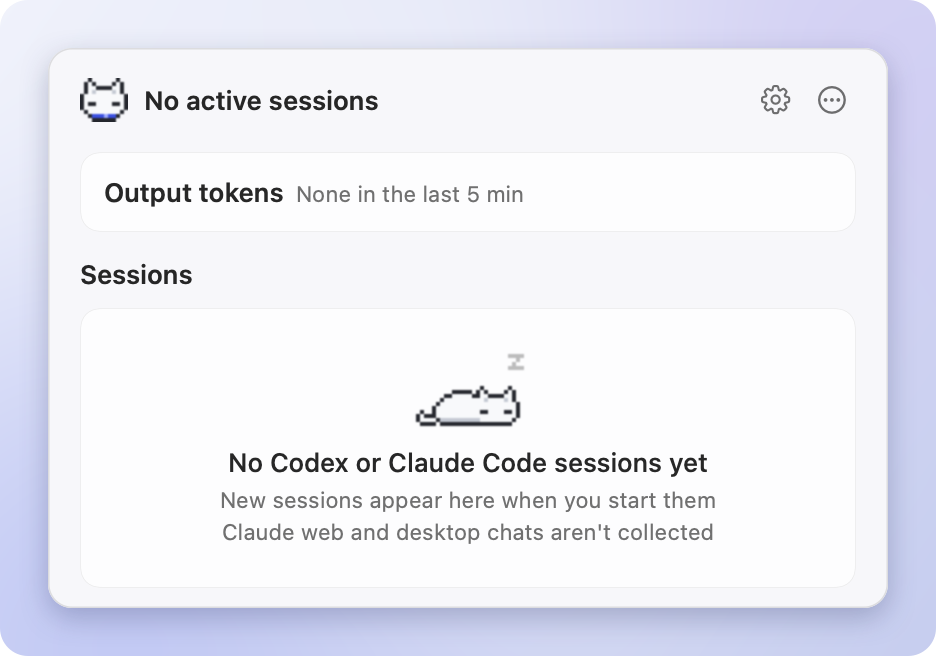
  </picture>
</p>

With no records yet, you'll see the sleeping cat. Start a new session in any supported client and it appears right away. If no client's log folder exists, the card lists the supported clients in one line; hover it for the folders TokenCat looks in.

### Updates

TokenCat checks GitHub for the latest release on its own, and installs only when you click.

- **Checking**: when `Check for updates automatically` in Settings › About › Updates is on (the default), TokenCat checks right after launch, every 15 minutes after that, after your Mac wakes from sleep, and when you open the dashboard more than 5 minutes after the last check. When it's off, it checks only when you click `Check Now`.
- **Notice**: when a new version is available, `New version 1.0.0` and an `Update` button quietly appear on one line at the bottom of the dashboard, and the right-click quick menu gets `Install Update 1.0.0…`. The line's close button hides the notice for that version only. To get a system notification as well, turn on `Notify about new versions` (off by default).
- **Installing**: click `Update` and TokenCat downloads `TokenCat.zip` (`Downloading update 45%`), checks that it matches the SHA-256 recorded by GitHub, replaces the app (`Installing…`) and relaunches. When it reopens, it shows `Updated to 1.0.0` once. If it fails, `Update failed` and a way to open the release page appear, plus `Try Again` for failures that a retry might fix. If you quit during installation, TokenCat finishes the install step before quitting.

Settings and measurement backups live outside the app, so they stay the same after an update. To update by hand, [install](#install) again or run the commands in [Install from the terminal](#install-from-the-terminal). For an app you downloaded or moved yourself, quit the running TokenCat before opening it. If one is running, the newly opened app just opens the existing app's panel and exits.

### Disconnect and uninstall

TokenCat checks the measurement connection on every launch and adds it again if needed. Once you disconnect (`Disconnect…` in Settings › Telemetry, or `--disconnect-telemetry` in step 3 below, even if a restore is refused), it stops connecting automatically; `Reconnect` in the same row, or `--connect-telemetry`, connects it again.

1. If you turned on open at login, turn it off in Settings › General.
2. Click `Disconnect…` in Settings › Telemetry (or skip it and use step 3), then right-click the menu bar item and quit TokenCat.
3. If you didn't disconnect in Settings, restore the client settings from the terminal. If the app is somewhere else (`dist/TokenCat.app` if you built from source), use the executable inside that `TokenCat.app`.

   ```sh
   /Applications/TokenCat.app/Contents/MacOS/TokenCat --disconnect-telemetry
   ```

   Config files unchanged since connecting are restored to their original bytes. In files edited since, only TokenCat's entries are reverted, and the current copy is kept in `~/Library/Application Support/TokenCat/telemetry-backups/`. The command says what it did, including any file left for you to clean up from the backups, and the restore takes effect the next time each client launches. If `statusLine.command` in `~/.claude/settings.json` still points to `claude-statusline.sh`, replace it with the command in `~/Library/Application Support/TokenCat/claude-statusline-command` (or remove `statusLine` if that file doesn't exist). The exact rules are in [Details › Token metrics](docs/DETAILS.md#token-metrics).
4. Delete the app. Once the restore is done, you can also delete `~/Library/Application Support/TokenCat/` (backups and bridge) and the settings (`defaults delete dev.seuput.TokenCat`, which includes the Claude limit records). Don't delete that folder while `~/.claude/settings.json` still points to `claude-statusline.sh`: the original command would go with it, and the Claude Code status line would fail to run.

## Windows (preview)

<p align="center">
  <picture>
    <source media="(prefers-color-scheme: dark)" srcset="docs/images/en/windows-flyout-dark.png">
    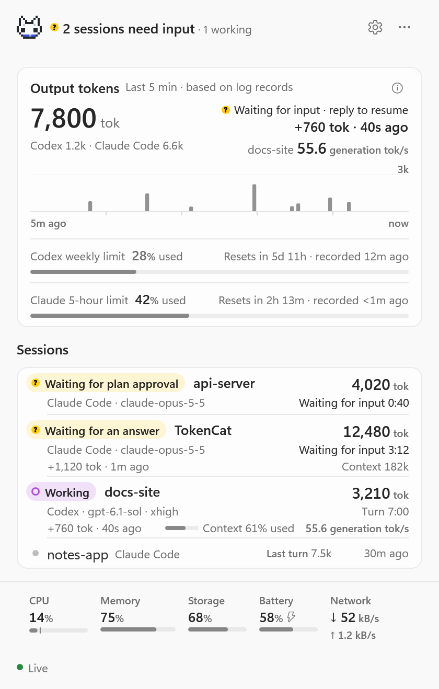
  </picture>
</p>

TokenCat also runs in the Windows notification area, starting with 0.11.0. It's a port of the Mac app's rules, with the same checks, but it has been tried on far fewer PCs, so please [report issues](https://github.com/SeuPut0705/TokenCat/issues) (don't attach `--diagnose` output: it includes project paths). How it's built is in [Details › Windows (preview)](docs/DETAILS.md#windows-preview).

It runs on Windows 10 and 11 (x64). There's no installer.

1. [**Download TokenCat-Windows.zip**](https://github.com/SeuPut0705/TokenCat/releases/latest/download/TokenCat-Windows.zip) (attached to the same [latest release](https://github.com/SeuPut0705/TokenCat/releases/latest) as the Mac app). It holds a single `TokenCat.exe` and `LICENSE`. Checking **Unblock** in the zip's **Properties** before extracting skips the SmartScreen prompt in step 3.
2. Extract the whole zip (`TokenCat.exe` and `LICENSE`) to `%LOCALAPPDATA%\Programs\TokenCat` (recommended) and run `TokenCat.exe` from there. In PowerShell, `Expand-Archive "$HOME\Downloads\TokenCat-Windows.zip" "$env:LOCALAPPDATA\Programs\TokenCat"` creates the folder. Run from inside the zip or a temporary folder, it can't update itself or open at login.
3. The exe isn't code-signed, so Microsoft Defender SmartScreen may show **Windows protected your PC**. Click **More info**, then **Run anyway** (on Korean Windows, **추가 정보** → **실행**). The wording can differ between Windows versions, so follow what your PC shows. With **Smart App Control** on (Windows 11), unsigned apps are blocked with no per-app exception, so TokenCat runs only with it off.
4. The cat may sit in the hidden icons (**^**) at first. To keep it in view, drag it from **^** onto the taskbar, or turn it on in **Settings › Personalization › Taskbar › Other system tray icons**.

> [!IMPORTANT]
> On first launch, TokenCat **automatically** adds settings that send telemetry to this PC (`127.0.0.1:16493`) to Codex `%USERPROFILE%\.codex\config.toml` and Claude Code `%USERPROFILE%\.claude\settings.json`, creating them if they don't exist yet, and, when their folders exist, to the `telemetry` section of Gemini CLI `%USERPROFILE%\.gemini\settings.json` and Qwen Code `%USERPROFILE%\.qwen\settings.json` (skipped when one already sends telemetry elsewhere or isn't plain JSON). It backs up the originals to `%LOCALAPPDATA%\TokenCat\telemetry-backups` first and turns off prompt and response text logging. If Claude Code has no `statusLine`, it adds the TokenCat bridge (`%LOCALAPPDATA%\TokenCat\claude-statusline.ps1`, run by PowerShell), which sends the status JSON only to `127.0.0.1` and prints nothing; an existing `statusLine` is left untouched. It checks the connection on every launch; after `--disconnect-telemetry`, it won't reconnect until you run `--connect-telemetry`.

**What's different from macOS**

- **Widget on screen**: the taskbar can't show text, so the menu bar item floats on screen instead: the character, the AI status and session count (Minimal), or the menu bar's Two Lines and One Line layouts. Drag it anywhere (edges snap); it's remembered per monitor setup, never takes the focus and hides while a full-screen app is in front. Click it for the dashboard, right-click for the quick menu. To hide it, right-click › **Hide Widget** or turn off `Show widget on screen` in Settings › Widget.
- **Settings › Widget** is the Mac's Menu Bar tab: preset, layout, and which items show in what order (drag a row, press Alt+↑/↓ or right-click it), including the Average speed item, which is off by default. The character's own checkbox heads that list (the tray icon always shows it). It also sets the widget's size, 100–300 %, which **Widget Size** in the right-click menu and Ctrl + mouse wheel over the widget change too; a resized widget keeps its nearest screen edges in place.
- **Tray icon**: the character and its state. A yellow corner dot means input is needed, an orange one an API retry. Hover for a short summary, click for the dashboard with all the numbers, and right-click for the quick menu.
- **Size follows the display scale**: at 100–175 % the icon is the cat head, which bobs while working; at 200 % and above it's the full-body character you picked.
- **WSL isn't tracked**: only clients running on Windows itself are collected (their folders under `%USERPROFILE%`, such as `%USERPROFILE%\.codex\sessions` and `%USERPROFILE%\.claude\projects`).
- **Claude limits**: an existing Claude Code `statusLine` isn't wrapped, so apart from the live check (which reads Claude Code's token from `%USERPROFILE%\.claude\.credentials.json`), Claude limits then come only from the Claude desktop app's usage history, if you use the desktop app, and from omp's or Pi's usage history (`%USERPROFILE%\.omp\agent\agent.db`, `%USERPROFILE%\.pi\agent\agent.db`).
- **Language**: follows the Windows display language (Korean if it's Korean, English otherwise).

**Updates** work as on the Mac: TokenCat checks GitHub (Settings › About › `Check for updates automatically`), shows `New version` with an `Update` button, downloads `TokenCat-Windows.zip`, verifies its SHA-256, swaps `TokenCat.exe` and relaunches. From inside the zip, a temporary folder or a folder you can't write to (such as Program Files), quit TokenCat and replace `TokenCat.exe` by hand instead.

**Disconnect and uninstall**

1. If you turned on `Open TokenCat at login`, turn it off in Settings › General. This removes the startup entry.
2. Click `Disconnect…` in Settings › Telemetry (or use step 3 instead), then right-click the tray icon and choose **Quit TokenCat**.
3. If you didn't disconnect in Settings, restore the client settings in PowerShell (use the folder you extracted to; `| Out-Host` waits for the output). The rules are the same as on the Mac, and `statusLine` is removed only while it's still exactly the TokenCat bridge.

   ```powershell
   & "$env:LOCALAPPDATA\Programs\TokenCat\TokenCat.exe" --disconnect-telemetry | Out-Host
   ```

4. Delete `%LOCALAPPDATA%\Programs\TokenCat`. Once the restore is done, you can also delete `%LOCALAPPDATA%\TokenCat` (settings, Claude limit records, backups and the bridge), but not while `%USERPROFILE%\.claude\settings.json` still points to `claude-statusline.ps1`.

## How it works

<picture>
  <source media="(prefers-color-scheme: dark)" srcset="docs/images/en/architecture-dark.png">
  
</picture>

- **Logs** provide sessions, models, output tokens and progress. They're reflected only when the log is written, so for a client like Claude Code that writes at the end of a message, the numbers go up after the message completes. A session shows as working only within an allowance after its last record (10 minutes waiting for a model response, 15 minutes for a Claude Code tool, 120 seconds for a Codex tool); after that it changes to `Waiting for log`. This doesn't say whether the OS process is alive.
- **Gemini CLI and Qwen Code** chat logs (`~/.gemini/tmp`, `~/.qwen/projects`) are read the same way, with their subagents, as soon as their folders exist. Neither log records generation times, so their speed comes from their own telemetry, which TokenCat connects like Codex and Claude Code: each main-conversation response's output tokens divided by its request time (**request tok/s**).
- **Copilot CLI, Amp and Factory Droid** logs (`~/.copilot/session-state`, `~/.local/share/amp/threads`, `~/.factory/sessions` or `$FACTORY_HOME_OVERRIDE/.factory/sessions`) are read the same way as soon as their folders exist. Copilot CLI also logs its permission prompts, so those show as `Input needed`; Droid records only a session output total, so its output appears as that total grows. None of them records generation times, so their sessions never get a speed.
- **OpenCode** sessions come from its database (`~/.local/share/opencode/opencode.db`, or `$XDG_DATA_HOME`, `OPENCODE_DB`), opened read-only, as soon as the folder exists, in both the classic format and OpenCode 2's `session_message` format; a session held in both is read from one only, so nothing is counted twice. **Kilo Code** (`~/.local/share/kilo/kilo.db`) and **MiMo Code** (`~/.local/share/mimocode/mimocode.db`) use the same store and show under their own names. OpenCode records when each reply started and when its last token was generated, so its sessions get a measured **request tok/s** from that record, without the collector.
- **Cline, Roo Code, Kilo Code, Zoo Code and IBM Bob** tasks (`globalStorage/<extension>/tasks` in every VS Code-style editor) and Cline's shared store (`~/.cline/data/tasks`, and **Cline CLI** sessions in `~/.cline/data/sessions`; `CLINE_DIR`, `CLINE_DATA_DIR`, `CLINE_SESSION_DATA_DIR`) are read as soon as those folders exist. A question or approval prompt shows as `Input needed`. They don't record generation times, so their sessions never get a speed.
- **omp and Pi** session logs (`~/.omp/agent/sessions` and its named profiles, `~/.pi/agent/sessions`, plus `PI_CODING_AGENT_DIR`, `PI_CONFIG_DIR`, `$XDG_DATA_HOME/omp` and Pi's `PI_CODING_AGENT_SESSION_DIR`) are read the same way, with their subagents, as soon as their folders exist. omp records each request's duration, so its replies get a measured **request tok/s** from that record, without the collector.
- **Cursor** agent sessions, from the IDE and the `cursor-agent` CLI (`~/.cursor/projects`, `CURSOR_CONFIG_DIR`), show state, model, title, context and project from Cursor's transcripts and its own database. Cursor stores no token counts on disk, so its rows never show output tokens or a speed.
- **Grok** (xAI's Grok Build CLI, `~/.grok/sessions` or `$GROK_HOME`) gets output tokens and a measured **request tok/s** per model call from Grok's `logs/unified.jsonl`, which records each call's own duration.
- **Hermes** (Nous Research's Hermes Agent) is read from `~/.hermes/state.db` (or `$HERMES_HOME`) and every profile's `state.db`, opened read-only. Output comes from the growth of Hermes's session totals; context and **request tok/s** come from the `API call` lines in its `logs/agent.log`, so they appear only while that log has the session's recent calls.
- **OpenClaw** (also older Clawdbot and Moltbot installs, `~/.openclaw/agents` or `$OPENCLAW_STATE_DIR`) is read from its per-agent SQLite store and older JSONL files. Recent versions compress large entries in a format TokenCat can't decode, so a turn's output can appear only when the run ends, from OpenClaw's own total. OpenClaw records no request durations, so it never gets a speed.
- **Goose** (`~/.local/share/goose/sessions/sessions.db`, or `$GOOSE_PATH_ROOT`) is read read-only: output tokens per model call from its usage ledger, and a **request tok/s** when Goose recorded the call's elapsed time. Sessions that run another agent's CLI or ACP server (claude-code, codex, gemini-cli, cursor-agent, `*-acp`) report no tokens or speed, because that agent's own log is already counted.
- **Kimi Code** (`~/.kimi-code/sessions` or `$KIMI_CODE_HOME`), the same runtime inside the Kimi desktop app (shown as **Kimi Work**) and the archived kimi-cli (`~/.kimi/sessions`, shown as **Kimi CLI**) are read with their subagents. Kimi Code records each step's first-token and streaming times, so Kimi Code and Kimi Work sessions get a measured **request tok/s**; Kimi CLI sessions show no speed and no title. Sessions Kimi Code migrated from kimi-cli show once.
- **Other data folders** are followed where the clients themselves keep them: `CODEX_HOME`, `CLAUDE_CONFIG_DIR` (also a comma-separated list) and `~/.config/claude`, and Gemini CLI's macOS sandbox folder `~/.cache/.gemini`. Products that write another client's format show under their own name: **TRAE CLI** (Codex format, `~/.trae/cli/sessions`), **OpenClaude** (`~/.openclaude`) and **Qoder** (`~/.qoder`, Claude Code format). Their rows show no Codex or Claude account limits and no resume command.
- **Measurements** are attached to a session row only when the provider, session and agent identifiers match exactly. They're never linked by model name or closeness in time. Speeds are shown in separate units by basis.
- **Usage limits** come from the live check while `Live usage limits` is on (Codex through the local `codex app-server`, Claude from `api.anthropic.com` with Claude Code's saved token, or omp's or Pi's for the same account when Claude Code's is missing or expired), from the Codex logs, from the status JSON that the bridge sends to the same collector (`/v1/claude/status`) whenever Claude Code draws its status line, reading only the 5-hour and weekly limits, from the Claude desktop app's usage history file, reading only the last percentages and record time, and from omp's and Pi's usage history (`agent.db`, opened read-only), reading only the newest percentages, reset times and record times.
- **Updates** and the **live usage limit check** are the only requests that leave this Mac. For updates, TokenCat asks the GitHub API for the latest release and compares version numbers, and downloads the file only when you click `Update`. Both run separately from the collection paths in the diagram.

| Unit | Basis |
|---|---|
| generation tok/s | The inverse of the actual time between tokens (TBT) reported by the Codex server |
| model tok/s | The average time between tokens from a server metric that bundles several observations. Not attributed to any single session's speed |
| request tok/s | Output tokens ÷ request time: successful request time from Claude Code's `api_request`, or the reply times OpenCode, omp, Grok, Hermes, Goose and Kimi Code record in their logs. Includes the wait for the first response and reasoning, so it isn't a pure generation speed |

The full rules are in [Details](docs/DETAILS.md), under [Token metrics](docs/DETAILS.md#token-metrics), [Sessions and states](docs/DETAILS.md#sessions-and-states) and [Collection scope and refresh](docs/DETAILS.md#collection-scope-and-refresh).

## FAQ

<details>
<summary><b>The first time I open it, macOS says Apple could not verify it is free of malware.</b></summary>

<br>

That message appears because TokenCat isn't notarized by Apple. Allow it once following [Opening it the first time](#opening-it-the-first-time), and it opens directly from then on. You can also review the source code and [build from source](#build-from-source).

</details>

<details>
<summary><b>What does it send over the internet?</b></summary>

<br>

Two kinds of requests, and neither carries usage history, device information or identifiers. Logs, measurements and conversation content never leave this Mac.

- **Update check**: a GET request to `api.github.com` asking for this repository's latest release, carrying only what any HTTP request carries (IP address, a User-Agent such as `TokenCat/0.9.0`, and a language header fixed to `en`). It uses cache validation headers so an unchanged response isn't downloaded again, and when GitHub reports a rate limit it pauses until the given time. If you turn off `Check for updates automatically` in Settings › About, it checks only when you click. When you click `Update`, it downloads `TokenCat.zip` from GitHub at that moment.
- **Live usage limits** (on by default): for Codex, TokenCat starts the local `codex app-server` for a moment, which asks OpenAI for your limits with the Codex CLI's own sign-in. For Claude, it sends Claude Code's saved sign-in token (or, when that one is missing or expired, omp's or Pi's saved token for the same account) in one GET to `https://api.anthropic.com/api/oauth/usage`; the token stays in memory and is never stored, logged or refreshed. Turn it off with `Live usage limits` in Settings › Telemetry.

</details>

<details>
<summary><b>How do I update?</b></summary>

<br>

When a new version is out, a `New version` line appears at the bottom of the dashboard. Click `Update` and TokenCat downloads, verifies the SHA-256, replaces the app and relaunches in one go. It never installs automatically. See [Updates](#updates) for more. If you built from source, you can also `git pull` and run `./build.sh` again.

</details>

<details>
<summary><b>The speed shows <code>—</code>.</b></summary>

<br>

It means there's no measurement yet. TokenCat doesn't derive speeds from log timestamps. To receive measurements, TokenCat has to be running, and Codex, Claude Code, Gemini CLI or Qwen Code has to be launched again after connecting (OpenCode, omp, Grok, Hermes, Goose and Kimi Code record their own request times, so they need nothing). You can check whether each client's measurements are arriving in the Settings › Telemetry tab. Depending on the client version or server response, the metrics may not arrive at all. `Speed now` in the output card uses only measurements received within the last 2 minutes, so if a measurement is older than that, or was measured with a different model than the session uses now, it reads `No measured speed` even when the row has a speed. Hover over it or the row's `—` to see why.

</details>

<details>
<summary><b>If the output bars or the cat's walk speed up, are tokens coming faster?</b></summary>

<br>

No. The bars are the amount recorded every 5 seconds, and with the default motion source the cat's pace is fixed for each state. To make it move with measured speed, choose 'Measured AI Speed' in Settings › Character. It reacts only to measurements from the last 5 seconds.

</details>

<details>
<summary><b>Does it show Claude on the web or desktop chats?</b></summary>

<br>

No. It collects only Claude Code sessions run in a terminal or the desktop app. Claude on the web and regular desktop chats take a different path from Claude Code, so they're out of scope.

</details>

<details>
<summary><b>What about speed in the Codex desktop app?</b></summary>

<br>

The Codex desktop app (codex-app-server) sends logs and traces, but TokenCat couldn't confirm a per-request generation time format, so its speed shows as `—`.

</details>

<details>
<summary><b>I don't see Claude usage limits.</b></summary>

<br>

With `Live usage limits` on (Settings › Telemetry), TokenCat asks Anthropic with Claude Code's saved sign-in, and opening the dashboard checks right away. On macOS, the first check may ask for access to the `Claude Code-credentials` Keychain item; if you deny it, TokenCat reads only `~/.claude/.credentials.json` for the rest of that run. TokenCat never refreshes the token. When Claude Code's token is missing or expired, TokenCat uses the Claude sign-in omp or Pi saved for the same account, which they keep fresh while you work through them; otherwise an expired token isn't sent until Claude Code runs again and refreshes it.

Without a usable token, Claude limits come from the `rate_limits` (5-hour and weekly) that Claude Code passes to the status line command. These are present only for Claude.ai subscription accounts, and only after the first response. So the row appears once TokenCat is running and a Claude Code launched after connecting has received one response and redrawn its status line. If you use the Claude desktop app, TokenCat also reads the usage history the desktop app writes about every 15 minutes, so the row appears once that history exists after you've used the app. A value, once received, carries over to the next launch; after its reset time, it shows `—` and `Reset` for a day and then hides. If `statusLine` isn't a command, connecting is skipped, and if you removed the bridge yourself, it isn't added again.

</details>

<details>
<summary><b>My Claude Code status line setting changed.</b></summary>

<br>

To receive usage limits, TokenCat wrapped the `statusLine` command as `/bin/sh "$HOME/Library/Application Support/TokenCat/claude-statusline.sh"`. The bridge runs the original command (the `claude-statusline-command` file) with the same input, so the status line output stays the same, and other fields such as `padding` are kept. How to undo it is in [Disconnect and uninstall](#disconnect-and-uninstall).

</details>

<details>
<summary><b>Why isn't Claude Code context shown as a percentage?</b></summary>

<br>

Claude Code doesn't write the context window size to its logs. So instead of a share of the window, it's shown as an absolute value such as `Context 182k`, and the window size is never guessed from the model name.

</details>

<details>
<summary><b>A session waiting for a permission prompt doesn't change to <code>Input needed</code>.</b></summary>

<br>

Permission prompts aren't logged, so TokenCat can't know about them. `Input needed` shows only waits that are recorded in the logs, such as questions and plan approvals.

</details>

<details>
<summary><b>I already use another OpenTelemetry destination.</b></summary>

<br>

TokenCat never overwrites an existing external telemetry destination that would conflict. In that case, `Telemetry off · config conflict` appears at the bottom of the dashboard, and clicking it opens the Telemetry tab in Settings. Session state and token counts come from the logs, so they keep showing. For Gemini CLI or Qwen Code, only that client is skipped: its row in Settings › Telemetry reads `Not connected · existing telemetry settings kept` with the reason, and the other clients still connect.

</details>

<details>
<summary><b>How much does it use in resources?</b></summary>

<br>

CPU and memory measurements aren't documented here yet. Instead, TokenCat keeps the load down like this:

- Log files are read only from where they were appended. It wakes on file change events (FSEvents) but rereads at most 4 times per second, alongside a check every second and a new-file check every 60 seconds (a write to a log not yet tracked is opened at once).
- System and log collection and local measurements each run on their own background queue.
- Measurements are kept in memory up to a fixed count, and the collector limits body size, concurrent connections and request time.
- The animation timer stops when the cat is hidden, the display sleeps or the menu bar is covered, and also 20 minutes after the cat falls asleep.

</details>

## Development

```sh
./build.sh
dist/TokenCat.app/Contents/MacOS/TokenCat --self-test                    # checks log parsing, state, measurements, settings backup, status line bridge and update steps
dist/TokenCat.app/Contents/MacOS/TokenCat --telemetry-lifecycle-checks   # checks the collector lifecycle on a loopback port for tests
dist/TokenCat.app/Contents/MacOS/TokenCat --live-check                   # checks refreshes for about 6 seconds with the real system and logs
dist/TokenCat.app/Contents/MacOS/TokenCat --update-check                 # compares with the latest release only (doesn't install)
```

Screens can also be rendered from synthetic data instead of local logs and the collector.

```sh
dist/TokenCat.app/Contents/MacOS/TokenCat --snapshot-fixtures work/fixtures
dist/TokenCat.app/Contents/MacOS/TokenCat --snapshot-menubar work/menubar-states.png --fixtures
dist/TokenCat.app/Contents/MacOS/TokenCat --snapshot-settings work/settings.png --pane all --fixtures
```

Pick the language of snapshots and command-line output with `--language en|ko`. The README images are regenerated from the synthetic snapshots above and `Assets/` alone, and images with text are made per language in `docs/images/en/` and `docs/images/ko/`. See [`docs/Generator`](docs/Generator/README.md) (Korean) for how.

```sh
mkdir -p work && swiftc -O docs/Generator/*.swift -o work/docs-generator && work/docs-generator
```

> [!WARNING]
> `--snapshot` without fixtures and `--diagnose` include real project names, paths and session titles from this Mac. Don't attach them to issues or docs.

All commands and what they check are in [Details › Verification commands](docs/DETAILS.md#verification-commands).

### Project layout

| Path (under `Sources/TokenCat/`) | Contents |
|---|---|
| `Entry.swift` | Entry point and command-line options (checks, snapshots, diagnostics, telemetry connection, update check, live limits) |
| `App.swift` | App lifecycle, menu bar item, popover and panel, settings values |
| `Models.swift` | Data models for system, token and session state |
| `StatusBarView.swift` | Menu bar rendering |
| `DashboardView.swift`, `SessionPresentation.swift`, `TokenFlow.swift` | Dashboard, session grouping and state, output bars |
| `SettingsView.swift` | Settings window |
| `TokenTracker.swift`, `LogWatcher.swift` | Local JSONL parsing and file change detection |
| `TokenProviders.swift`, `Providers/` | The client registry and one log reader per other client (OpenCode/Kilo Code/MiMo Code, Gemini CLI and Qwen Code, Copilot CLI, Amp, Cline/Roo/Kilo/Zoo/IBM Bob, omp/Pi, Droid, Cursor, Grok, Hermes, OpenClaw, Goose, Kimi) |
| `SessionTitle.swift` | Client-generated or renamed session titles |
| `LiveLimits.swift`, `AgentUsageHistory.swift` | Live usage limit checks (`codex app-server`, Anthropic) and omp's and Pi's usage history |
| `Telemetry.swift`, `TelemetrySetup.swift`, `TokenSpeed.swift` | Local OTLP and status line collector, connecting and restoring client settings and the Claude Code status line bridge, measured speeds |
| `Updater.swift` | GitHub latest release check, download, SHA-256 verification, app replacement and relaunch |
| `SystemSampler.swift` | CPU, memory, storage, battery and network |
| `Runner.swift`, `RunnerAnimator.swift` | Cat sprites and motion |
| `Notifier.swift`, `LoginItem.swift` | Notifications, login item |
| `DesignTokens.swift` | Type, color and state glyphs |
| `Localization.swift` | Display language choice, English and Korean texts (`loc`) and time formats |
| `*Checks.swift`, `SnapshotFixtures.swift` | `--self-test` checks and synthetic snapshots |

[`Assets/`](Assets) at the repository root holds the sprites and icons and the Swift code that makes them (`Assets/Generator/`), and [`docs/Generator/`](docs/Generator/README.md) (Korean) holds the generator for the README preview images.

## License

The source and the TokenCat-generated assets in this repository are released under the [MIT License](LICENSE). MIT License: keep the copyright notice and you can use, modify and redistribute it, including commercially. TokenCat uses no images or code from RunCat. TokenCat isn't an official tool of Codex or Claude Code.
