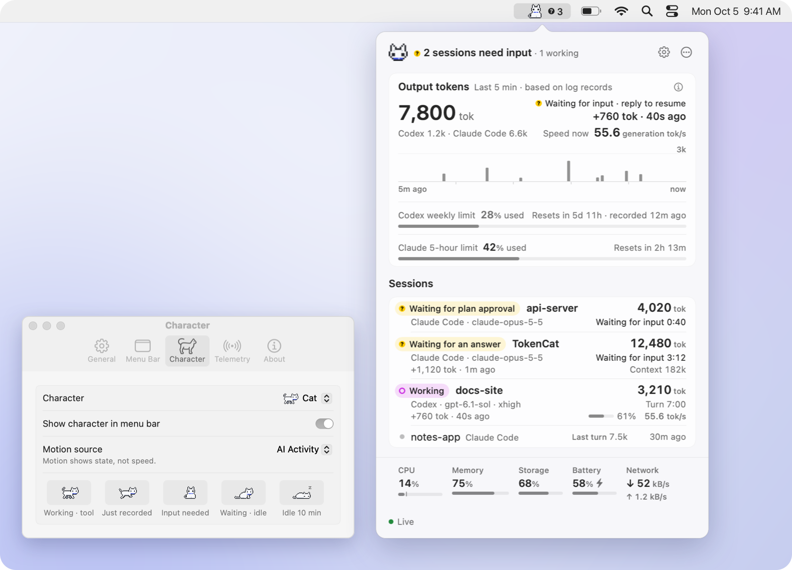
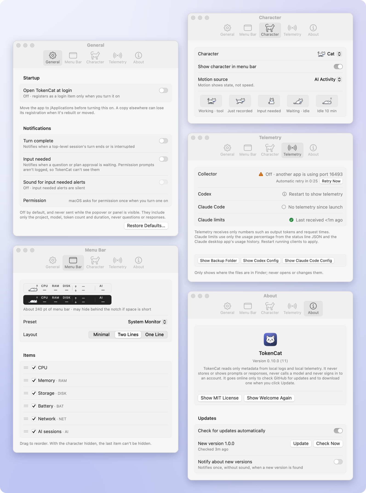
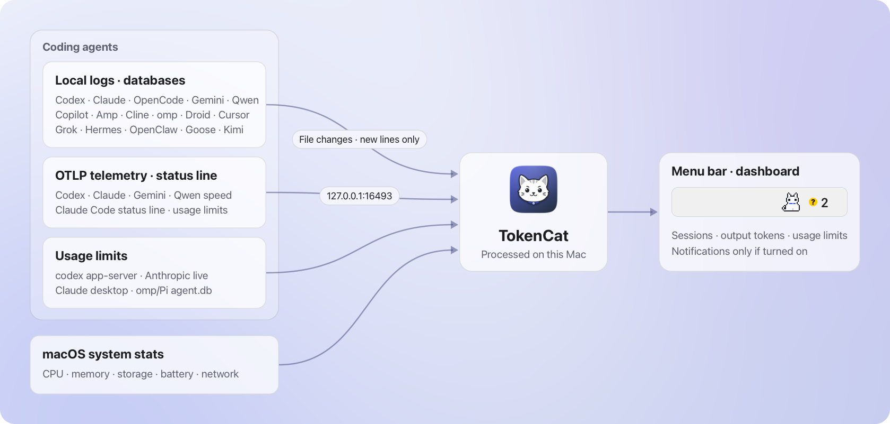

English · [한국어](README.ko.md)

<p align="center">
  
</p>

<h1 align="center">TokenCat</h1>

<p align="center">
  <b>A pixel cat in your menu bar that tells you<br>what Codex and Claude Code are doing right now.</b>
</p>

<p align="center">
  <a href="https://github.com/SeuPut0705/TokenCat/releases/latest"></a>
  
  
  
  <a href="LICENSE"></a>
</p>

<p align="center">
  <picture>
    <source media="(prefers-color-scheme: dark)" srcset="docs/images/en/hero-dark.png">
    
  </picture>
</p>

<p align="center">
  <a href="#features">Features</a> ·
  <a href="#privacy-and-safety">Privacy</a> ·
  <a href="#install">Install</a> ·
  <a href="#how-it-works">How it works</a> ·
  <a href="#faq">FAQ</a> ·
  <a href="docs/DETAILS.md">Details</a>
</p>

---

Run Codex and Claude Code in a few terminals and it's easy to lose track of which session is working and which one is waiting for you. TokenCat gathers that state into a single menu bar item. A walking cat means work is in progress; a cat sitting and facing you means a session needs input. Click the item to see each session's state, output tokens from the last 5 minutes, the current speed, Codex and Claude usage limits, and your Mac's system metrics on one screen.

The numbers are shown as they are. Token counts are the values actually recorded in local logs, and a tok/s speed appears only when a client has sent a **measurement** to the collector on this Mac. TokenCat never estimates speed from gaps between log timestamps, never sums or averages speeds across sessions, and leaves unknown values as `—`.

- **Never miss an input request**: a session waiting for an answer or a plan approval shows a yellow `?` and a cat facing you. Notifications are available if you want them.
- **Sessions and subagents in one list**: each session shows its progress, the kind of tool running, output this turn and context, and subagents are grouped under their parent.
- **Local only**: no conversation text is stored, the measurement collector listens only on `127.0.0.1`, and TokenCat never calls a model or signs in to an account. It goes online only to check for and download updates from GitHub, and automatic checks can be turned off. To receive measurements, it automatically adds settings to Codex and Claude Code that send telemetry to this Mac, and wraps the Claude Code status line command with a TokenCat bridge, backing up the originals first.
- **Native app**: Swift, AppKit and SwiftUI only, with no third-party packages. Targets macOS 13 and later.

## Features

### The output flow at a glance

<p align="center">
  <picture>
    <source media="(prefers-color-scheme: dark)" srcset="docs/images/en/popover-flow-dark.png">
    
  </picture>
</p>

Output tokens recorded in the logs over the last 5 minutes are shown as 5-second bars. When both clients record, the total is split, as in `Codex 1.2k · Claude Code 6.6k`. The right side shows the last record; after 30 seconds without a new one, that spot tells you what is being waited on instead (input, plan approval, an API retry, or a tool category such as `Running command`). The bars are amounts recorded and are never converted into a speed.

**Speed now**, under the number, is the single most recent measurement received within the last 2 minutes from the visible working sessions (`Speed now · docs-site 55.6 generation tok/s`). Only a value measured with that session's current model counts, clients waiting for a restart are left out, and sessions are never summed or averaged. If sessions are working, running a tool or retrying the API with no measurement, it shows `—`; if they are only waiting for input or logs, it's hidden. Speeds derived from log timestamps are never used.

### What each session is doing

<p align="center">
  <picture>
    <source media="(prefers-color-scheme: dark)" srcset="docs/images/en/popover-sessions-dark.png">
    
  </picture>
</p>

Working sessions move to the top. Each row shows a state chip, the output so far this turn, the client, model and Codex effort, the turn's elapsed time, and context usage. For Codex, context is a share of the recorded window (`Context 91% used`); Claude Code doesn't record its window size, so it's shown as an absolute value such as `Context 182k`, followed by `Compacted 1m ago` after a compaction. A session with a measurement shows its speed with the unit that names its basis, such as `44.1 request tok/s`. Without a measurement, only rows that may be generating (working, running a tool or retrying the API) show `—`, and rows waiting for input or logs show nothing.

`Input needed` comes from the logs: Claude Code's questions (AskUserQuestion) and plan approvals (ExitPlanMode), and questions in Codex Plan mode (`request_user_input`). Permission prompts aren't logged, so they can't be shown.

### Subagents under their parent

<p align="center">
  <picture>
    <source media="(prefers-color-scheme: dark)" srcset="docs/images/en/popover-subagents-dark.png">
    
  </picture>
</p>

Codex and Claude Code subagents are grouped under their parent by its exact session identifier and shown as a tree. Each is titled by its role or nickname (a short ID when the role is a common one). Every running subagent is shown, and those waiting for logs collapse into one line, such as `+3 subagents waiting for log`.

### Details and copying in one click

<p align="center">
  <picture>
    <source media="(prefers-color-scheme: dark)" srcset="docs/images/en/popover-detail-dark.png">
    
  </picture>
</p>

Click a row or press Return to expand its session ID, model, running tool and record times. The right-click menu copies the session or agent ID and the resume command (`claude --resume …`, `codex resume …`), and shows the log file or project folder in Finder. File contents are never opened. ↑↓ · Return · ⌘C let you do all of this from the keyboard.

### Codex and Claude usage limits

<p align="center">
  <picture>
    <source media="(prefers-color-scheme: dark)" srcset="docs/images/en/popover-limits-dark.png">
    
  </picture>
</p>

At the bottom of the output card, one line per client shows the last usage percentage received, the time until it resets, and how long ago it was received. 85% or more is orange, 95% or more is red, and once the reset time passes it changes to `—`. It isn't a live balance or a forecast of when you'll run out.

- **Codex**: the usage percentage recorded in the Codex logs.
- **Claude**: Claude Code doesn't write usage limits to its logs; it only passes them to the status line command. So TokenCat wraps the status line command with a [bridge](docs/DETAILS.md#claude-usage-limits-and-the-status-line-bridge) and takes only the 5-hour and weekly limits from it. They appear for Claude.ai subscription accounts once a Claude Code launched after connecting has received one response, and they update only when Claude Code redraws its status line. Claude Code in the Claude desktop app doesn't run the status line, so TokenCat also uses the last 5-hour and weekly percentages from the usage history the desktop app writes about every 15 minutes (`~/Library/Application Support/Claude/plan-usage-history.json`, read only). That history has no reset time, so only `Recorded 5m ago` is shown, and a window counts as reset once its length (5 hours or 7 days) has passed since the record. For each window the more recent of the two sources wins; of the two windows that haven't reset, the one with higher usage is shown, and the other is given in the help when its reset time is known.

### As much menu bar as you want

<p align="center">
  <picture>
    <source media="(prefers-color-scheme: dark)" srcset="docs/images/en/menubar-layouts-dark.png">
    
  </picture>
</p>

Choose **Minimal** (about 72 pt), **Two Lines** (the default, about 272 pt) or **One Line** (about 410 pt), then turn items on or off and drag them to reorder. Each item has a fixed width, so the icons next to it don't shift when values change, and labels follow the bar's light or dark appearance so they stay readable on tinted bars. On a Mac without a battery, the battery item is hidden.

<p align="center">
  <picture>
    <source media="(prefers-color-scheme: dark)" srcset="docs/images/en/menubar-states-dark.png">
    
  </picture>
</p>

The AI number is the count of top-level sessions that are working or waiting for input, and the mark uses the same glyphs as the dashboard. Recorded output shows as a short run by the cat instead of a mark. Right-click the item (or use its `Quick menu` action in VoiceOver) for a quick menu that jumps straight to up to three urgent sessions.

### A cat that shows the state

<p align="center">
  <picture>
    <source media="(prefers-color-scheme: dark)" srcset="docs/images/en/cat-dark.gif">
    
  </picture>
</p>

With the default motion source, **AI Activity**, the cat walks while sessions are working or running tools, runs for 1.2 seconds when new output is recorded, and sits facing you when input is needed. It sits and blinks while waiting for logs, and falls asleep after 10 minutes without activity. The pace is fixed for each state and doesn't indicate speed. In Settings you can switch to CPU Usage, Measured AI Speed or Still, and the cat respects Reduce Motion.

<p align="center">
  <picture>
    <source media="(prefers-color-scheme: dark)" srcset="docs/images/en/poses-dark.png">
    
  </picture>
</p>

The cat is pixel art drawn 1:1, without blur, in a 32 × 20 pt cell. The dashboard header and the 16 and 32 px app icons use the same pixel head.

### Characters & presets

<p align="center">
  <picture>
    <source media="(prefers-color-scheme: dark)" srcset="docs/images/en/characters-dark.png">
    
  </picture>
</p>

Besides the cat, you can pick a dog, hamster, penguin or robot in Settings › Character or in the quick menu's Character submenu. All five share the same poses and pace, so only the look changes; the dashboard header and the app icon keep the cat.

Presets set up the menu bar in one step: **Minimal**, **AI Focus** (AI, CPU and memory on two lines), **System Monitor** (every item on two lines) or **Everything Inline** (every item on one line). Choose one in Settings › Menu Bar › Preset. Picking a preset also shows the character again, and when the layout or items no longer match any preset, the picker shows **Custom**.

### Settings and notifications

<p align="center">
  <picture>
    <source media="(prefers-color-scheme: dark)" srcset="docs/images/en/settings-dark.png">
    
  </picture>
</p>

- **General**: Open TokenCat at login, and notifications (Turn complete, Input needed, Sound for input needed alerts). The login item and all notifications are off by default; TokenCat registers the login item or asks for notification permission only when you turn one on.
- **Menu Bar**: 1:1 light and dark previews, preset, layout, and item visibility and order.
- **Character**: the character, whether it's shown, the motion source, and a legend of poses by state.
- **Telemetry**: collector status and retry, whether each client's measurements are arriving, whether Claude limits are arriving (status line bridge, Claude desktop app history), and Show in Finder for the backup folder and config files.
- **About**: version, privacy statement, MIT License, Show Welcome Again, and Updates (Check for updates automatically, a status line with `Update` and `Check Now`, `Try Again` or `Open Release Page` on failure, and Notify about new versions). Only Check for updates automatically is on by default, and Notify about new versions asks for notification permission only when you turn it on.

Notifications include only the project, client and model, token count and duration, never the question or response text. They aren't sent while the dashboard is visible. A new-version notification is sent once per version, without sound, and the previous one is removed when a newer version appears or you update.

### Language

Screens, menus, notifications, help, VoiceOver labels and command-line output are in English and Korean. TokenCat follows your macOS language settings, using whichever of Korean and English comes first in your preferred languages, and English if neither is listed. To pick a language for TokenCat alone, use **System Settings › General › Language & Region › Applications**; the change applies the next time you open TokenCat.

## Privacy and safety

<p align="center">
  <picture>
    <source media="(prefers-color-scheme: dark)" srcset="docs/images/en/popover-onboarding-dark.png">
    
  </picture>
</p>

On first launch, the card above tells you what TokenCat actually did and what it doesn't do.

- **No conversation text is stored.** Only metadata from local logs is used, such as models, token counts, tool types and project folders. Tool inputs aren't read, and error messages in API retry records aren't stored either.
- **The collector stays inside this Mac.** It accepts requests only on `127.0.0.1:16493` and rejects any request that carries a web page Origin. Received measurements are kept in memory up to a fixed count and never written to files. The only things from the collector that reach disk are the Claude limits' usage percentage, reset time and time received, stored in TokenCat's settings (UserDefaults) so they still show on the next launch. The Claude desktop app's usage history file is only read, and just the last record's percentages and time are stored in the same place.
- **Connected with text logging off.** When TokenCat adds telemetry to the Codex and Claude Code settings, prompt and response text logging is turned off.
- **The Claude Code status line is only wrapped.** Claude Code passes usage limits only to its status line command, so TokenCat replaces the `statusLine` command in `~/.claude/settings.json` with the TokenCat bridge (`~/Library/Application Support/TokenCat/claude-statusline.sh`). The bridge sends the status JSON that Claude Code passes it (working folder, session, model, cost, usage limits and so on) only to `127.0.0.1`, then runs the original command with the same input and returns its output and exit code unchanged. TokenCat keeps only the 5-hour and weekly limit numbers from that JSON and discards the rest. If there was no status line, it adds a bridge that prints nothing.
- **No model calls, no account sign-ins.** TokenCat never calls any model and never signs in to any account.
- **The only internet access is for updates.** TokenCat asks GitHub only for the latest release's version number, and sends no usage history, device information or identifiers. If you turn off `Check for updates automatically` in Settings › About, it asks only when you click `Check Now`. The new version is downloaded only when you click `Update`. All other communication stays inside this Mac (`127.0.0.1`).
- **Original settings are backed up first.** Before changing anything, TokenCat keeps the originals in a folder with restricted access, and it never overwrites an existing external telemetry destination that would conflict. If a config file changed after connecting, the disconnect command (`--disconnect-telemetry`) doesn't overwrite the whole file; it backs up the current file and reverts only the entries TokenCat added.
- **Login item and notifications only when you turn them on.** Both are off by default. Updates are installed only when you click, too.

## Install

TokenCat runs on macOS 13 and later, and one universal app supports both Apple silicon and Intel Macs.

1. [**Download TokenCat.zip**](https://github.com/SeuPut0705/TokenCat/releases/latest/download/TokenCat.zip) (attached to the [latest release](https://github.com/SeuPut0705/TokenCat/releases/latest))
2. Unzip it and move `TokenCat.app` to the **Applications** folder. That location is best if you want to use open at login.
3. The first time, open it following [Opening it the first time](#opening-it-the-first-time) below.

> [!IMPORTANT]
> On first launch, to receive measurements, TokenCat **automatically** adds settings to Codex `~/.codex/config.toml` and Claude Code `~/.claude/settings.json` that send telemetry to this Mac (`127.0.0.1:16493`), and wraps Claude Code's status line (`statusLine`) command with the TokenCat bridge (the original status line output stays the same). It backs up the originals first and turns off prompt and response text logging. It checks the connection on every launch; after you disconnect with `--disconnect-telemetry`, it won't reconnect until you run `--connect-telemetry`. How to undo it is in [Disconnect and uninstall](#disconnect-and-uninstall).

### Opening it the first time

TokenCat has only an ad-hoc signature, without an Apple Developer ID signature or notarization. So the first time you open an app downloaded with a browser, macOS (Gatekeeper) treats it as an unverified app and blocks it. You only need to allow each installed app once.

**macOS 15 and later**

1. Open `TokenCat.app`. When a window says it can't be opened, click **Done**. Don't click **Move to Trash**.
2. Open **System Settings › Privacy & Security** and scroll down to the **Security** section.
3. Next to the message “TokenCat” was blocked to protect your Mac, click **Open Anyway**. This button appears only for about an hour after you tried to open the app.
4. In the window that appears, click **Open Anyway** again and confirm with your Mac password or Touch ID.

**macOS 13–14**

1. In Finder, Control-click (or right-click) `TokenCat.app` and choose **Open**.
2. Click **Open** in the confirmation window. If the window has no Open button, click **Open Anyway** in **System Settings › Privacy & Security**, as on macOS 15.

### Install from the terminal

Download it first, then compare the SHA-256 with the value in the [latest release](https://github.com/SeuPut0705/TokenCat/releases/latest) notes.

```sh
curl -fL https://github.com/SeuPut0705/TokenCat/releases/latest/download/TokenCat.zip -o /tmp/TokenCat.zip \
  && shasum -a 256 /tmp/TokenCat.zip
```

If the values match, unzip the new app first, then quit the running TokenCat, replace the existing app and open it. If unzipping fails, the existing app isn't removed. Settings and backups live outside the app, so they stay as they are.

```sh
rm -rf /tmp/TokenCat-new && ditto -x -k /tmp/TokenCat.zip /tmp/TokenCat-new \
  && { pkill -x TokenCat; rm -rf /Applications/TokenCat.app; } \
  && mv /tmp/TokenCat-new/TokenCat.app /Applications/ \
  && open /Applications/TokenCat.app
```

Unlike a browser, `curl` doesn't add the quarantine attribute (`com.apple.quarantine`) to the downloaded file, so the app opens without the confirmation windows above. That's why checking that the URL points to this repository and verifying the SHA-256 first matters.

### Build from source

You need Xcode. `Package.swift` requires Swift 5.9 or later, and the build was confirmed on macOS 27.0.1 · Xcode 27.0 · Swift 6.4. In the same environment, the Command Line Tools alone fail to build because they lack the SwiftUI macro plugin.

```sh
git clone https://github.com/SeuPut0705/TokenCat.git
cd TokenCat
./build.sh
open dist/TokenCat.app
```

`build.sh` makes `dist/TokenCat.app` as a universal release build for Apple silicon and Intel and signs it ad hoc. There's no Developer ID signing, notarization or App Store distribution. To open it automatically at login, move the app to `/Applications` and turn it on in Settings › General. Rebuilding or moving an app in another location can drop the registration.

### On first launch

1. The cat appears in the menu bar. There's no Dock icon, and opening the app again while it's running opens the Settings window.
2. Once the local collector is ready, TokenCat **automatically** adds local telemetry settings to Codex `~/.codex/config.toml` and Claude Code `~/.claude/settings.json`. For Claude Code, it also replaces the `statusLine` command with the bridge script to receive usage limits, and keeps the original command in `~/Library/Application Support/TokenCat/claude-statusline-command`, which the bridge runs unchanged. The original config files are backed up to `~/Library/Application Support/TokenCat/telemetry-backups/` first, and other settings such as authentication, models and hooks, as well as file permissions, are left alone. If the collector isn't ready, no settings are changed.
3. Both clients send measurements and Claude usage limits **from their next launch**. Work in progress isn't restarted. Session state and token counts come from the logs, so they show right away.

<p align="center">
  <picture>
    <source media="(prefers-color-scheme: dark)" srcset="docs/images/en/popover-empty-dark.png">
    
  </picture>
</p>

With no records yet, you'll see the sleeping cat. Start a new session in Codex or Claude Code and it appears right away.

### Updates

TokenCat checks GitHub for the latest release on its own, and installs only when you click.

- **Checking**: when `Check for updates automatically` in Settings › About › Updates is on (the default), TokenCat checks right after launch, every 15 minutes after that, after your Mac wakes from sleep, and when you open the dashboard more than 5 minutes after the last check. When it's off, it checks only when you click `Check Now`.
- **Notice**: when a new version is available, `New version 1.0.0` and an `Update` button quietly appear on one line at the bottom of the dashboard, and the right-click quick menu gets `Install Update 1.0.0…`. The line's close button hides the notice for that version only. To get a system notification as well, turn on `Notify about new versions` (off by default).
- **Installing**: click `Update` and TokenCat downloads `TokenCat.zip` (`Downloading update 45%`), checks that it matches the SHA-256 recorded by GitHub, replaces the app (`Installing…`) and relaunches. When it reopens, it shows `Updated to 1.0.0` once. If it fails, `Update failed` and a way to open the release page appear, plus `Try Again` for failures that a retry might fix. If you quit during installation, TokenCat finishes the install step before quitting.

Settings and measurement backups live outside the app, so they stay the same after an update. To update by hand, [install](#install) again or run the commands in [Install from the terminal](#install-from-the-terminal). For an app you downloaded or moved yourself, quit the running TokenCat before opening it. If one is running, the newly opened app just opens the existing app's panel and exits.

### Disconnect and uninstall

TokenCat checks the measurement connection on every launch and adds it again if needed. Once you run `--disconnect-telemetry` in step 3 below (even if a restore is refused), it stops connecting automatically; running `--connect-telemetry` connects it again.

1. If you turned on open at login, turn it off in Settings › General.
2. Right-click the menu bar item and quit TokenCat.
3. Restore the client settings. If the app is somewhere else (`dist/TokenCat.app` if you built from source), use the executable inside that `TokenCat.app`.

   ```sh
   /Applications/TokenCat.app/Contents/MacOS/TokenCat --disconnect-telemetry
   ```

   Config files that haven't changed since connecting are restored to their original bytes, and the bridge script is removed. For files modified in the meantime (including Codex's folder trust records and settings saved by Claude Code), the current file is kept in the backup folder as `before-disconnect-<time>-…`, then only the entries TokenCat added are reverted and other changes are left alone. For Codex, that's the `[otel]` table TokenCat appended at the end (if it's unchanged); for Claude Code, it's the `OTEL_*` and `CLAUDE_CODE_*` entries in `env` that still hold TokenCat's values (restored to their original values, or removed if there were none), the text logging entries TokenCat set to `0`, and a `statusLine` that's still exactly the TokenCat bridge command (removed if there was none originally). If a TokenCat entry was changed to a different value, the original Codex settings already had an `[otel]` table, or the `statusLine` of a modified settings file couldn't be reverted, neither file is reverted automatically and only the `statusLine` is restored, so clean up the rest by hand using the originals in the backup folder. If `statusLine.command` still points to `claude-statusline.sh` after that (because you were told it couldn't be reverted, or the command is written differently), change it by hand to the original command written in `~/Library/Application Support/TokenCat/claude-statusline-command`. The original `statusLine` object is also in `statusLine.original` of `telemetry-connection.json` in the same folder; if that value is missing, there was no status line originally, so remove the `statusLine` key. The restore takes effect the next time each client launches.
4. Delete the app. Once the restore is done, you can also delete `~/Library/Application Support/TokenCat/` (backups and bridge) and the settings (`defaults delete dev.seuput.TokenCat`, which includes the Claude limit records). Don't delete that folder while `~/.claude/settings.json` still points to `claude-statusline.sh`: the original command would go with it, and the Claude Code status line would fail to run.

## How it works

<picture>
  <source media="(prefers-color-scheme: dark)" srcset="docs/images/en/architecture-dark.png">
  
</picture>

- **Logs** provide sessions, models, output tokens and progress. They're reflected only when the log is written, so for a client like Claude Code that writes at the end of a message, the numbers go up after the message completes. A session shows as working only within an allowance after its last record (10 minutes waiting for a model response, 15 minutes for a Claude Code tool, 120 seconds for a Codex tool); after that it changes to `Waiting for log`. This doesn't say whether the OS process is alive.
- **Measurements** are attached to a session row only when the provider, session and agent identifiers match exactly. They're never linked by model name or closeness in time. Speeds are shown in separate units by basis.
- **Claude usage limits** come from the status JSON that the bridge sends to the same collector (`/v1/claude/status`) whenever Claude Code draws its status line, reading only the 5-hour and weekly limits, and from the Claude desktop app's usage history file, reading only the last percentages and record time.
- **Updates** are the only thing that leaves this Mac. TokenCat asks the GitHub API for the latest release and compares version numbers, and downloads the file only when you click `Update`. This runs separately from the collection paths in the diagram.

| Unit | Basis |
|---|---|
| generation tok/s | The inverse of the actual time between tokens (TBT) reported by the Codex server |
| model tok/s | The average time between tokens from a server metric that bundles several observations. Not attributed to any single session's speed |
| request tok/s | Output tokens ÷ successful request time from Claude Code's `api_request`. Includes the wait for the first response and reasoning, so it isn't a pure generation speed |

The full rules are in [Details](docs/DETAILS.md), under [Token metrics](docs/DETAILS.md#token-metrics), [Sessions and states](docs/DETAILS.md#sessions-and-states) and [Collection scope and refresh](docs/DETAILS.md#collection-scope-and-refresh).

## FAQ

<details>
<summary><b>The first time I open it, macOS says Apple could not verify it is free of malware.</b></summary>

<br>

That message appears because TokenCat isn't notarized by Apple. Allow it once following [Opening it the first time](#opening-it-the-first-time), and it opens directly from then on. You can also review the source code and [build from source](#build-from-source).

</details>

<details>
<summary><b>What does it send over the internet?</b></summary>

<br>

Only the update check. It's a GET request to `api.github.com` asking for this repository's latest release, and apart from what any HTTP request carries (IP address, a User-Agent such as `TokenCat/0.9.0`, and a language header fixed to `en`), it sends no usage history, device information or identifiers. It uses cache validation headers so an unchanged response isn't downloaded again, and when GitHub reports a rate limit it pauses until the given time. If you turn off `Check for updates automatically` in Settings › About, it checks only when you click. When you click `Update`, it downloads `TokenCat.zip` from GitHub at that moment. Logs, measurements and conversation content never leave this Mac.

</details>

<details>
<summary><b>How do I update?</b></summary>

<br>

When a new version is out, a `New version` line appears at the bottom of the dashboard. Click `Update` and TokenCat downloads, verifies the SHA-256, replaces the app and relaunches in one go. It never installs automatically. See [Updates](#updates) for more. If you built from source, you can also `git pull` and run `./build.sh` again.

</details>

<details>
<summary><b>The speed shows <code>—</code>.</b></summary>

<br>

It means there's no measurement yet. TokenCat doesn't derive speeds from log timestamps. To receive measurements, TokenCat has to be running, and Codex or Claude Code has to be launched again after connecting. You can check whether each client's measurements are arriving in the Settings › Telemetry tab. Depending on the client version or server response, the metrics may not arrive at all. `Speed now` in the output card uses only measurements received within the last 2 minutes, so if a measurement is older than that, or was measured with a different model than the session uses now, it stays `—` even when the row has a speed. Hover over `—` to see why.

</details>

<details>
<summary><b>If the output bars or the cat's walk speed up, are tokens coming faster?</b></summary>

<br>

No. The bars are the amount recorded every 5 seconds, and with the default motion source the cat's pace is fixed for each state. To make it move with measured speed, choose 'Measured AI Speed' in Settings › Character. It reacts only to measurements from the last 5 seconds.

</details>

<details>
<summary><b>Does it show Claude on the web or desktop chats?</b></summary>

<br>

No. It collects only Claude Code sessions run in a terminal or the desktop app. Claude on the web and regular desktop chats take a different path from Claude Code, so they're out of scope.

</details>

<details>
<summary><b>What about speed in the Codex desktop app?</b></summary>

<br>

The Codex desktop app (codex-app-server) sends logs and traces, but TokenCat couldn't confirm a per-request generation time format, so its speed shows as `—`.

</details>

<details>
<summary><b>I don't see Claude usage limits.</b></summary>

<br>

Claude limits come from the `rate_limits` (5-hour and weekly) that Claude Code passes to the status line command. These are present only for Claude.ai subscription accounts, and only after the first response. So the row appears once TokenCat is running and a Claude Code launched after connecting has received one response and redrawn its status line. If you use the Claude desktop app, TokenCat also reads the usage history the desktop app writes about every 15 minutes, so the row appears once that history exists after you've used the app. A value, once received, carries over to the next launch; after its reset time, it shows `—` and `Reset` for a day and then hides. If `statusLine` isn't a command, connecting is skipped, and if you removed the bridge yourself, it isn't added again.

</details>

<details>
<summary><b>My Claude Code status line setting changed.</b></summary>

<br>

To receive usage limits, TokenCat wrapped the `statusLine` command as `/bin/sh "$HOME/Library/Application Support/TokenCat/claude-statusline.sh"`. The bridge runs the original command (the `claude-statusline-command` file) with the same input, so the status line output stays the same, and other fields such as `padding` are kept. How to undo it is in [Disconnect and uninstall](#disconnect-and-uninstall).

</details>

<details>
<summary><b>Why isn't Claude Code context shown as a percentage?</b></summary>

<br>

Claude Code doesn't write the context window size to its logs. So instead of a share of the window, it's shown as an absolute value such as `Context 182k`, and the window size is never guessed from the model name.

</details>

<details>
<summary><b>A session waiting for a permission prompt doesn't change to <code>Input needed</code>.</b></summary>

<br>

Permission prompts aren't logged, so TokenCat can't know about them. `Input needed` shows only waits that are recorded in the logs, such as questions and plan approvals.

</details>

<details>
<summary><b>I already use another OpenTelemetry destination.</b></summary>

<br>

TokenCat never overwrites an existing external telemetry destination that would conflict. In that case, `Telemetry off · config conflict` appears at the bottom of the dashboard, and clicking it opens the Telemetry tab in Settings. Session state and token counts come from the logs, so they keep showing.

</details>

<details>
<summary><b>How much does it use in resources?</b></summary>

<br>

CPU and memory measurements aren't documented here yet. Instead, TokenCat keeps the load down like this:

- Log files are read only from where they were appended. It wakes on file change events (FSEvents) but rereads at most 4 times per second, alongside a check every second and a new-file check every 5 seconds.
- System and log collection and local measurements each run on their own background queue.
- Measurements are kept in memory up to a fixed count, and the collector limits body size, concurrent connections and request time.
- The animation timer stops when the cat is hidden, the display sleeps or the menu bar is covered, and also 20 minutes after the cat falls asleep.

</details>

## Development

```sh
./build.sh
dist/TokenCat.app/Contents/MacOS/TokenCat --self-test                    # checks log parsing, state, measurements, settings backup, status line bridge and update steps
dist/TokenCat.app/Contents/MacOS/TokenCat --telemetry-lifecycle-checks   # checks the collector lifecycle on a loopback port for tests
dist/TokenCat.app/Contents/MacOS/TokenCat --live-check                   # checks refreshes for about 6 seconds with the real system and logs
dist/TokenCat.app/Contents/MacOS/TokenCat --update-check                 # compares with the latest release only (doesn't install)
```

Screens can also be rendered from synthetic data instead of local logs and the collector.

```sh
dist/TokenCat.app/Contents/MacOS/TokenCat --snapshot-fixtures work/fixtures
dist/TokenCat.app/Contents/MacOS/TokenCat --snapshot-menubar work/menubar-states.png --fixtures
dist/TokenCat.app/Contents/MacOS/TokenCat --snapshot-settings work/settings.png --pane all --fixtures
```

Pick the language of snapshots and command-line output with `--language en|ko`. The README images are regenerated from the synthetic snapshots above and `Assets/` alone, and images with text are made per language in `docs/images/en/` and `docs/images/ko/`. See [`docs/Generator`](docs/Generator/README.md) for how.

```sh
mkdir -p work && swiftc -O docs/Generator/*.swift -o work/docs-generator && work/docs-generator
```

> [!WARNING]
> `--snapshot` without fixtures and `--diagnose` include real project names and paths from this Mac. Don't attach them to issues or docs.

All commands and what they check are in [Details › Verification commands](docs/DETAILS.md#verification-commands).

### Releases

1. Bump `CFBundleShortVersionString` in `build.sh` (for example `0.10.1`) and increase `CFBundleVersion` by 1.
2. Push to main, and the GitHub Actions [release workflow](.github/workflows/release.yml) builds on a macOS runner, runs `--self-test` and the universal, version and signature checks, and uploads `TokenCat.zip` to a draft release. It publishes the draft as the latest release with the `v0.10.1` tag only if the asset SHA-256 recorded by GitHub matches the zip. If the tag already exists, it does nothing, and it stops if the new version isn't higher than the current latest release.
3. A running TokenCat announces the new version at its next check (usually within 15 minutes).

You can also run the workflow by hand from the Actions tab (main branch only). The English and Korean release notes include commit subjects since the previous tag, install and Gatekeeper instructions, the settings changed on first launch and the command to undo them, and the SHA-256 of `TokenCat.zip`.

### Project layout

| Path (under `Sources/TokenCat/`) | Contents |
|---|---|
| `Entry.swift` | Entry point and command-line options (checks, snapshots, diagnostics, telemetry connection, update check) |
| `App.swift` | App lifecycle, menu bar item, popover and panel, settings values |
| `Models.swift` | Data models for system, token and session state |
| `StatusBarView.swift` | Menu bar rendering |
| `DashboardView.swift`, `SessionPresentation.swift`, `TokenFlow.swift` | Dashboard, session grouping and state, output bars |
| `SettingsView.swift` | Settings window |
| `TokenTracker.swift`, `LogWatcher.swift` | Local JSONL parsing and file change detection |
| `Telemetry.swift`, `TelemetrySetup.swift`, `TokenSpeed.swift` | Local OTLP and status line collector, connecting and restoring client settings and the Claude Code status line bridge, measured speeds |
| `Updater.swift` | GitHub latest release check, download, SHA-256 verification, app replacement and relaunch |
| `SystemSampler.swift` | CPU, memory, storage, battery and network |
| `Runner.swift`, `RunnerAnimator.swift` | Cat sprites and motion |
| `Notifier.swift`, `LoginItem.swift` | Notifications, login item |
| `DesignTokens.swift` | Type, color and state glyphs |
| `Localization.swift` | Display language choice, English and Korean texts (`loc`) and time formats |
| `*Checks.swift`, `SnapshotFixtures.swift` | `--self-test` checks and synthetic snapshots |

[`Assets/`](Assets) at the repository root holds the sprites and icons and the Swift code that makes them (`Assets/Generator/`), and [`docs/Generator/`](docs/Generator/README.md) holds the generator for the README preview images.

### Assets

<p align="center">
  <picture>
    <source media="(prefers-color-scheme: dark)" srcset="docs/images/app-icon-dark.png">
    
  </picture>
</p>

The app icon and the menu bar cat are generated deterministically by the Swift code in [`Assets/Generator`](Assets/Generator), with the palette defined in one place. Generation commands and measurements are in [`Assets/runner-v2.md`](Assets/runner-v2.md) and [`Assets/app-icon-v2.md`](Assets/app-icon-v2.md).

## License

The source and the TokenCat-generated assets in this repository are released under the [MIT License](LICENSE). MIT License: keep the copyright notice and you can use, modify and redistribute it, including commercially. TokenCat uses no images or code from RunCat. TokenCat isn't an official tool of Codex or Claude Code.
